# Module 1 - Fundamentals of Cloud and Azure

# Azure and Cloud Computing Fundamentals

## Types of Cloud Services

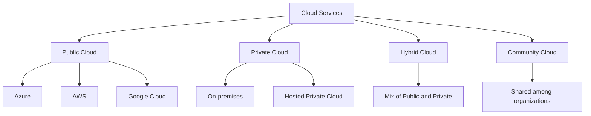

- Public Cloud: Accessible over the internet, shared resources (e.g., Azure, AWS, Google Cloud)
- Private Cloud: Dedicated to a single organization, can be on-premises or hosted
- Hybrid Cloud: Combination of public and private clouds
- Community Cloud: Shared by several organizations with common concerns

## Cloud Service Models

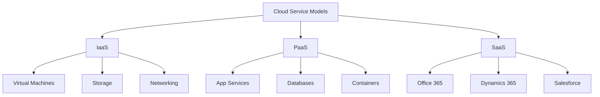

- IaaS (Infrastructure as a Service): Provides virtualized computing resources
- PaaS (Platform as a Service): Offers development and deployment environments
- SaaS (Software as a Service): Delivers software applications over the internet

## Core Characteristics of Cloud Computing

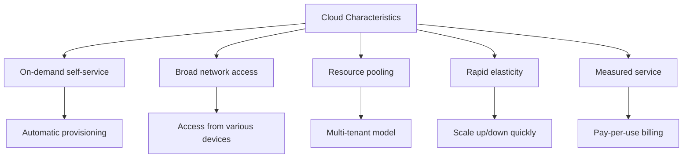

1. On-demand self-service: Users can provision resources without human interaction
2. Broad network access: Services are available over the network and accessed through standard mechanisms
3. Resource pooling: Provider's resources are pooled to serve multiple consumers
4. Rapid elasticity: Capabilities can be elastically provisioned and released to scale with demand
5. Measured service: Resource usage is monitored, controlled, and reported

## Benefits of Public Cloud

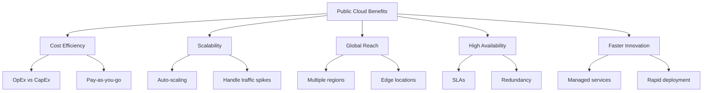

- Cost Efficiency: Pay for what you use, reduce capital expenses
- Scalability: Easily scale resources up or down based on demand
- Global Reach: Deploy applications closer to users worldwide
- High Availability: Built-in redundancy and fault tolerance
- Faster Innovation: Access to latest technologies and managed services

## Microsoft Azure Services

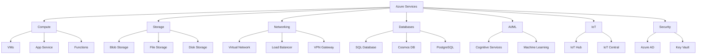

Azure offers a comprehensive set of services across various categories, including compute, storage, networking, databases, AI/ML, IoT, and security.

## Getting Started with Azure

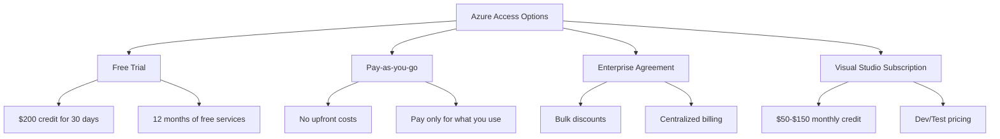

- Free Trial: Offers $200 credit for 30 days and 12 months of free services
- Pay-as-you-go: No upfront costs, pay only for what you use
- Enterprise Agreement: For large organizations, offers bulk discounts and centralized management
- Visual Studio Subscription: Includes monthly Azure credit for development and testing

## Azure Reliability and Resiliency

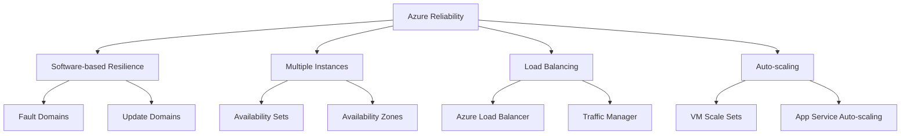

- Software-based Resilience: Focus on distributing workloads across multiple instances
- Multiple Instances: Use of availability sets and zones for redundancy
- Load Balancing: Distribute traffic across multiple instances
- Auto-scaling: Automatically adjust resources based on demand

## Why Choose Azure

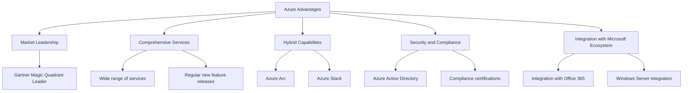

- Market Leadership: Consistently ranked as a leader in Gartner Magic Quadrant
- Comprehensive Services: Wide range of services covering various IT needs
- Hybrid Capabilities: Strong support for hybrid cloud scenarios
- Security and Compliance: Advanced security features and compliance certifications
- Integration with Microsoft Ecosystem: Seamless integration with other Microsoft products and services


# Azure Master Class v2 - Module 2 - Identity

## Introduction to Azure Identity and Access Management

This summary provides a comprehensive overview of Azure's identity and access management solutions, focusing on Azure Active Directory (Azure AD) and related services. It covers key concepts, features, and best practices for implementing secure and efficient identity management in Azure cloud environments.

## Azure Active Directory (Azure AD)

### Overview
Azure AD is Microsoft's cloud-based identity and access management service, serving as the foundation for securing access to Azure resources, Microsoft 365, and third-party applications.

### Key Components
- **Users**: Represent individuals within the organization
- **Groups**: Collections of users for easier management
- **Applications**: Registered apps that integrate with Azure AD
- **Devices**: Endpoints that can be registered or joined to Azure AD

### Features
- **Single Sign-On (SSO)**: Enables users to access multiple applications with a single set of credentials
- **Multi-Factor Authentication (MFA)**: Adds an extra layer of security by requiring additional verification
- **Conditional Access**: Allows granular control over access to resources based on various factors
- **Identity Protection**: Uses machine learning to detect and prevent identity-based risks

### Azure AD Editions
- **Free**: Basic directory services and user management
- **Office 365 Apps**: Tailored for Office 365 users
- **Premium P1**: Advanced identity and access management features
- **Premium P2**: Adds advanced security and governance capabilities

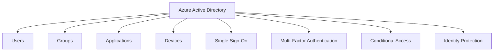

## Authentication and Authorization

### Authentication Methods
- **Password Hash Synchronization**: Syncs password hashes from on-premises AD to Azure AD
- **Pass-through Authentication**: Validates passwords against on-premises AD
- **Federation**: Delegates authentication to a separate identity provider (e.g., ADFS)

### Authorization
- **Role-Based Access Control (RBAC)**: Assigns permissions to users, groups, or applications
- **Administrative Units**: Allows delegation of administrative tasks for specific groups of users or resources

### Best Practices
- Implement **least privilege** access principles
- Use **Privileged Identity Management (PIM)** for just-in-time access to elevated roles
- Regularly perform **access reviews** to ensure appropriate permissions

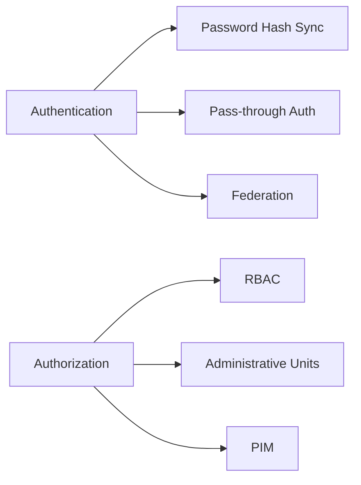

## Multi-Factor Authentication and Passwordless

### MFA Options
- **Microsoft Authenticator app**: Push notifications or one-time passcodes
- **SMS**: Text messages with verification codes
- **Phone call**: Automated voice calls for verification
- **FIDO2 security keys**: Physical keys for passwordless authentication

### Passwordless Authentication
- **Windows Hello for Business**: Biometric and PIN-based authentication for Windows devices
- **FIDO2 security keys**: Standards-based passwordless authentication
- **Microsoft Authenticator app**: Passwordless sign-in using the mobile app

### Best Practices
- Enable MFA for all users, especially administrators
- Implement **number matching** for enhanced security in MFA prompts
- Gradually transition to passwordless authentication methods

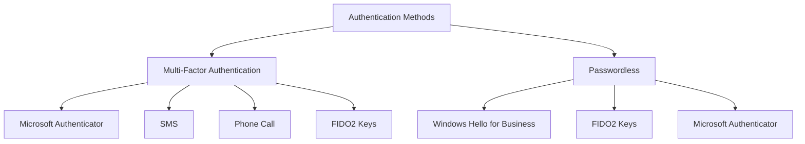

## Conditional Access and Identity Protection

### Conditional Access
- **Policies**: Define rules for allowing or blocking access based on various signals
- **Signals**: User, device, location, application, and real-time risk detection
- **Access Controls**: Require MFA, compliant devices, or specific locations for access

### Identity Protection
- **Risk Detection**: Uses machine learning to identify potentially compromised identities
- **Risk Remediation**: Automated actions to mitigate detected risks
- **Reporting**: Provides detailed reports on risky users and sign-ins

### Best Practices
- Implement a **Zero Trust** security model using Conditional Access
- Use **risk-based Conditional Access** policies to adapt security requirements dynamically
- Regularly review and update policies based on changing security needs

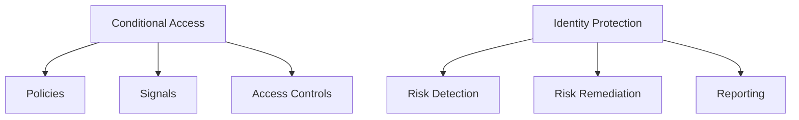

## Azure AD B2B and B2C

### Azure AD B2B (Business-to-Business)
- Enables collaboration with external partners using their own identities
- Supports various identity providers (Azure AD, Microsoft Account, Google, etc.)
- Allows fine-grained control over external user access

### Azure AD B2C (Business-to-Consumer)
- Customer identity and access management solution
- Supports social identity providers and local accounts
- Customizable user experiences for sign-up, sign-in, and profile management

### Best Practices
- Use **cross-tenant access settings** to control inbound and outbound access for B2B collaboration
- Implement **custom policies** in B2C for complex identity scenarios
- Regularly review external user access and implement **lifecycle management**

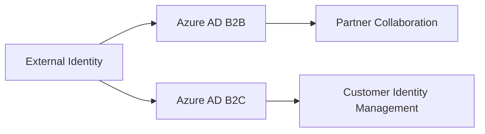

## Hybrid Identity and Azure AD Connect

### Azure AD Connect
- Synchronizes on-premises AD with Azure AD
- Supports **password hash synchronization**, **pass-through authentication**, and **federation**
- Enables hybrid identity scenarios for seamless access to cloud and on-premises resources

### Azure AD Connect Cloud Sync
- Lightweight alternative to full Azure AD Connect
- Supports multi-forest scenarios and partial attribute synchronization
- Managed service with reduced on-premises footprint

### Best Practices
- Implement **staged rollout** for synchronization
- Use **filtering** to control which objects are synchronized
- Regularly monitor synchronization health and errors

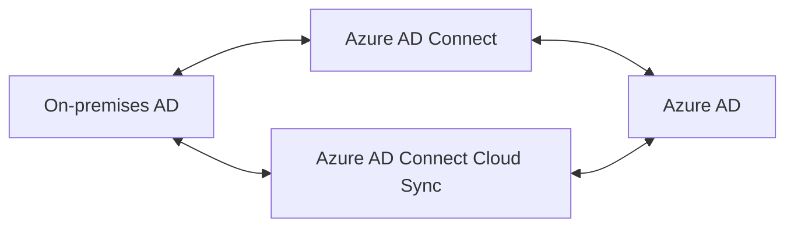

By implementing these Azure identity and access management solutions, organizations can secure their cloud resources, enable seamless access for users, and maintain compliance with security best practices. Regular review and optimization of identity policies and configurations are essential to adapt to evolving security threats and organizational needs.


# Azure Master Class v2 - Module 3 - Governance
## Azure Governance and Management

This summary provides a comprehensive overview of Azure governance and management concepts, focusing on key components, best practices, and tools for effectively controlling and optimizing Azure environments.

## Introduction to Governance in Azure

Governance in Azure is critical due to the shift from traditional on-premises IT operations to cloud-based self-service models. It ensures that organizational policies, compliance requirements, and best practices are enforced across cloud resources.

### Key Components:
- **Policies**: Define what can be done
- **Role-Based Access Control (RBAC)**: Define who can do it
- **Budgets**: Define how much can be spent

### Importance:
- Enforces company rules and regulatory requirements
- Prevents misconfigurations and security risks
- Enables cost control and optimization

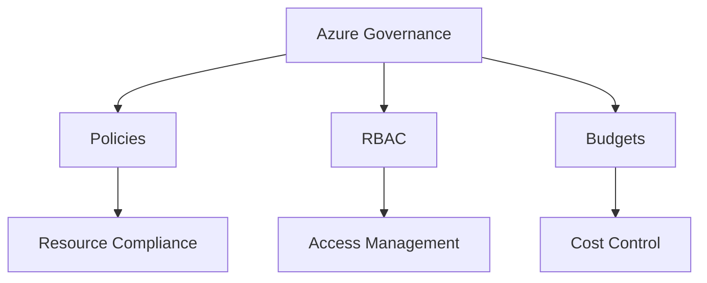

## Management Groups and Subscriptions

Management groups and subscriptions provide a hierarchical structure for organizing and managing Azure resources.

### Management Groups
- Root-level container for organizing subscriptions
- Can have up to 6 levels of hierarchy
- Enables inheritance of policies and access controls

### Subscriptions
- Billing and access control boundary
- Trust a specific Azure AD tenant
- Container for resource groups and resources

### Best Practices:
- Use management groups for consistent policy application across multiple subscriptions
- Create subscriptions based on business needs, environments, or departments
- Consider quota limits when designing subscription structure

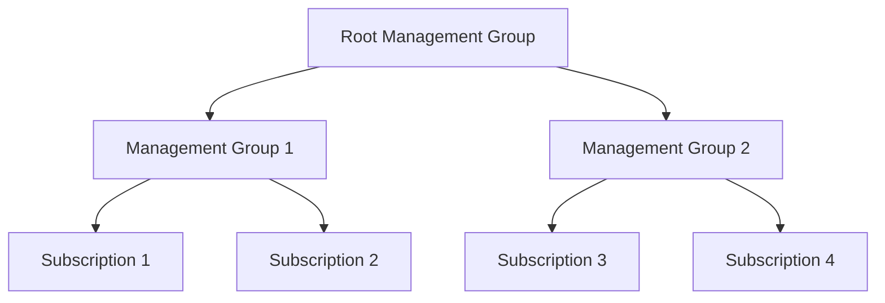

## Azure Policy

Azure Policy is a service for creating, assigning, and managing policies to enforce rules and effects across Azure resources.

### Key Features:
- **Policy Definitions**: JSON files that describe policy rules
- **Initiatives**: Groups of related policies
- **Assignments**: Application of policies to specific scopes

### Policy Effects:
- Audit: Check compliance without enforcing
- Deny: Prevent non-compliant resources from being created
- Deploy: Automatically create or modify resources
- Modify: Add, update, or remove resource properties

### Best Practices:
- Start with audit policies before enforcing deny
- Use initiatives for comprehensive compliance management
- Regularly review and update policies

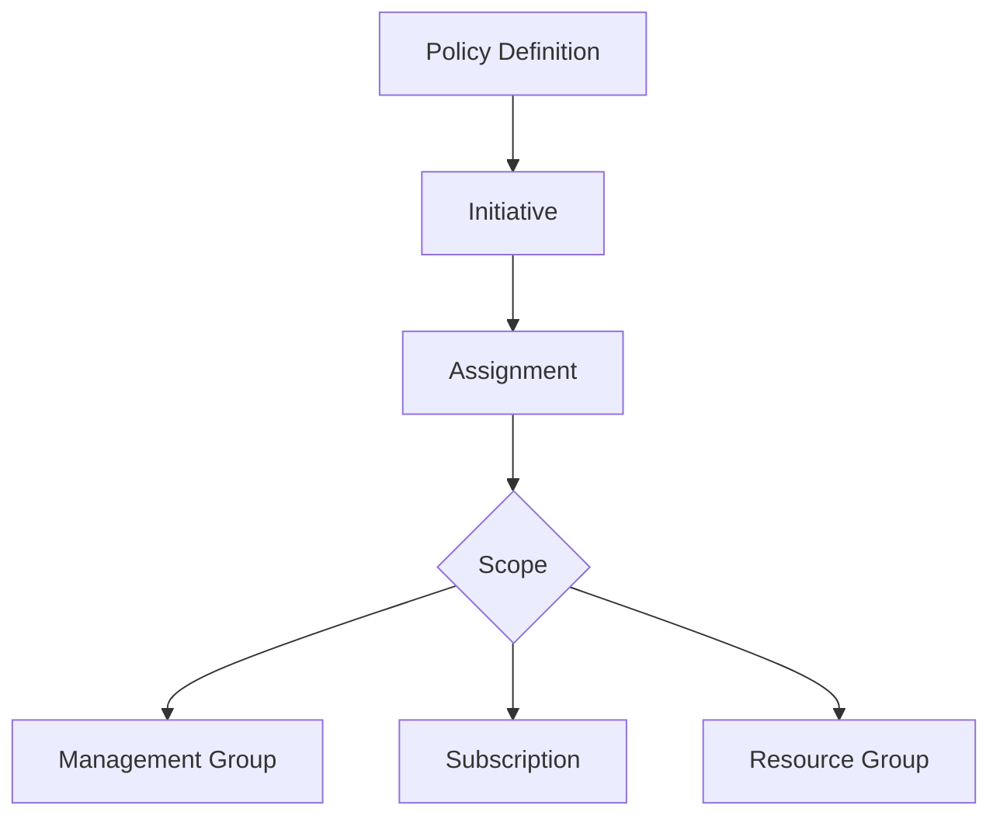

## Role-Based Access Control (RBAC)

RBAC in Azure provides fine-grained access management for Azure resources.

### Components:
- **Security Principal**: User, group, or service principal
- **Role Definition**: Set of permissions
- **Scope**: Boundary for the role assignment
- **Assignment**: Linking of role to principal at a scope

### Best Practices:
- Follow the principle of least privilege
- Use built-in roles when possible
- Assign roles to groups instead of individual users
- Regularly review and audit role assignments

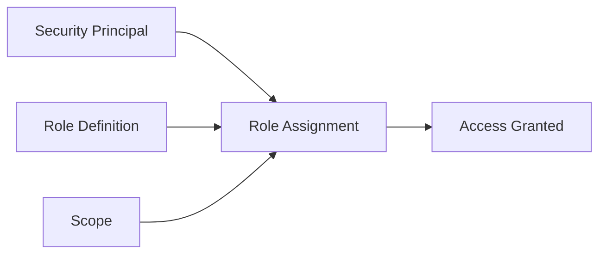

## Azure Cost Management and Billing

Azure Cost Management provides tools for monitoring, allocating, and optimizing cloud spending.

### Key Features:
- **Cost Analysis**: Detailed breakdown of resource costs
- **Budgets**: Set spending limits and alerts
- **Alerts**: Notifications for cost anomalies
- **Recommendations**: Cost optimization suggestions

### Best Practices:
- Set up budgets and alerts for proactive cost management
- Use tags for cost allocation and chargeback
- Leverage Azure Advisor for cost optimization recommendations
- Regularly review and optimize resource usage

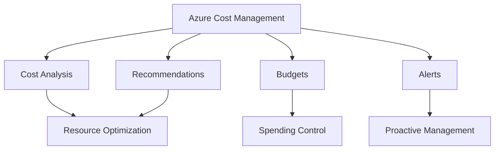

## Azure Resource Graph

Azure Resource Graph provides fast and efficient querying capabilities for Azure resources across subscriptions.

### Key Features:
- Uses Kusto Query Language (KQL)
- Supports complex queries across multiple subscriptions
- Provides near real-time results

### Use Cases:
- Resource inventory and compliance checking
- Security and operational investigations
- Cost optimization queries

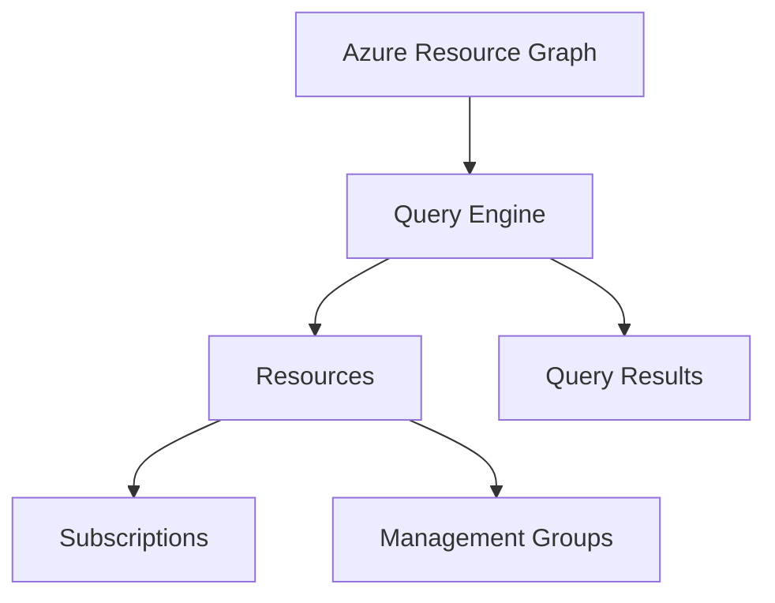

## Azure Advisor

Azure Advisor is a personalized cloud consultant that provides recommendations to optimize Azure deployments.

### Recommendation Categories:
- Cost
- Security
- Reliability
- Performance
- Operational Excellence

### Best Practices:
- Regularly review Advisor recommendations
- Prioritize high-impact suggestions
- Integrate Advisor with other Azure services for automated improvements

```mermaid
flowchart TD
    A[Azure Advisor] --> B[Cost]
    A --> C[Security]
    A --> D[Reliability]
    A --> E[Performance]
    A --> F[Operational Excellence]
    B --> G[Optimization Recommendations]
    C --> G
    D --> G
    E --> G
    F --> G
```

## Conclusion

Effective governance and management are crucial for successful Azure deployments. By leveraging management groups, subscriptions, Azure Policy, RBAC, and cost management tools, organizations can ensure compliance, security, and cost optimization across their Azure environments. Regular use of Azure Advisor and Resource Graph can provide valuable insights and opportunities for improvement.

Azure's governance tools offer a comprehensive approach to managing cloud resources, which is essential in today's complex and rapidly evolving cloud landscapes. Compared to other cloud providers, Azure's integrated governance features provide a robust framework for organizations to maintain control and visibility over their cloud operations.


# Azure Master Class v2 - Module 4 - Resiliency

## Azure Resiliency and Disaster Recovery

This summary provides a comprehensive overview of resiliency and disaster recovery concepts in Azure, focusing on key components, best practices, and tools for ensuring high availability and business continuity.

## Introduction to Azure Resiliency

Resiliency in Azure is critical for ensuring applications and services remain available and can recover quickly from failures. It involves designing systems that can withstand various types of failures and recover gracefully.

### Key Components:
- **Software failures**: Bugs, crashes, memory leaks
- **Hardware failures**: Disk, server, network, power
- **Data corruption**: Accidental or malicious
- **Human errors**: Misconfiguration, insufficient testing

### Importance:
- Ensures business continuity
- Maintains customer trust
- Meets regulatory requirements
- Minimizes financial impact of outages

```mermaid
graph TD
    A[Azure Resiliency] --> B[Software Failures]
    A --> C[Hardware Failures]
    A --> D[Data Corruption]
    A --> E[Human Errors]
    B --> F[Application Design]
    C --> G[Infrastructure Design]
    D --> H[Backup and Recovery]
    E --> I[Process and Automation]
```

## Azure Resiliency Constructs

Azure provides various constructs to help build resilient applications and infrastructure.

### Key Components:
- **Availability Sets**: Logical grouping of VMs for resiliency against rack-level failures
- **Availability Zones**: Physically separate datacenters within an Azure region
- **Regions**: Geographical areas containing one or more datacenters
- **Azure Site Recovery**: Disaster recovery service for VMs and applications

### Best Practices:
- Use Availability Sets for VMs that perform the same function
- Distribute critical workloads across Availability Zones
- Implement multi-region deployments for critical applications
- Regularly test disaster recovery scenarios

```mermaid
graph TD
    A[Azure Resiliency Constructs] --> B[Availability Sets]
    A --> C[Availability Zones]
    A --> D[Regions]
    A --> E[Azure Site Recovery]
    B --> F[Fault Domains]
    B --> G[Update Domains]
    C --> H[Zonal Services]
    C --> I[Zone-redundant Services]
    D --> J[Primary Region]
    D --> K[Secondary Region]
    E --> L[VM Replication]
    E --> M[Application Recovery]
```

## Replication Strategies

Replication is a key component of resiliency, ensuring data and services are available in multiple locations.

### Types of Replication:
- **Synchronous**: Real-time replication with potential performance impact
- **Asynchronous**: Delayed replication with better performance but potential data loss

### Azure Services for Replication:
- **Azure Storage**: Geo-redundant storage (GRS) and read-access geo-redundant storage (RA-GRS)
- **Azure SQL Database**: Active geo-replication and auto-failover groups
- **Azure Cosmos DB**: Multi-region writes

### Considerations:
- Recovery Point Objective (RPO): Acceptable data loss
- Recovery Time Objective (RTO): Acceptable downtime
- Performance impact of replication
- Cost of maintaining replicated resources

```mermaid
flowchart TD
    A[Replication Strategies] --> B[Synchronous]
    A --> C[Asynchronous]
    B --> D[Real-time consistency]
    B --> E[Performance impact]
    C --> F[Better performance]
    C --> G[Potential data loss]
    A --> H[Azure Storage]
    A --> I[Azure SQL Database]
    A --> J[Azure Cosmos DB]
```

## Backup and Recovery

Backup is essential for protecting against data loss and ensuring business continuity.

### Azure Backup Services:
- **Azure Backup**: Backup service for Azure VMs, on-premises servers, and more
- **Azure Site Recovery**: Disaster recovery service for Azure VMs and on-premises workloads

### Key Features:
- Application-consistent backups
- Long-term retention
- Geo-redundant storage for backups
- Backup for hybrid environments

### Best Practices:
- Regularly test backup restoration
- Implement backup encryption
- Use immutable storage for backups to protect against ransomware
- Implement role-based access control (RBAC) for backup management

```mermaid
graph TD
    A[Azure Backup and Recovery] --> B[Azure Backup]
    A --> C[Azure Site Recovery]
    B --> D[VM Backup]
    B --> E[File and Folder Backup]
    B --> F[Application Backup]
    C --> G[VM Replication]
    C --> H[Physical Server Replication]
    C --> I[Failover and Failback]
```

## Multi-Region Deployments

Multi-region deployments are crucial for ensuring high availability and disaster recovery for critical applications.

### Key Components:
- **Traffic Manager**: DNS-based traffic routing for global load balancing
- **Front Door**: Application delivery network for global HTTP/HTTPS routing
- **Cosmos DB**: Global distribution for low-latency data access

### Deployment Patterns:
- Active-Passive: Primary region handles all traffic, secondary region on standby
- Active-Active: Both regions handle traffic simultaneously

### Considerations:
- Data synchronization between regions
- Latency and performance impact
- Cost of maintaining multiple deployments
- Complexity of managing multi-region applications

```mermaid
flowchart TD
    A[Multi-Region Deployment] --> B[Traffic Manager]
    A --> C[Front Door]
    A --> D[Cosmos DB]
    B --> E[DNS-based routing]
    C --> F[HTTP/HTTPS routing]
    D --> G[Global data distribution]
    A --> H[Active-Passive]
    A --> I[Active-Active]
```

## Testing and Monitoring

Regular testing and monitoring are essential for ensuring the effectiveness of resiliency measures.

### Key Components:
- **Azure Monitor**: Platform for collecting and analyzing telemetry data
- **Application Insights**: Application performance management service
- **Azure Chaos Studio**: Service for running controlled experiments on Azure workloads

### Best Practices:
- Implement comprehensive monitoring for all critical components
- Regularly conduct disaster recovery drills
- Use chaos engineering to identify weaknesses in the system
- Continuously review and update resiliency strategies based on test results

```mermaid
graph TD
    A[Testing and Monitoring] --> B[Azure Monitor]
    A --> C[Application Insights]
    A --> D[Azure Chaos Studio]
    B --> E[Log Analytics]
    B --> F[Metrics]
    C --> G[Application Performance]
    C --> H[Usage Analytics]
    D --> I[Fault Injection]
    D --> J[Resilience Validation]
```

Azure's resiliency features provide a robust framework for building highly available and disaster-resistant applications. By leveraging these tools and following best practices, organizations can ensure their services remain available and recoverable in the face of various failures and disasters. Compared to on-premises solutions, Azure offers more flexibility and cost-effective options for implementing resiliency across multiple geographical locations.


# Azure Master Class v2 - Module 5 - Storage

## Azure Storage Overview

Azure Storage provides a suite of cloud storage solutions designed to meet various data storage and access requirements. This section covers the fundamental concepts and services within Azure Storage.

### Key Components

- **Storage Accounts**: The top-level namespace for storage services in Azure
- **Blob Storage**: For unstructured data like files, images, and videos
- **File Storage**: Managed file shares accessible via SMB and NFS protocols
- **Queue Storage**: For message-based communication between application components
- **Table Storage**: NoSQL data store for semi-structured data

### Storage Account Types

- **General Purpose v2 (GPv2)**: Standard multi-service storage account
- **Premium Storage**: High-performance SSD-based storage for specific workloads

### Data Redundancy Options

- **Locally Redundant Storage (LRS)**: Three copies within a single datacenter
- **Zone Redundant Storage (ZRS)**: Three copies across availability zones
- **Geo-Redundant Storage (GRS)**: Six copies across paired regions
- **Geo-Zone Redundant Storage (GZRS)**: Combines ZRS in primary region with GRS

### Access Tiers

- **Hot**: Frequent access, higher storage cost, lower access cost
- **Cool**: Infrequent access, lower storage cost, higher access cost
- **Archive**: Rarely accessed data, lowest storage cost, highest retrieval cost

```mermaid
graph TD
    A[Azure Storage Account] --> B[Blob Storage]
    A --> C[File Storage]
    A --> D[Queue Storage]
    A --> E[Table Storage]
    B --> F[Hot Tier]
    B --> G[Cool Tier]
    B --> H[Archive Tier]
    A --> I[Redundancy Options]
    I --> J[LRS]
    I --> K[ZRS]
    I --> L[GRS]
    I --> M[GZRS]
```

## Blob Storage and Data Lake Storage

Blob Storage is designed for storing large amounts of unstructured data, while Data Lake Storage Gen2 builds on Blob Storage to provide a hierarchical namespace and enhanced analytics capabilities.

### Blob Storage Features

- **Block Blobs**: For storing large objects, ideal for streaming and storing documents
- **Append Blobs**: Optimized for append operations, useful for logging scenarios
- **Page Blobs**: For frequent random read/write operations, used for VM disks

### Data Lake Storage Gen2

- Built on top of Blob Storage
- Provides a true hierarchical file system
- Supports Azure AD-based access control and POSIX permissions
- Optimized for big data analytics workloads

### Key Capabilities

- **Object Level Tiering**: Move individual blobs between access tiers
- **Lifecycle Management**: Automatically move or delete data based on age or access patterns
- **Soft Delete**: Protects against accidental deletion or overwrite
- **Blob Versioning**: Automatically maintain previous versions of blobs

```mermaid
graph TD
    A[Blob Storage] --> B[Block Blobs]
    A --> C[Append Blobs]
    A --> D[Page Blobs]
    A --> E[Data Lake Storage Gen2]
    E --> F[Hierarchical Namespace]
    E --> G[Azure AD Integration]
    E --> H[POSIX ACLs]
    A --> I[Object Level Tiering]
    A --> J[Lifecycle Management]
    A --> K[Soft Delete]
    A --> L[Blob Versioning]
```

## Azure Files and File Sync

Azure Files provides fully managed file shares in the cloud, while Azure File Sync enables hybrid scenarios by synchronizing on-premises file servers with Azure Files.

### Azure Files Features

- Supports SMB and NFS protocols
- Integrates with Azure AD Domain Services for identity-based access control
- Offers snapshot capabilities for point-in-time recovery

### Azure File Sync Capabilities

- Synchronizes multiple on-premises file servers with Azure Files
- Provides cloud tiering to optimize on-premises storage usage
- Enables fast disaster recovery for file servers

### Use Cases

- **Lift and Shift**: Easily migrate on-premises file shares to the cloud
- **Hybrid Storage**: Maintain local access while leveraging cloud storage
- **Backup and Disaster Recovery**: Use Azure Files as a backup target or for quick recovery

```mermaid
graph TD
    A[Azure Files] --> B[SMB Protocol]
    A --> C[NFS Protocol]
    A --> D[Azure AD Integration]
    A --> E[File Share Snapshots]
    A --> F[Azure File Sync]
    F --> G[On-premises File Servers]
    F --> H[Cloud Tiering]
    F --> I[Disaster Recovery]
```

## Managed Disks

Managed Disks provide scalable and highly available block storage for Azure VMs, abstracting the complexities of storage account management.

### Managed Disk Types

- **Standard HDD**: Cost-effective storage for dev/test workloads
- **Standard SSD**: General-purpose SSD storage
- **Premium SSD**: High-performance storage for production workloads
- **Ultra Disk**: Highest performance for data-intensive workloads

### Key Features

- **Availability Sets Alignment**: Ensures disks are placed on separate storage clusters
- **Shared Disks**: Allows multiple VMs to attach to the same managed disk
- **Disk Encryption**: Supports encryption at rest using platform-managed or customer-managed keys
- **Bursting**: Provides temporary performance boost for supported disk types

### Performance Considerations

- IOPS and throughput limits vary based on disk size and type
- Premium SSD v2 and Ultra Disks allow independent scaling of IOPS and throughput

```mermaid
graph TD
    A[Managed Disks] --> B[Standard HDD]
    A --> C[Standard SSD]
    A --> D[Premium SSD]
    A --> E[Ultra Disk]
    A --> F[Availability Sets Alignment]
    A --> G[Shared Disks]
    A --> H[Disk Encryption]
    A --> I[Bursting]
```

## Storage Security and Networking

Azure Storage provides various security and networking features to protect data and control access to storage resources.

### Authentication and Authorization

- **Azure AD Integration**: Supports Azure AD-based access control for fine-grained permissions
- **Shared Access Signatures (SAS)**: Provides time-limited, scoped access to storage resources
- **Storage Account Keys**: Offers full access to storage accounts (use with caution)

### Networking Features

- **Private Endpoints**: Enables access to storage accounts over a private IP address within a VNet
- **Service Endpoints**: Provides optimized routing from VNet subnets to storage services
- **Firewall Rules**: Allows IP-based access restrictions for storage accounts

### Encryption

- **Encryption at Rest**: All data is automatically encrypted using Microsoft-managed keys
- **Customer-Managed Keys**: Allows use of customer-controlled keys for encryption
- **Encryption in Transit**: Enforces secure transfer using HTTPS

```mermaid
graph TD
    A[Storage Security] --> B[Authentication]
    A --> C[Networking]
    A --> D[Encryption]
    B --> E[Azure AD]
    B --> F[SAS]
    B --> G[Account Keys]
    C --> H[Private Endpoints]
    C --> I[Service Endpoints]
    C --> J[Firewall Rules]
    D --> K[Encryption at Rest]
    D --> L[Customer-Managed Keys]
    D --> M[Encryption in Transit]
```

These sections provide a comprehensive overview of Azure Storage services, their key features, and important considerations for implementation and management. The mermaid diagrams visually represent the relationships between different components and features within each main section.

# Azure Master Class v2 - Module 6 - Networking
## Azure Virtual Networks

Azure Virtual Networks (VNets) provide the fundamental networking infrastructure for Azure resources, enabling secure communication and isolation.

### Key Components

- **Address Space**: Defined using CIDR notation (e.g., 10.0.0.0/16)
- **Subnets**: Subdivisions of the VNet address space
- **Network Interface Cards (NICs)**: Connect VMs to subnets
- **Network Security Groups (NSGs)**: Act as a built-in firewall for subnets and NICs

### Features and Capabilities

- **IP Addressing**: Supports both IPv4 and IPv6
- **DNS**: Built-in DNS or custom DNS servers
- **Peering**: Connect VNets within or across regions
- **Service Endpoints**: Secure and direct connectivity to Azure services
- **Private Link**: Private connectivity to Azure PaaS services

### Best Practices

- Plan address spaces carefully to avoid overlaps
- Use NSGs to control traffic flow
- Implement least privilege access
- Utilize service endpoints and private link for enhanced security

```mermaid
graph TD
    A[Azure Virtual Network] --> B[Address Space]
    A --> C[Subnets]
    A --> D[Network Interface Cards]
    A --> E[Network Security Groups]
    A --> F[DNS]
    A --> G[Peering]
    A --> H[Service Endpoints]
    A --> I[Private Link]
    C --> J[Resources]
    D --> K[Virtual Machines]
    E --> L[Security Rules]
```

## Connectivity Options

Azure offers various connectivity options to connect on-premises networks, other cloud providers, and the internet to Azure resources.

### VPN Connections

- **Point-to-Site (P2S)**: Individual device to Azure VNet
- **Site-to-Site (S2S)**: On-premises network to Azure VNet
- **VNet-to-VNet**: Connect Azure VNets in different regions

### ExpressRoute

- Dedicated private connection to Azure
- Higher bandwidth and lower latency than VPN
- Supports private peering and Microsoft peering

### Azure Virtual WAN

- Managed networking service for branch-to-branch connectivity
- Integrates VPN, ExpressRoute, and SD-WAN

### Considerations

- Choose based on bandwidth requirements, security needs, and budget
- Consider using a combination of options for redundancy
- Implement proper routing and firewalls for security

```mermaid
graph TD
    A[Connectivity Options] --> B[VPN Connections]
    A --> C[ExpressRoute]
    A --> D[Azure Virtual WAN]
    B --> E[Point-to-Site]
    B --> F[Site-to-Site]
    B --> G[VNet-to-VNet]
    C --> H[Private Peering]
    C --> I[Microsoft Peering]
    D --> J[Branch-to-Branch]
    D --> K[VPN Integration]
    D --> L[ExpressRoute Integration]
```

## Traffic Control and Security

Azure provides multiple layers of traffic control and security to protect your network resources.

### Network Security Groups (NSGs)

- Stateful firewall for VNets
- Control inbound and outbound traffic
- Apply to subnets or individual NICs

### Azure Firewall

- Managed, cloud-based network security service
- Provides inbound and outbound traffic filtering
- Supports FQDN filtering, network and application rules

### Web Application Firewall (WAF)

- Protects web applications from common exploits
- Can be deployed with Azure Application Gateway or Azure Front Door

### DDoS Protection

- Defends against Distributed Denial of Service attacks
- Available in Basic (free) and Standard tiers

### Best Practices

- Implement defense in depth with multiple security layers
- Use NSGs as a first line of defense
- Utilize Azure Firewall for advanced filtering and logging
- Enable DDoS Protection Standard for critical workloads

```mermaid
graph TD
    A[Traffic Control and Security] --> B[Network Security Groups]
    A --> C[Azure Firewall]
    A --> D[Web Application Firewall]
    A --> E[DDoS Protection]
    B --> F[Inbound Rules]
    B --> G[Outbound Rules]
    C --> H[FQDN Filtering]
    C --> I[Threat Intelligence]
    D --> J[OWASP Protection]
    E --> K[Volumetric Attacks]
    E --> L[Protocol Attacks]
```

## Azure DNS and Name Resolution

Azure provides both public and private DNS services to manage domain names for Azure resources and external domains.

### Azure Public DNS

- Hosts your public domain names
- Supports A, AAAA, CNAME, MX, NS, SOA, SRV, and TXT records
- High availability and global distribution

### Azure Private DNS

- Name resolution for VNets
- Automatic registration of VMs
- Split-horizon DNS support

### Azure DNS Private Resolver

- Custom DNS forwarding
- Enables hybrid DNS scenarios
- Supports inbound and outbound endpoints

### Best Practices

- Use Azure Private DNS for internal name resolution
- Implement DNS Private Resolver for hybrid scenarios
- Secure DNS zones with Azure RBAC
- Regularly audit and monitor DNS records

```mermaid
graph TD
    A[Azure DNS] --> B[Public DNS]
    A --> C[Private DNS]
    A --> D[DNS Private Resolver]
    B --> E[Public Domain Hosting]
    C --> F[VNet Name Resolution]
    C --> G[Automatic VM Registration]
    D --> H[Custom DNS Forwarding]
    D --> I[Hybrid DNS Scenarios]
    D --> J[Inbound Endpoints]
    D --> K[Outbound Endpoints]
```

This summary provides an overview of key Azure networking concepts, including Virtual Networks, connectivity options, traffic control and security, and DNS services. Each section includes important features, best practices, and a mermaid diagram to visualize the relationships between components. The information is structured to give Azure Solutions Architects a comprehensive understanding of networking capabilities in Azure, enabling them to design and implement secure and efficient network architectures.


# Azure Master Class v2 - Module 7 - VM and VMSS
## Azure Virtual Machines

Azure Virtual Machines (VMs) are a fundamental Infrastructure-as-a-Service (IaaS) offering in Azure, providing scalable computing resources on-demand.

### Key Components and Concepts

- **VM Series and Sizes**: Different VM types optimized for various workloads (e.g., general purpose, compute-optimized, memory-optimized)
- **VM Generations**: Gen1 (BIOS-based) and Gen2 (UEFI-based) VMs
- **Disks**: OS disks, data disks, and temporary storage
- **Networking**: Virtual network integration, network interfaces, and public IPs
- **Extensions**: Additional capabilities and configurations for VMs

### Features and Capabilities

- **Availability options**: Availability Sets and Availability Zones for high availability
- **Scaling**: Manual scaling or auto-scaling with VM Scale Sets
- **Security**: Network Security Groups, Azure Security Center integration
- **Monitoring**: Azure Monitor integration for performance tracking and diagnostics

### Best Practices

- Choose the appropriate VM size based on workload requirements
- Use Managed Disks for simplified storage management
- Implement proper backup and disaster recovery strategies
- Utilize Azure Hybrid Benefit for cost savings on Windows Server VMs

```mermaid
graph TD
    A[Azure Virtual Machine] --> B[VM Series/Size]
    A --> C[VM Generation]
    A --> D[Disks]
    A --> E[Networking]
    A --> F[Extensions]
    D --> G[OS Disk]
    D --> H[Data Disks]
    D --> I[Temporary Storage]
    E --> J[Virtual Network]
    E --> K[Network Interface]
    E --> L[Public IP]
```

## VM Scale Sets

VM Scale Sets enable you to manage and scale multiple identical VMs as a single resource.

### Key Features

- **Auto-scaling**: Automatically adjust the number of VM instances based on demand
- **Load balancing**: Built-in load balancing for distributed applications
- **High availability**: Spread VMs across fault domains and availability zones
- **Large-scale applications**: Support for up to 1,000 VM instances per scale set

### Scaling Options

- **Horizontal scaling**: Add or remove VM instances
- **Vertical scaling**: Increase or decrease VM size
- **Scheduled scaling**: Set up scaling rules based on time of day or week

### Best Practices

- Use application health probes for accurate scaling decisions
- Implement proper monitoring and alerting for scale events
- Consider using multiple scale sets for different application tiers

```mermaid
graph TD
    A[VM Scale Set] --> B[Auto-scaling]
    A --> C[Load Balancing]
    A --> D[High Availability]
    B --> E[Horizontal Scaling]
    B --> F[Vertical Scaling]
    B --> G[Scheduled Scaling]
    D --> H[Fault Domains]
    D --> I[Availability Zones]
```

## Azure Compute Gallery

Azure Compute Gallery (formerly Shared Image Gallery) is a service for storing and managing VM images and applications.

### Key Components

- **Image definitions**: Metadata about the image, including OS type, publisher, and version
- **Image versions**: Specific builds of an image
- **Applications**: VM applications that can be deployed alongside VMs

### Features and Capabilities

- **Replication**: Replicate images across regions for faster deployment
- **Versioning**: Manage multiple versions of images
- **Sharing**: Share images across subscriptions and Azure AD tenants

### Best Practices

- Use image definitions to organize and categorize images
- Implement proper versioning strategy for image updates
- Leverage replication for improved deployment performance in multi-region scenarios

```mermaid
graph TD
    A[Azure Compute Gallery] --> B[Image Definitions]
    A --> C[Image Versions]
    A --> D[Applications]
    B --> E[OS Type]
    B --> F[Publisher]
    C --> G[Replication]
    C --> H[Versioning]
    D --> I[VM Extensions]
```

## VM Management and Maintenance

Proper management and maintenance of VMs are crucial for ensuring optimal performance, security, and cost-efficiency.

### Key Management Tasks

- **Patching**: Regular OS and application updates
- **Monitoring**: Performance tracking and diagnostics
- **Backup**: Regular backups of VM data and configurations
- **Security**: Implementing security measures and best practices

### Azure Automation Options

- **Azure Automation**: Automate common management tasks
- **Azure Update Management**: Centralized update management for VMs
- **Azure Monitor**: Comprehensive monitoring and alerting solution

### Best Practices

- Implement a robust patching strategy
- Use Azure Backup for regular VM backups
- Leverage Azure Security Center for security recommendations and compliance

```mermaid
graph TD
    A[VM Management] --> B[Patching]
    A --> C[Monitoring]
    A --> D[Backup]
    A --> E[Security]
    B --> F[Azure Update Management]
    C --> G[Azure Monitor]
    D --> H[Azure Backup]
    E --> I[Azure Security Center]
```

This summary provides an overview of key concepts related to Azure Virtual Machines, VM Scale Sets, Azure Compute Gallery, and VM management best practices. These components form the foundation of many Azure services and are crucial for building scalable and resilient cloud applications. Understanding these concepts is essential for Azure Solutions Architects to design effective and efficient cloud infrastructures.


# Azure Master Class v2 - Module 8 - App Services
## Container Technology

### Introduction
Containers are the next stage in virtualization, allowing multiple isolated applications to run on the same OS instance.

### Key Components
- **Container Runtime**: Manages container lifecycle (e.g., ContainerD)
- **Container Image**: Layered file system for application and dependencies
- **Container Host**: The underlying OS running the container runtime

### Comparison: Containers vs. Virtual Machines
- Containers virtualize the OS, while VMs virtualize hardware
- Containers share the host OS kernel, resulting in lighter resource usage
- Containers offer faster startup times and higher density

### Best Practices
- Use containers for stateless applications
- Implement proper isolation and security measures
- Leverage container orchestration for production workloads

```mermaid
graph TD
    A[Container Technology] --> B[Container Runtime]
    A --> C[Container Image]
    A --> D[Container Host]
    B --> E[ContainerD]
    C --> F[Base Layer]
    C --> G[Application Layer]
    C --> H[Read-Write Layer]
    D --> I[Host OS]
    D --> J[Container Engine]
```

## Azure Container Instances (ACI)

### Introduction
Azure Container Instances is the fastest and simplest way to run containers in Azure without managing servers.

### Key Features
- Fast startup times
- Per-second billing
- Persistent storage options
- Support for both Windows and Linux containers

### Use Cases
- Simple applications
- Task automation
- Build jobs

### Considerations
- Limited orchestration capabilities
- Not suitable for complex multi-container applications

```mermaid
graph TD
    A[Azure Container Instances] --> B[Fast Startup]
    A --> C[Per-second Billing]
    A --> D[Persistent Storage]
    A --> E[Windows/Linux Support]
    A --> F[Use Cases]
    F --> G[Simple Apps]
    F --> H[Task Automation]
    F --> I[Build Jobs]
```

## Azure Kubernetes Service (AKS)

### Introduction
Azure Kubernetes Service is a managed Kubernetes offering that simplifies container orchestration and management.

### Key Components
- **Control Plane**: Managed by Azure (API server, scheduler, etc.)
- **Node Pools**: Worker nodes running containerized applications
- **Pods**: Smallest deployable units in Kubernetes

### Features
- Automated upgrades and scaling
- Integration with Azure AD for authentication
- Advanced networking options (e.g., CNI, kubenet)

### Best Practices
- Implement proper resource requests and limits
- Use namespaces for logical separation of resources
- Leverage Helm charts for application deployment

```mermaid
graph TD
    A[Azure Kubernetes Service] --> B[Control Plane]
    A --> C[Node Pools]
    A --> D[Pods]
    B --> E[API Server]
    B --> F[Scheduler]
    C --> G[Worker Node 1]
    C --> H[Worker Node 2]
    D --> I[Container 1]
    D --> J[Container 2]
```

## Azure Container Apps

### Introduction
Azure Container Apps is a fully managed environment for running microservices and containerized applications.

### Key Features
- Built on top of AKS, but abstracts Kubernetes complexity
- Integrated with Dapr (Distributed Application Runtime)
- KEDA-powered autoscaling
- Envoy proxy for advanced networking features

### Use Cases
- Microservices architectures
- Event-driven applications
- API backends

### Considerations
- Less control over underlying infrastructure compared to AKS
- May have limitations for highly customized Kubernetes workloads

```mermaid
graph TD
    A[Azure Container Apps] --> B[AKS Foundation]
    A --> C[Dapr Integration]
    A --> D[KEDA Autoscaling]
    A --> E[Envoy Proxy]
    B --> F[Abstracted Kubernetes]
    C --> G[Service Invocation]
    C --> H[State Management]
    D --> I[Event-driven Scaling]
    E --> J[Traffic Splitting]
```

## Azure App Service

### Introduction
Azure App Service is a fully managed platform for building, deploying, and scaling web apps.

### Key Components
- **App Service Plan**: Defines the compute resources for your apps
- **Web App**: The actual application running on App Service
- **Deployment Slots**: Facilitates staging and testing of new versions

### Features
- Support for multiple languages and frameworks
- Built-in CI/CD integration
- Custom domain and SSL support
- Automatic scaling options

### Best Practices
- Use deployment slots for zero-downtime updates
- Implement App Service Environment for network isolation
- Leverage App Service Diagnostics for troubleshooting

```mermaid
graph TD
    A[Azure App Service] --> B[App Service Plan]
    A --> C[Web App]
    A --> D[Deployment Slots]
    B --> E[Compute Resources]
    C --> F[Runtime Stack]
    C --> G[Application Code]
    D --> H[Production Slot]
    D --> I[Staging Slot]
```

## Azure Functions

### Introduction
Azure Functions is a serverless compute service that enables running event-driven code without managing infrastructure.

### Key Features
- Support for multiple programming languages
- Flexible scaling options (Consumption and Premium plans)
- Extensive binding system for easy integration with other services
- Durable Functions for long-running workflows

### Use Cases
- Real-time data processing
- IoT data handling
- Microservices implementation
- Scheduled tasks

### Best Practices
- Keep functions focused and small
- Use dependency injection for better testability
- Implement proper error handling and logging

```mermaid
graph TD
    A[Azure Functions] --> B[Event Triggers]
    A --> C[Function App]
    A --> D[Bindings]
    B --> E[HTTP Trigger]
    B --> F[Timer Trigger]
    B --> G[Queue Trigger]
    C --> H[Function 1]
    C --> I[Function 2]
    D --> J[Input Binding]
    D --> K[Output Binding]
```

## Azure Logic Apps

### Introduction
Azure Logic Apps is a cloud service that helps you automate workflows and processes across applications and services.

### Key Components
- **Workflow Designer**: Visual tool for creating logic apps
- **Connectors**: Pre-built components for integrating with various services
- **Triggers**: Events that start a workflow
- **Actions**: Tasks performed within a workflow

### Features
- No-code/low-code development
- Built-in error handling and retry logic
- Integration with Azure services and external APIs
- Support for long-running workflows

### Use Cases
- Business process automation
- System integration
- Data orchestration

```mermaid
graph TD
    A[Azure Logic Apps] --> B[Workflow Designer]
    A --> C[Connectors]
    A --> D[Triggers]
    A --> E[Actions]
    B --> F[Visual Workflow]
    C --> G[Azure Services]
    C --> H[Third-party APIs]
    D --> I[HTTP Trigger]
    D --> J[Recurrence Trigger]
    E --> K[Data Manipulation]
    E --> L[Service Calls]
```

## Azure Static Web Apps

### Introduction
Azure Static Web Apps is a service that automatically builds and deploys full stack web apps to Azure from a code repository.

### Key Features
- Integrated CI/CD with GitHub or Azure DevOps
- Built-in authentication providers
- Globally distributed content for fast delivery
- Optional integration with Azure Functions for API support

### Use Cases
- Single Page Applications (SPAs)
- Static content websites
- Progressive Web Apps (PWAs)

### Best Practices
- Implement proper caching strategies
- Use custom domains and free SSL certificates
- Leverage staging environments for testing

```mermaid
graph TD
    A[Azure Static Web Apps] --> B[Source Code Repository]
    A --> C[Build Process]
    A --> D[Global Content Delivery]
    A --> E[Authentication]
    B --> F[GitHub]
    B --> G[Azure DevOps]
    C --> H[Frontend Build]
    C --> I[API Build]
    E --> J[Built-in Auth Providers]
    E --> K[Custom Auth]
```

This summary provides an overview of the key Azure services related to containerization, serverless computing, and web application hosting. Each section highlights the main components, features, and best practices associated with the respective service, along with mermaid diagrams to visualize the relationships between different elements.


# Azure Master Class v2 - Module 9 - Database & A.I.
## Types of Data Structures

### Introduction
This section covers the various data structures used in Azure databases, including relational and non-relational models.

### Key Points
- **Relational Data**: Structured data following a schema, typically used for OLTP (Online Transaction Processing)
- **Non-Relational Data**: Flexible data structures, often referred to as NoSQL databases
- **Unstructured Data**: Raw data without a predefined schema, such as media files or documents

### Technical Details
1. Relational Data:
   - Uses tables with defined schemas
   - Normalizes data to reduce redundancy
   - Supports ACID transactions
   - Examples: SQL Server, PostgreSQL, MySQL

2. Non-Relational Data:
   - Document databases (e.g., JSON, XML)
   - Key-value stores
   - Columnar databases
   - Graph databases

3. Unstructured Data:
   - Binary Large Objects (BLOBs)
   - Media files (JPEG, MP4, etc.)
   - Text documents (PDF, DOCX, etc.)

### Best Practices
- Choose the appropriate data structure based on the application's requirements
- Consider scalability and performance needs when selecting a data model
- Use relational databases for complex transactions and data integrity
- Leverage non-relational databases for flexibility and scalability in big data scenarios

```mermaid
graph TD
    A[Data Structures in Azure] --> B[Relational Data]
    A --> C[Non-Relational Data]
    A --> D[Unstructured Data]
    B --> E[Tables]
    B --> F[Schemas]
    B --> G[Normalization]
    C --> H[Document DB]
    C --> I[Key-Value]
    C --> J[Columnar]
    C --> K[Graph]
    D --> L[BLOBs]
    D --> M[Media Files]
    D --> N[Documents]
```

## Azure Database Services

### Introduction
Azure offers a wide range of database services to cater to various data storage and processing needs.

### Key Points
- **SQL Server-based**: Azure SQL Database, Azure SQL Managed Instance
- **Open-source**: Azure Database for PostgreSQL, MySQL, and MariaDB
- **NoSQL**: Azure Cosmos DB
- **Data Warehousing**: Azure Synapse Analytics

### Technical Details
1. Azure SQL Database:
   - Fully managed PaaS offering
   - High compatibility with SQL Server
   - Supports single databases, elastic pools, and hyperscale

2. Azure SQL Managed Instance:
   - Near 100% compatibility with on-premises SQL Server
   - VNET integration for enhanced security
   - Supports SQL Agent, CLR, and other advanced features

3. Azure Database for PostgreSQL/MySQL:
   - Flexible server option for more control
   - Supports high availability and read replicas
   - Built-in security features and encryption

4. Azure Cosmos DB:
   - Multi-model database (document, key-value, graph, column-family)
   - Global distribution with multi-region writes
   - Configurable consistency levels

5. Azure Synapse Analytics:
   - Integrated analytics platform
   - Combines data warehousing, big data analytics, and data integration

### Best Practices
- Use managed services to reduce operational overhead
- Implement proper security measures, including encryption and network isolation
- Leverage built-in high availability and disaster recovery features
- Choose the appropriate service tier based on performance and scalability requirements

```mermaid
graph TD
    A[Azure Database Services] --> B[SQL Server-based]
    A --> C[Open-source]
    A --> D[NoSQL]
    A --> E[Data Warehousing]
    B --> F[Azure SQL Database]
    B --> G[Azure SQL Managed Instance]
    C --> H[Azure Database for PostgreSQL]
    C --> I[Azure Database for MySQL]
    C --> J[Azure Database for MariaDB]
    D --> K[Azure Cosmos DB]
    E --> L[Azure Synapse Analytics]
```

## Data Flow and Analytics

### Introduction
This section covers the process of data flow, from ingestion to analysis, in Azure.

### Key Points
- **ETL/ELT**: Extract, Transform, Load / Extract, Load, Transform processes
- **Data Lake**: Azure Data Lake Storage Gen2 for raw data storage
- **Data Factory**: Orchestration and data movement service
- **Synapse Analytics**: Integrated analytics service
- **Power BI**: Business intelligence and data visualization tool

### Technical Details
1. Data Ingestion:
   - Batch processing for large volumes of data
   - Stream processing for real-time data using Azure Event Hubs or IoT Hub

2. Data Storage:
   - Azure Data Lake Storage Gen2 for raw data
   - Azure Blob Storage for unstructured data
   - Azure SQL Database or Cosmos DB for structured/semi-structured data

3. Data Processing:
   - Azure Databricks for big data processing and machine learning
   - Azure HDInsight for Hadoop-based analytics
   - Azure Stream Analytics for real-time data processing

4. Data Warehousing:
   - Azure Synapse Analytics for large-scale data warehousing
   - Supports both serverless and dedicated SQL pools

5. Data Visualization:
   - Power BI for creating interactive dashboards and reports
   - Integration with Azure Synapse Analytics for seamless data exploration

### Best Practices
- Implement a data governance strategy to ensure data quality and compliance
- Use Azure Data Factory for orchestrating complex data workflows
- Leverage Azure Synapse Analytics for unified data warehousing and big data analytics
- Implement proper security measures throughout the data pipeline
- Optimize data storage and processing for cost-effectiveness

```mermaid
graph LR
    A[Data Sources] --> B[Data Ingestion]
    B --> C[Data Lake]
    C --> D[Data Processing]
    D --> E[Data Warehouse]
    E --> F[Analytics & Visualization]
    G[Azure Data Factory] --> B
    G --> C
    G --> D
    G --> E
```

## Artificial Intelligence and Machine Learning

### Introduction
Azure provides a comprehensive suite of AI and ML services for building intelligent applications.

### Key Points
- **Azure Cognitive Services**: Pre-built AI models for vision, speech, language, and decision-making
- **Azure Machine Learning**: End-to-end ML platform for building, training, and deploying models
- **Azure OpenAI Service**: Integration of OpenAI's powerful language models

### Technical Details
1. Azure Cognitive Services:
   - Computer Vision: Image analysis, object detection, OCR
   - Speech Services: Speech-to-text, text-to-speech, translation
   - Language Understanding: Natural language processing, sentiment analysis
   - Decision: Anomaly detection, content moderation

2. Azure Machine Learning:
   - Automated ML for model selection and hyperparameter tuning
   - MLOps capabilities for CI/CD of ML models
   - Integration with popular ML frameworks (TensorFlow, PyTorch, etc.)

3. Azure OpenAI Service:
   - GPT-3.5 for natural language generation
   - Codex for code generation and completion
   - DALL-E 2 for image generation from text descriptions

### Best Practices
- Start with pre-built Cognitive Services for quick implementation of AI capabilities
- Use Azure Machine Learning for custom model development and deployment
- Implement responsible AI practices, including fairness, transparency, and privacy
- Leverage Azure OpenAI Service for advanced language models while adhering to usage guidelines
- Monitor and optimize AI/ML models for performance and cost-effectiveness

```mermaid
graph TD
    A[Azure AI & ML Services] --> B[Cognitive Services]
    A --> C[Azure Machine Learning]
    A --> D[Azure OpenAI Service]
    B --> E[Vision]
    B --> F[Speech]
    B --> G[Language]
    B --> H[Decision]
    C --> I[AutoML]
    C --> J[MLOps]
    C --> K[Custom Models]
    D --> L[GPT-3.5]
    D --> M[Codex]
    D --> N[DALL-E 2]
```

This summary provides an overview of the key concepts discussed in the transcript, focusing on Azure's database services, data structures, data flow and analytics, and AI/ML capabilities. The information is structured to highlight the main components, technical details, and best practices for each topic, along with mermaid diagrams to visualize the relationships between different elements.


# Azure Master Class v2 - Module 10 - Monitoring & Security

## Azure Monitoring

### Introduction
Azure Monitoring is a comprehensive solution for collecting, analyzing, and acting on telemetry from Azure and on-premises environments. It helps ensure high availability and performance of applications and services.

### Key Components

1. **Azure Monitor**: The core platform for all monitoring data
2. **Log Analytics**: A tool for querying and analyzing log data
3. **Application Insights**: Application Performance Management (APM) service
4. **Metrics**: Time-series database for storing numerical data
5. **Diagnostic Settings**: Configuration for routing platform logs and metrics

### Technical Details

- **Data Sources**:
  - Activity Log: Subscription-level events
  - Resource Logs: Resource-level diagnostic information
  - Guest OS: Data from within VMs or other compute resources
  - Application: Custom application telemetry

- **Data Types**:
  - Metrics: Numerical values stored in a time-series database
  - Logs: Text-based data stored in Log Analytics

- **Azure Monitor Agent (AMA)**: Latest agent for collecting monitoring data, replacing older agents like Log Analytics agent and Telegraf

- **Data Collection Rules (DCRs)**: Define what data to collect and where to send it

### Best Practices

- Implement a comprehensive monitoring strategy across all resources
- Use Azure Policy to enforce consistent monitoring configuration
- Leverage Auto-scaling based on monitoring data
- Implement proper retention policies to manage costs

```mermaid
graph TD
    A[Azure Monitor] --> B[Metrics]
    A --> C[Logs]
    A --> D[Application Insights]
    B --> E[Azure Monitor Metrics]
    C --> F[Log Analytics]
    D --> G[APM Service]
    A --> H[Azure Monitor Agent]
    H --> I[Data Collection Rules]
    I --> F
    I --> E
```

## Azure Security

### Introduction
Azure Security is a multi-layered approach to protect cloud resources, data, and applications. It encompasses various services and best practices to ensure a secure cloud environment.

### Key Components

1. **Microsoft Defender for Cloud**: Cloud Security Posture Management (CSPM) and Cloud Workload Protection Platform (CWPP)
2. **Azure Active Directory (AD)**: Identity and access management service
3. **Azure Key Vault**: Secure storage for secrets, keys, and certificates
4. **Azure Firewall**: Cloud-native firewall as a service
5. **Azure Sentinel**: Cloud-native SIEM and SOAR solution

### Technical Details

- **Zero Trust Model**: 
  - Verify explicitly
  - Use least privilege access
  - Assume breach

- **Microsoft Defender for Cloud**:
  - Free tier: Basic CSPM features
  - Paid tier: Advanced threat protection for various Azure services

- **Managed Identities**:
  - System-assigned: Tied to a specific Azure resource
  - User-assigned: Can be shared across multiple resources

- **Azure Key Vault**:
  - Supports secrets, keys, and certificates
  - Integrates with Azure AD for access control
  - Offers automated rotation for keys and secrets

### Best Practices

- Implement the principle of least privilege
- Use Multi-Factor Authentication (MFA) for all accounts
- Encrypt data at rest and in transit
- Regularly review and update security policies
- Implement Just-In-Time (JIT) VM access

```mermaid
graph TD
    A[Azure Security] --> B[Microsoft Defender for Cloud]
    A --> C[Azure Active Directory]
    A --> D[Azure Key Vault]
    A --> E[Azure Firewall]
    A --> F[Azure Sentinel]
    B --> G[CSPM]
    B --> H[CWPP]
    C --> I[Identity Management]
    C --> J[Access Control]
    D --> K[Secrets]
    D --> L[Keys]
    D --> M[Certificates]
    F --> N[SIEM]
    F --> O[SOAR]
```

## Azure Alerting and Action Groups

### Introduction
Azure Alerting helps proactively notify administrators about important events or conditions in the Azure environment. Action Groups define a set of actions to take when an alert is triggered.

### Key Components

1. **Alert Rules**: Define conditions that trigger alerts
2. **Action Groups**: Specify actions to take when alerts fire
3. **Alert Processing Rules**: Control how alerts are handled

### Technical Details

- **Alert Types**:
  - Metric Alerts: Based on resource performance metrics
  - Log Alerts: Based on Log Analytics queries
  - Activity Log Alerts: Based on Azure subscription events

- **Action Types**:
  - Email, SMS, Push notifications
  - Azure Functions
  - Logic Apps
  - Webhook
  - ITSM connection

- **Alert Processing Rules**:
  - Apply actions to multiple alerts
  - Suppress alerts during maintenance windows

### Best Practices

- Use dynamic thresholds for metric alerts where possible
- Implement proper alert severity levels
- Use Action Groups for consistent alert handling
- Regularly review and optimize alert configurations

```mermaid
graph TD
    A[Azure Alerting] --> B[Alert Rules]
    A --> C[Action Groups]
    A --> D[Alert Processing Rules]
    B --> E[Metric Alerts]
    B --> F[Log Alerts]
    B --> G[Activity Log Alerts]
    C --> H[Notifications]
    C --> I[Automated Actions]
    D --> J[Apply Actions]
    D --> K[Suppress Alerts]
```

## Azure Sentinel

### Introduction
Azure Sentinel is a cloud-native Security Information and Event Management (SIEM) and Security Orchestration Automated Response (SOAR) solution. It provides intelligent security analytics across the enterprise.

### Key Components

1. **Data Connectors**: Ingest data from various sources
2. **Workbooks**: Interactive reports and dashboards
3. **Analytics**: Correlation rules and anomaly detection
4. **Incident Management**: Investigate and respond to security incidents
5. **Hunting**: Proactively search for threats
6. **SOAR**: Automate response to threats

### Technical Details

- Built on top of Log Analytics workspace
- Uses Kusto Query Language (KQL) for data analysis
- Supports integration with Microsoft 365 Defender
- Offers Machine Learning models for anomaly detection

### Best Practices

- Implement a comprehensive data ingestion strategy
- Regularly update and tune analytics rules
- Use automation playbooks for common response scenarios
- Conduct regular threat hunting exercises
- Integrate with existing security tools and processes

```mermaid
graph TD
    A[Azure Sentinel] --> B[Data Connectors]
    A --> C[Workbooks]
    A --> D[Analytics]
    A --> E[Incident Management]
    A --> F[Hunting]
    A --> G[SOAR]
    B --> H[Azure Services]
    B --> I[Third-party Sources]
    D --> J[Correlation Rules]
    D --> K[Anomaly Detection]
    G --> L[Playbooks]
    G --> M[Automation]
```

These sections provide a comprehensive overview of Azure's monitoring and security capabilities, highlighting the key components, technical details, and best practices for each area. The mermaid diagrams visually represent the relationships between different components within each section, making it easier to understand the overall structure of these Azure services.

# Azure Master Class v2 - Module 11 - IaC & DevOps
