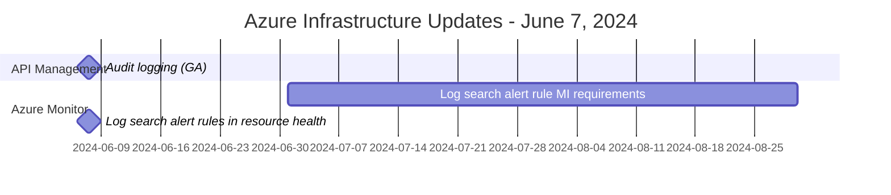

API Management:
1. Audit logging (GA)
   - Captures user actions like sign-in, sign-out, API viewing, and testing
   - Can be configured via diagnostic settings to send data to storage accounts, event hubs, or log analytics workspaces

Azure Monitor:
1. Log search alert rule managed identity requirements
   - Requires setting up a managed identity for log search alert rules using linked storage accounts
   - Affects new rules from July 2024 and all existing rules from September 2024
2. Log search alert rules in resource health
   - Enables checking the health status of log search alert rules using the activity log
   - Allows creation of alerts for unhealthy log search alert rules