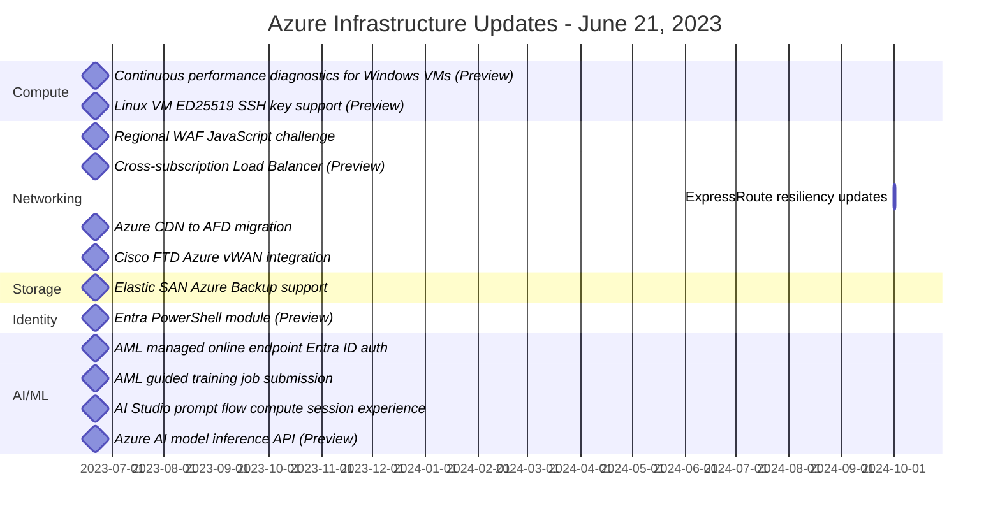

For the June 21, 2024 update:

Compute:
1. Continuous performance diagnostics for Windows VMs (Preview)
   - Monitors performance every 5 seconds, outputs data every 5 minutes to a storage account
2. Linux VM ED25519 SSH key support (Preview)
   - Allows use of ED25519 SSH keys for improved security and performance

Networking:
1. Regional WAF JavaScript challenge
   - Implements JavaScript challenge to defeat bots for App Gateway WAF
2. Cross-subscription Load Balancer (Preview)
   - Enables load balancer components to be in different subscriptions
3. ExpressRoute resiliency updates
   - Changes SLAs for different ExpressRoute connectivity options
4. Azure CDN to AFD migration
   - Enables zero-downtime migration from Azure CDN to Azure Front Door
5. Cisco FTD Azure vWAN integration
   - Allows deployment of Cisco Firepower Threat Defense in virtual WAN instances

Storage:
1. Elastic SAN Azure Backup support
   - Enables crash-consistent backups of elastic SAN volumes

Identity:
1. Entra PowerShell module (Preview)
   - New PowerShell module focused on Entra-specific scenarios

AI/ML:
1. AML managed online endpoint Entra ID auth
   - Enables Entra ID integrated authentication for Azure Machine Learning managed online endpoints
2. AML guided training job submission
   - Provides guided experience for submitting training jobs in Azure Machine Learning
3. AI Studio prompt flow compute session experience
   - Allows creation and management of prompt flow compute sessions in Azure AI Studio
4. Azure AI model inference API (Preview)
   - Provides uniform way to interact with various AI models