## Mermaid Examples
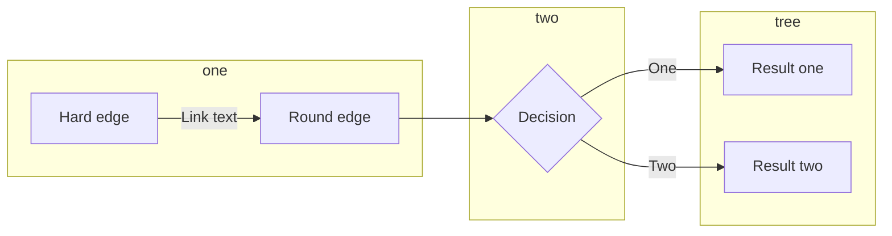

### Group Services together
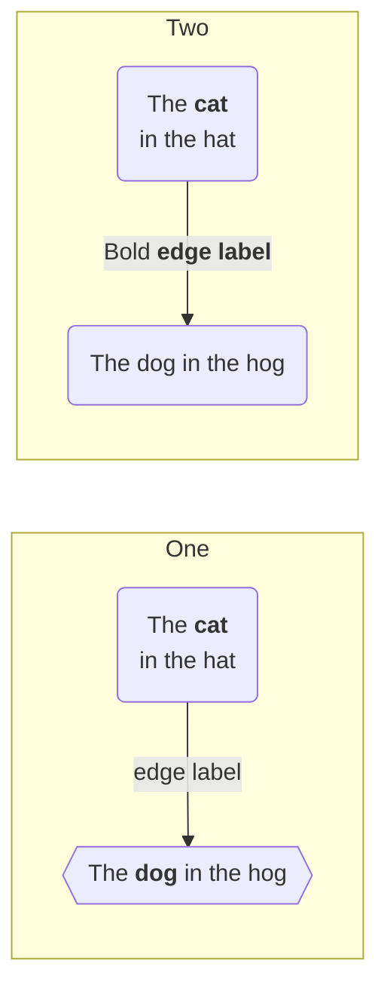

# icons 
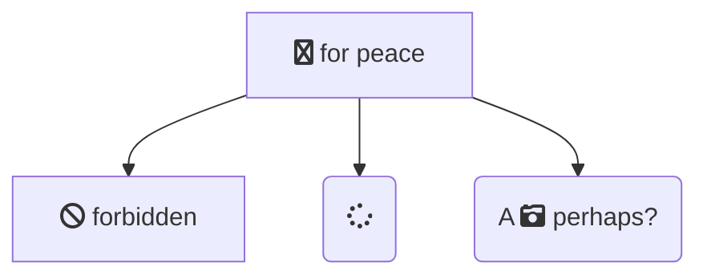

```powershell
Write-Host "test"
```

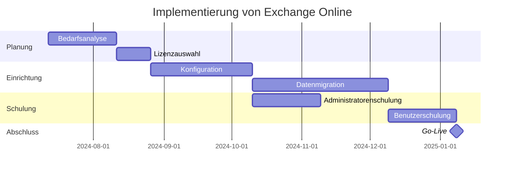
### Mermaid Example with all concepts
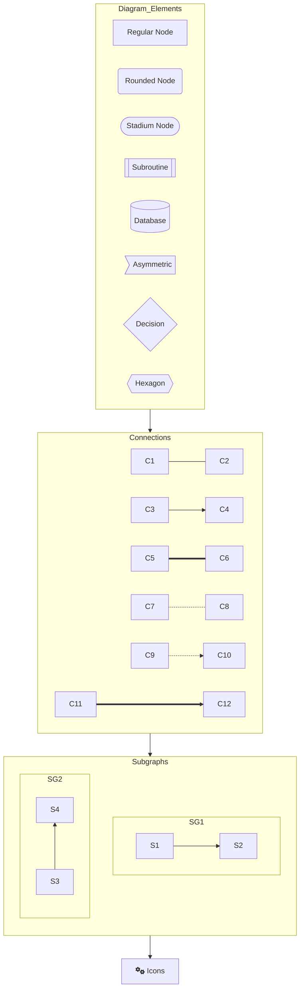

#### State Diagram
- Gute geeignet für technische Zeichnungen
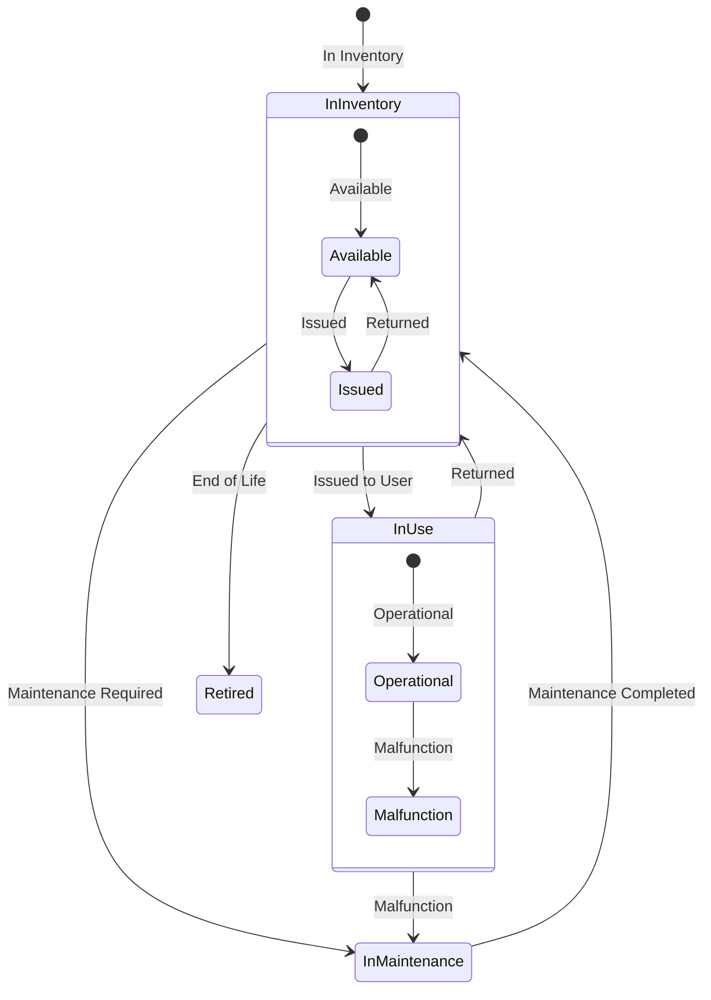

### Promtpt for technical drawings:
- Empfehlung Claude AI
- geht auch mit gpt-4o

Schritt 1: 
Fasse diesen Artikel in Strichpunkten zusammen

Schritt 2: Generieren Sie strukturierte JSON-Daten für ein interaktives Diagramm basierend auf meiner Dokumentation. Erfassen Sie folgende Elemente:

1. Dienste: Identifizieren Sie alle Dienste/Komponenten mit eindeutigen IDs.
2. Verbindungen: Erfassen Sie Abhängigkeiten zwischen Diensten.
3. Funktionen: Listen Sie Hauptfunktionen jedes Dienstes auf.
4. Warnungen: Notieren Sie fehlende Funktionen oder Einschränkungen.
5. Metadaten: Fügen Sie relevante Zusatzinformationen hinzu (Version, Datum, Verantwortliche).
Verwenden Sie dieses JSON-Format:
```json
{
  "services": [
    {
      "id": "service_id",
      "name": "Service Name",
      "description": "Kurzbeschreibung",
      "functions": [{"category": "Kategorie", "description": "Funktionsbeschreibung"}],
      "warnings": ["Warnung zu Einschränkungen"],
     "Team A"}
    }
  ],
  "connections": [
    {
      "source": "quell_service_id",
      "target": "ziel_service_id",
      "description": "Verbindungsbeschreibung"
    }
  ]
}
```
Schritt 3: Erstelle ein diagram:
When creating technical diagrams for documentation, follow these guidelines:
1. Use Mermaid syntax for all diagrams.
2. Start with a top-level flowchart:
TB
3. Group related elements using subgraphs:
end
4. Use appropriate node shapes:
Rectangle [] for general concepts
Rounded rectangle () for processes
Circle (()) for start/end points
Diamond {} for decisions
Cylinder [()] for databases
5. Connect nodes with appropriate arrows:
--> for normal flow
==> for emphasized flow
-.->for optional or background flow
6. Add labels to connections when necessary:
B
7. Use icons to enhance readability:
]
For complex diagrams, use nested subgraphs:
end
9. Use consistent color coding:
important
10. Add a title and brief description above the diagram.
Adjust the layout (TB, LR, RL, BT) as needed for best readability. Always prioritize clarity and simplicity in your diagrams.

Seien Sie konsistent in der Benennung und prägnant in den Beschreibungen. Markieren Sie fehlende Informationen mit "Keine Information verfügbar".

hier die doku aus der am ende ein technisches diagram entstehen soll:


## Übersicht über die Mermaid Diagramm Typen
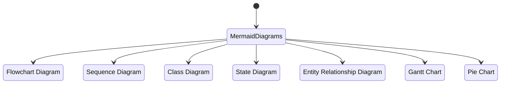

### Flowchart Example
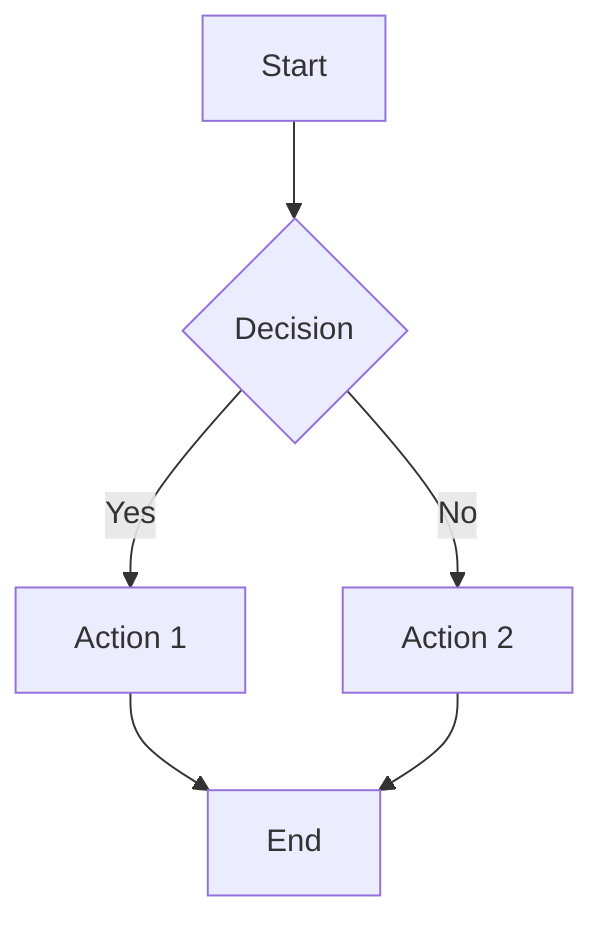

### Sequence Diagram Example
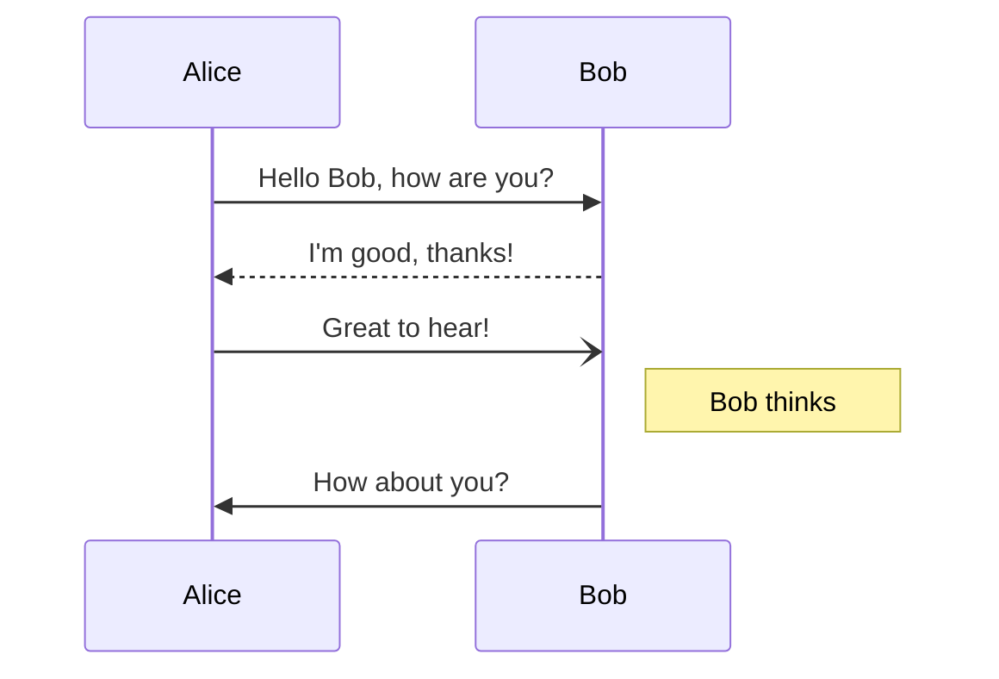

### Class Diagram Example
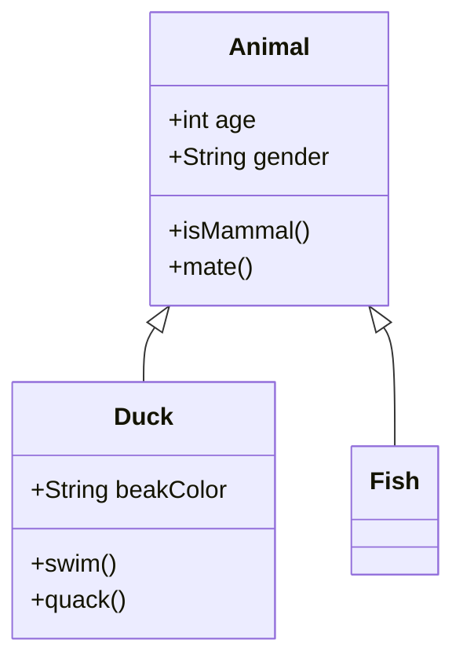

### State Diagram Example
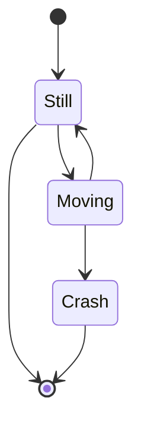

### Entity Relationship Diagram Example
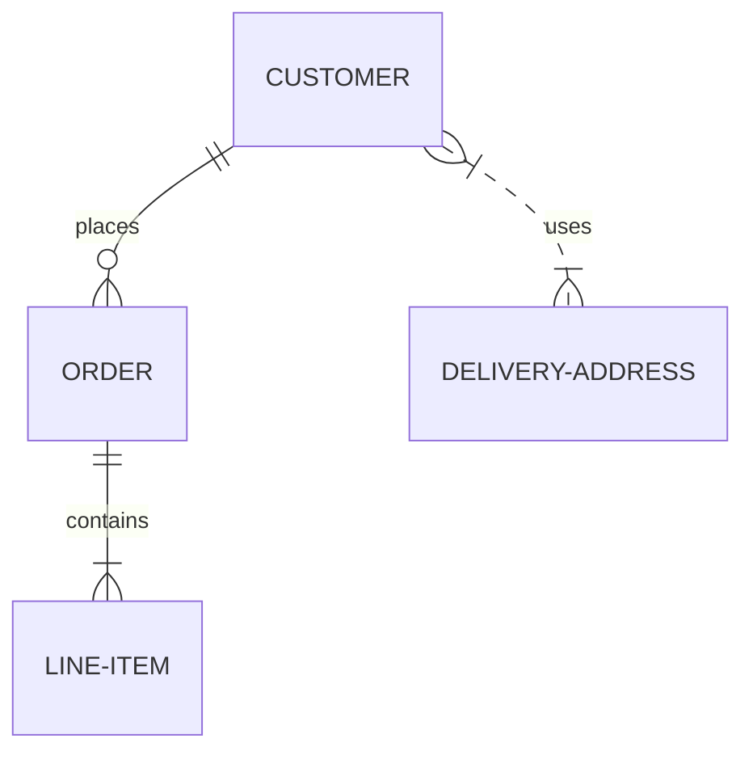

### Gantt Chart Example
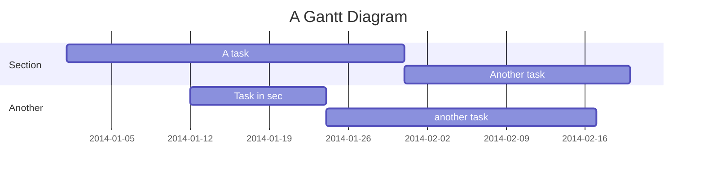

### Pie Chart Example
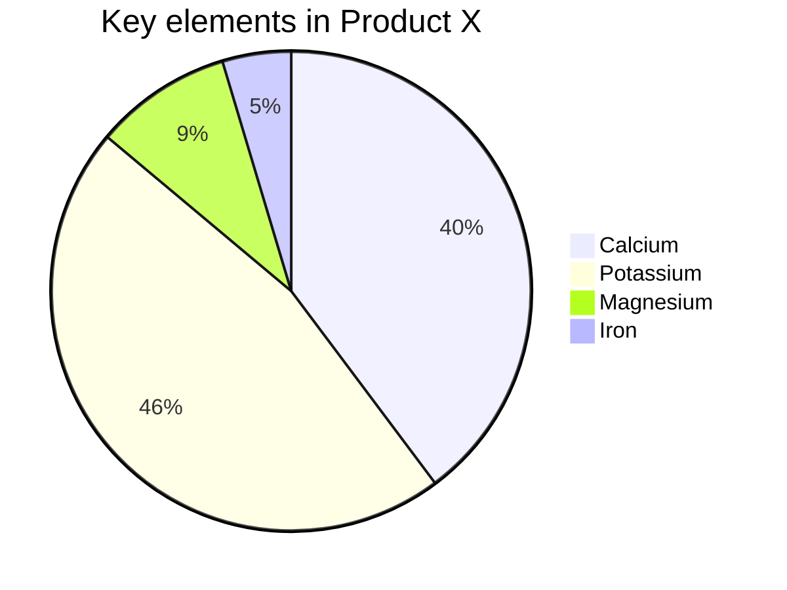

