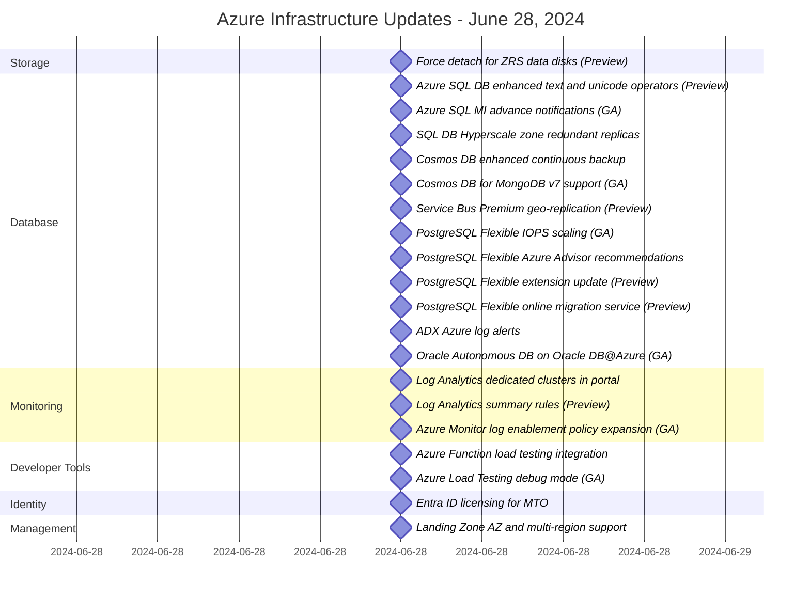

For the June 28, 2024 update:

```mermaid
gantt
    title Azure Infrastructure Updates - June 28, 2024
    dateFormat  YYYY-MM-DD
    section Storage
    Force detach for ZRS data disks (Preview) :milestone, m1, 2024-06-28, 1d
    section Database
    Azure SQL DB enhanced text and unicode operators (Preview) :milestone, m2, 2024-06-28, 1d
    Azure SQL MI advance notifications (GA) :milestone, m3, 2024-06-28, 1d
    SQL DB Hyperscale zone redundant replicas :milestone, m4, 2024-06-28, 1d
    Cosmos DB enhanced continuous backup :milestone, m5, 2024-06-28, 1d
    Cosmos DB for MongoDB v7 support (GA) :milestone, m6, 2024-06-28, 1d
    Service Bus Premium geo-replication (Preview) :milestone, m7, 2024-06-28, 1d
    PostgreSQL Flexible IOPS scaling (GA) :milestone, m8, 2024-06-28, 1d
    PostgreSQL Flexible Azure Advisor recommendations :milestone, m9, 2024-06-28, 1d
    PostgreSQL Flexible extension update (Preview) :milestone, m10, 2024-06-28, 1d
    PostgreSQL Flexible online migration service (Preview) :milestone, m11, 2024-06-28, 1d
    ADX Azure log alerts :milestone, m12, 2024-06-28, 1d
    Oracle Autonomous DB on Oracle DB@Azure (GA) :milestone, m13, 2024-06-28, 1d
    section Monitoring
    Log Analytics dedicated clusters in portal :milestone, m14, 2024-06-28, 1d
    Log Analytics summary rules (Preview) :milestone, m15, 2024-06-28, 1d
    Azure Monitor log enablement policy expansion (GA) :milestone, m16, 2024-06-28, 1d
    section Developer Tools
    Azure Function load testing integration :milestone, m17, 2024-06-28, 1d
    Azure Load Testing debug mode (GA) :milestone, m18, 2024-06-28, 1d
    section Identity
    Entra ID licensing for MTO :milestone, m19, 2024-06-28, 1d
    section Management
    Landing Zone AZ and multi-region support :milestone, m20, 2024-06-28, 1d
```
