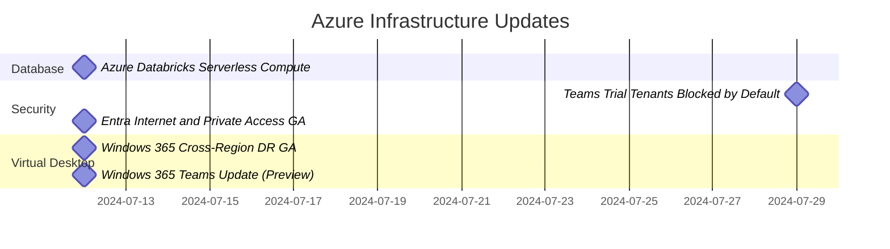

### Database

#### Azure Databricks Serverless Compute - July 12, 2024
- Eliminates need for manual deployment and configuration of infrastructure
- Available for Delta Live Tables (DLT) streaming data pipelines
- Supports serverless compute for notebooks with base configuration
- Enables jobs to execute on serverless compute offering
- Automatic optimization and scaling for data processing and analysis pipelines

### Security

#### Teams Trial Tenants Blocked by Default - July 29, 2024
- Aims to reduce phishing attack vectors
- Blocks temporary teams trial tenants (*.onmicrosoft.com) by default
- Organizations can manually enable federation if needed

#### Entra Internet and Private Access GA - July 12, 2024
- Part of the Secure Services Edge offering
- Internet Access:
  - Uses Global Secure Access client for connectivity
  - Applies conditional access and policies for site access
  - Protects against potential Wi-Fi-based attacks
- Private Access:
  - Enables TCP/UDP connections to network resources without traditional VPN
  - Applies conditional access at the Entra edge
  - Provides continuously verified connectivity

### Virtual Desktop

#### Windows 365 Cross-Region DR GA - July 12, 2024
- Add-on license for Windows 365 Enterprise only
- Creates a geographically distant copy of the cloud PC
- Based on the last restore point, including applications, user settings, and data
- Provides protection from regional outages

#### Windows 365 Teams Update (Preview) - July 12, 2024
- New client-side plugin for improved Teams architecture
- Establishes a virtual channel for Teams
- Handles media engine downloads and updates automatically
- Improves performance for:
  - Advanced meeting capabilities
  - Telephony
  - Voice media bypass
  - Other media-related features