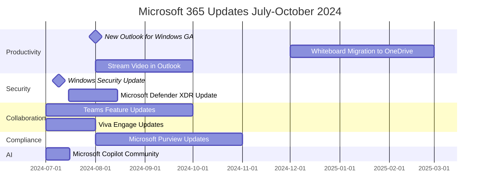

### Timeline

### Productivity and Collaboration:

#### New Microsoft Outlook for Windows - August 1, 2024
1. Generally available for commercial accounts
2. No automatic changes for current users
3. Organizations can control availability and plan migration

#### Microsoft Whiteboard Migration - December 2024
1. Existing Whiteboard files migrating from Azure to OneDrive
2. Client-based, non-blocking migration
3. New features, improved performance, and enhanced security

#### Microsoft Teams Updates - July to September 2024
1. New administrative units (AUs) for Teams administration
2. Change background while recording on phone (iOS)
3. Pre-pin meeting apps for users
4. Custom avatars for group chats
5. Apps support in group chats with external users
6. New skin tone settings and reactions

#### Microsoft Viva Updates - July to September 2024
1. New adoption community for Microsoft Copilot for Microsoft 365
2. Connections now available on the web
3. Update on community muting for admins
4. Import SharePoint navigational links into Resources in Viva Connections
5. Custom image icons for resources in Viva Connections

### Security and Compliance:

#### Windows Security Update - July 9, 2024
1. Available for all supported versions of Windows
2. Prompt installation recommended

#### Microsoft Defender XDR Update - July to August 2024
1. False positive email release from quarantine through post breach scenarios
2. Available for Defender for Office 365 Plan 2 and Microsoft 365 E5 customers

#### Microsoft Purview Updates - August to October 2024
1. New audit search filters: Id, UserType, UserKey, and ClientIP
2. Communication Compliance Insightful Policy Performance
3. Viva Engage users can report policy-violating posts and comments
4. Enhanced privacy control in Endpoint Data Loss Prevention

### AI and Analytics:

#### Microsoft Copilot Community - July 2024
1. New community in Viva Engage to support Copilot adoption
2. Features include one-click community creation and setup checklist

### Admin and Management:

#### Microsoft 365 Admin Center Updates - July 2024
1. User and License admins can manage self-service license requests
2. Roles previously limited to Global admins

#### Microsoft Entra (formerly Azure AD) Updates - June 2024
1. General availability releases for Entra ID
2. Azure AD Graph Retirement
3. Security enhancements for Apple devices

#### Microsoft Intune Updates - September 2024
1. Ending support for User Enrollment with Company Portal for iOS/iPadOS
2. Changes to Microsoft Graph Beta API properties for Windows Autopilot

### Other Updates:

#### Stream Video in Outlook - August to September 2024
1. Record and insert Stream video recordings in Outlook on the web and new Outlook for Windows
2. New policy to control video recording ability within supported applications

#### OneDrive for macOS - July 2024
1. Update to streamline background syncing
2. OpenAtLogin plist setting replaced by macOS System Setting Login Item

#### Windows 11 End of Servicing - October 8, 2024
1. End of servicing for Windows 11, version 21H2 (Enterprise, Education, and IoT Enterprise editions)