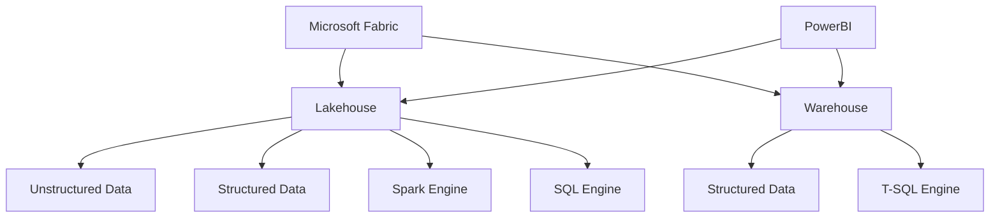
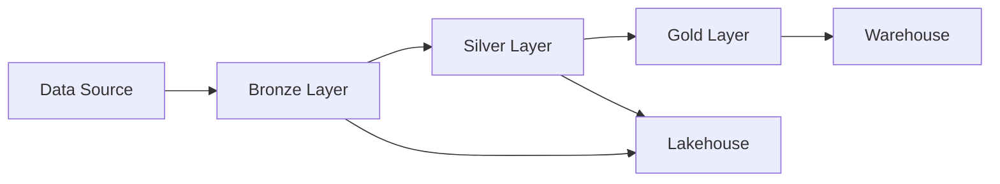
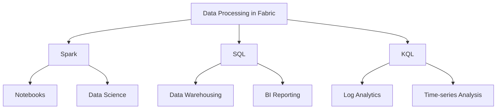

## Lakehouse vs. Warehouse in Microsoft Fabric

Microsoft Fabric provides a unified data platform that combines the capabilities of data lakes and data warehouses. This section explores the key differences and use cases for lakehouses and warehouses within the Fabric ecosystem.

### Lakehouse Overview

A lakehouse in Microsoft Fabric is a versatile data storage solution that supports both structured and unstructured data.

- **Structure:**
  - Contains a "Files" node for unstructured data
  - Includes a "Tables" node for structured data stored in Delta Parquet format
- **Key Features:**
  - Supports both SQL and Spark engines for data processing
  - Ideal for data scientists and engineers working with diverse data types
  - Enables code-first approaches using Python and notebooks

### Warehouse Overview

A warehouse in Microsoft Fabric is a structured data repository optimized for analytical workloads.

- **Structure:**
  - Purely structured data storage
  - Uses Delta Parquet format for efficient querying and storage
- **Key Features:**
  - Supports T-SQL for data manipulation and querying
  - Offers multi-table transaction capabilities
  - Provides a familiar experience for SQL developers


```
Microsoft Fabric
                                 Unified Data Platform
                                           |
           +-------------------------------|-------------------------------+
           |                               |                               |
     +-----v-----+                   +-----v-----+                   +-----v-----+
     | Lakehouse |                   | Warehouse |                   |  Engines  |
     +-----------+                   +-----------+                   +-----------+
           |                               |                               |
     +-----v-----+                   +-----v-----+               +---------v---------+
     |   Files   |                   |Structured |               |                   |
     |           |                   |   Data    |          +----v----+         +----v----+
     +-----------+                   |           |          |  Spark  |         |   SQL   |
           |                         +-----------+          |         |         |         |
     +-----v-----+                         |                +----^----+         +----^----+
     |  Tables   |                   +-----v-----+               |                   |
     |           |                   |  T-SQL    |          +----v----+         +----v----+
     +-----------+                   |           |          | Python  |         |  T-SQL  |
           |                         +-----------+          |         |         |         |
     +-----v-----+                                          +---------+         +---------+
     |SQL & Spark|
     |           |                                     Medallion Architecture
     +-----------+                                     +------------------------+
                                                       |        +-------+       |
                                                       |        | Gold  |       |
                                                       |        |       |       |
                                                       |    +---+-------+---+   |
                                                       |    |               |   |
                                                       |+---v---+       +---v---+
                                                       ||Silver |       |  BI   |
                                                       ||       |       |       |
                                                       |+---^---+       +-------+
                                                       |    |                   |
                                                       |+---v---+               |
                                                       ||Bronze |               |
                                                       ||       |               |
                                                       |+-------+               |
                                                       +------------------------+

Legend:
Files       - Unstructured Data    Structured Data - Organized Data
Tables      - Delta Tables         SQL & Spark     - Multi-Engine Support
Spark       - Big Data Processing  SQL             - Relational Queries
Python      - Scripting Support    T-SQL           - Transact-SQL
Gold        - Refined Data         Silver          - Cleansed Data
Bronze      - Raw Data             BI              - Business Intelligence
```


### Choosing Between Lakehouse and Warehouse

The decision to use a lakehouse or warehouse depends on several factors:

- **Data Types:** Lakehouse for mixed data types, Warehouse for purely structured data
- **Processing Engine:** Lakehouse for Spark, Warehouse for T-SQL
- **Developer Skillset:** Python/Spark developers may prefer Lakehouse, SQL developers may prefer Warehouse
- **Use Case:** Lakehouse for data science and ML workflows, Warehouse for traditional BI and reporting

### Unified Experience

Microsoft Fabric provides a unified experience across both lakehouse and warehouse:

- Both offer SQL endpoints for data consumption
- Shared namespace allows easy data discovery and access
- PowerBI integration for seamless visualization and reporting



## Medallion Architecture in Microsoft Fabric

The Medallion Architecture is a data organization pattern that structures data into different quality tiers, often referred to as Bronze, Silver, and Gold.

### Bronze Layer

- **Characteristics:**
  - Raw, unprocessed data
  - Typically stored in the Lakehouse
  - Preserves original data format and content

### Silver Layer

- **Characteristics:**
  - Cleansed and conformed data
  - Still stored in the Lakehouse
  - Includes data matching, merging, and initial transformations

### Gold Layer

- **Characteristics:**
  - Highly refined and aggregated data
  - Often stored in the Warehouse
  - Optimized for analytical queries and reporting

### Implementation in Fabric

Microsoft Fabric provides built-in support for implementing the Medallion Architecture:

- Workspace task flows guide users through setting up the architecture
- Automatic creation of necessary Lakehouse and Warehouse resources
- Flexibility to customize the architecture based on specific needs



## Data Processing in Microsoft Fabric

Microsoft Fabric offers multiple data processing engines to cater to different workloads and user preferences.

### Spark Processing

- **Use Cases:**
  - Big data processing
  - Machine learning workflows
  - Complex data transformations
- **Key Features:**
  - Supports Python, Scala, and R
  - Distributed processing for large datasets
  - Integration with popular data science libraries

### SQL Processing

- **Use Cases:**
  - Traditional data warehousing
  - Business intelligence reporting
  - Ad-hoc querying
- **Key Features:**
  - T-SQL support for familiar syntax
  - Optimized query performance
  - Integration with SQL Server tools and ecosystem

### KQL (Kusto Query Language) Processing

- **Use Cases:**
  - Log and time-series data analysis
  - Real-time data processing
  - Security and operations analytics
- **Key Features:**
  - Powerful syntax for complex data transformations
  - High-performance for large-scale data analysis
  - Native support in Azure Data Explorer



By leveraging these different processing engines and storage options, Microsoft Fabric provides a comprehensive and flexible platform for handling diverse data workloads within a unified ecosystem. This approach simplifies data management, improves collaboration between different data professionals, and enables organizations to derive more value from their data assets.

Citations:
[1] https://ppl-ai-file-upload.s3.amazonaws.com/web/direct-files/11681405/caaccde9-d533-4dfb-a899-8ad38f9d3c16/paste.txt
[2] https://blog.fabric.microsoft.com/en-US/blog/lakehouse-vs-data-warehouse-deep-dive-into-use-cases-differences-and-architecture-designs/
[3] https://learn.microsoft.com/en-us/azure/databricks/lakehouse/medallion
[4] https://learn.microsoft.com/en-us/answers/questions/1066283/the-role-of-sql-or-spark-pools-%28dedicated-or-serve
[5] https://azure.microsoft.com/en-us/resources/cloud-computing-dictionary/what-is-a-data-lake