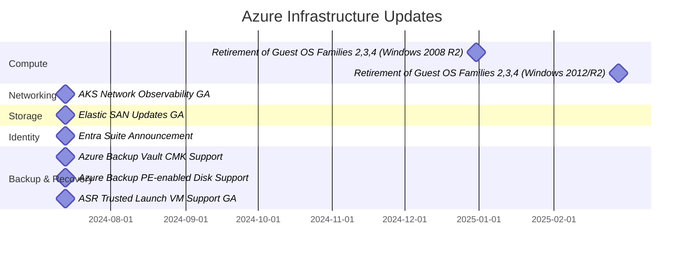
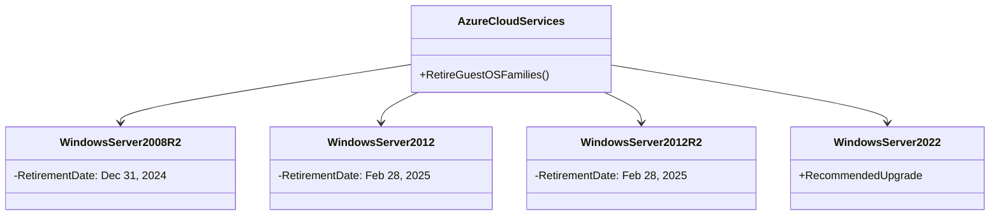
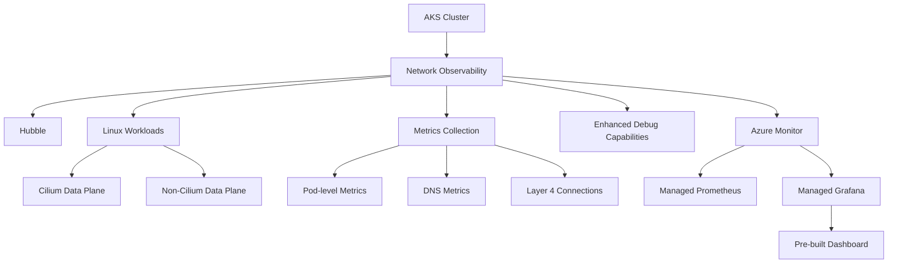
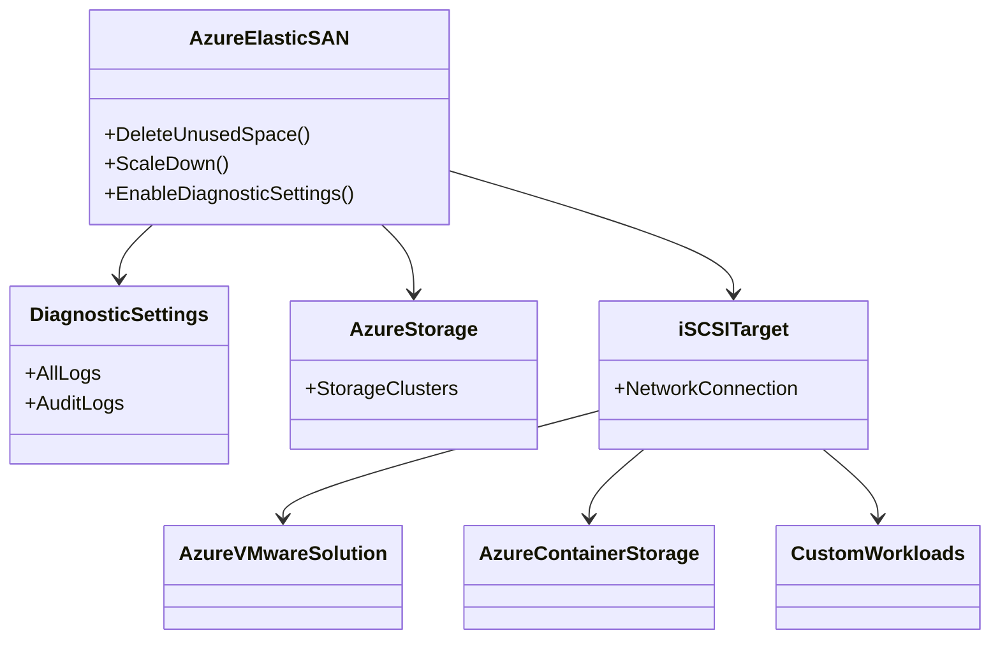
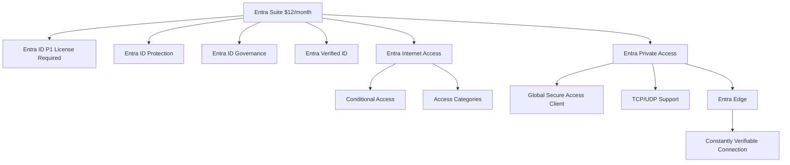
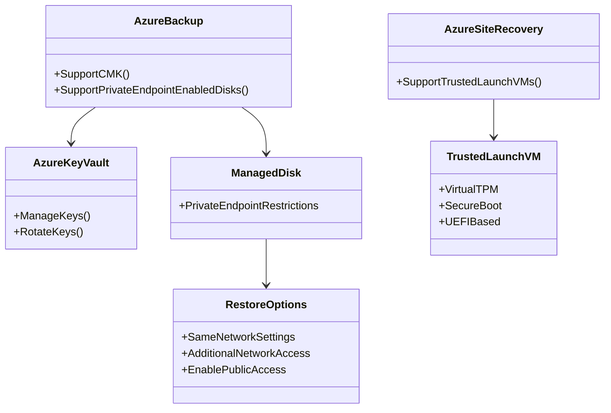

# Az Infra Update - July 13, 2024

## Overview

## Compute

### Retirement of Guest OS Families for Azure Cloud Services - December 2024 / February 2025

- Windows Server 2008 R2 retiring on December 31, 2024
- Windows Server 2012 and 2012 R2 retiring on February 28, 2025
- Recommendation to upgrade to newer OS versions like Windows Server 2022 (OS Family 7)

## Networking

### AKS Network Observability - Generally Available

- Based on Hubble
- Works for Linux workloads (Cilium and non-Cilium data planes)
- Provides pod-level metrics, DNS metrics, Layer 4 connections, and enhanced debug capabilities
- Integrates with Azure Monitor's managed service for Prometheus
- Pre-built dashboard in Azure Managed Grafana

## Storage

### Azure Elastic SAN Updates - Generally Available

- Ability to delete unused space and scale down SAN size
- Diagnostic settings for all logs or just audit logs
- New regions added for service availability

## Identity

### Entra Suite Announcement

- Combines multiple Entra components for $12/month (requires Entra ID P1 license)
- Includes:
  - Entra ID Protection
  - Entra ID Governance
  - Entra Verified ID
  - Entra Internet Access
  - Entra Private Access

## Backup & Recovery

### Azure Backup Vault Customer Managed Key (CMK) Support

- Allows customers to use their own keys for encrypting backup content
- Keys can be managed and rotated in Azure Key Vault

### Azure Backup Private Endpoint-enabled Disk Support

- Supports backup and restore of managed disks with private endpoint restrictions
- Restore options include:
  - Restoring with the same network settings
  - Restoring with additional network access
  - Enabling public access for operations

### Azure Site Recovery (ASR) Trusted Launch VM Support - Generally Available

- Supports replication of VMs with Trusted Launch features
- Includes VMs with virtual TPM, secure boot, and UEFI-based configuration
- Enables replication to other zones or regions

