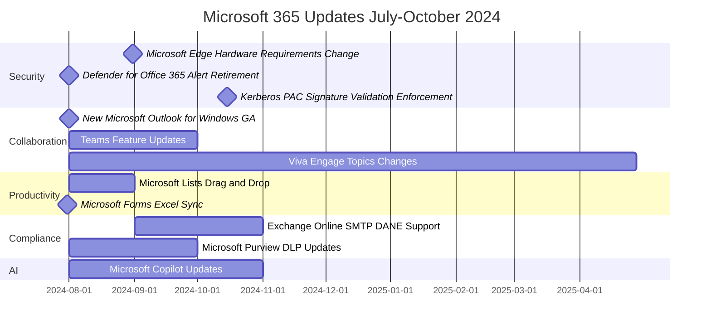

### Timeline

### Security and Compliance:

#### Microsoft Edge Hardware Requirements - August 31, 2024
1. Devices without SSE3 no longer supported from version 128
2. Users need to upgrade devices to continue receiving updates

#### Microsoft Defender for Office 365 - August 2024
1. Four legacy override alerts to be retired
2. Change due to redundancy from Secure by default feature
3. Automatic update for affected users with specific subscriptions

#### Kerberos PAC Signature Validation - October 15, 2024
1. Enforced by Default phase begins
2. All Windows domain controllers and clients move to Enforced mode
3. Secure behavior enforced by default

#### Exchange Online SMTP DANE Support - September to October 2024
1. Support for inbound SMTP DANE with DNSSEC
2. Public Preview in July, General Availability from September
3. Off by default, can be enabled using Exchange PowerShell

### Collaboration and Communication:

#### New Microsoft Outlook for Windows - August 1, 2024
1. Generally available for commercial accounts
2. No automatic changes for current users
3. Organizations can control availability and plan migration

#### Microsoft Teams Updates - August to September 2024
1. External USB webcams support for iPad meetings
2. Option to hide presenters, translators, moderators from webinar event page
3. Bidirectional support for live interpretation
4. Legal hold and eDiscovery support for webinars and town halls
5. Ability to rename General channel

#### Viva Engage Topics Changes - August 2024 to April 2025
1. Simplification of topics model
2. Retirement of integration with Viva Topics
3. Removal of premium and management experiences
4. Users can still create, edit, and follow topics

### Productivity and AI:

#### Microsoft Lists - August 2024
1. New drag and drop feature to reorder list items
2. Available by default, no admin action required

#### Microsoft Forms - July 31, 2024
1. Live data sync feature to Excel
2. Automatic updates and coauthor support
3. Supports both group forms and individual forms

#### Microsoft Copilot Updates - August to October 2024
1. Meeting chat as a data source in Teams
2. New Scheduled prompts feature in Microsoft 365
3. Requires Copilot license and Power Automate license

### Admin and Management:

#### Microsoft 365 Admin Center Updates - July to September 2024
1. Self-service purchase notifications for admins
2. New 'Actions' feature in Experience insights (preview)

#### Intune Updates - August to October 2024
1. Changes to custom OMA-URI settings for Windows
2. Migration of Windows device configuration templates
3. Support for Android 10 and later for user-based management methods

#### OneDrive Update - July 2024
1. New file type filters on the web version
2. Includes OneNote, Microsoft Lists, Videos, Loop, Photos, Whiteboard, and PowerBI

### Windows:

#### Windows 11 Update - Late 2024
1. Introduction of checkpoint cumulative updates
2. Smaller update files for quicker and more efficient updates
3. Applies to Windows 11 version 24H2 or later and Windows Server 2025