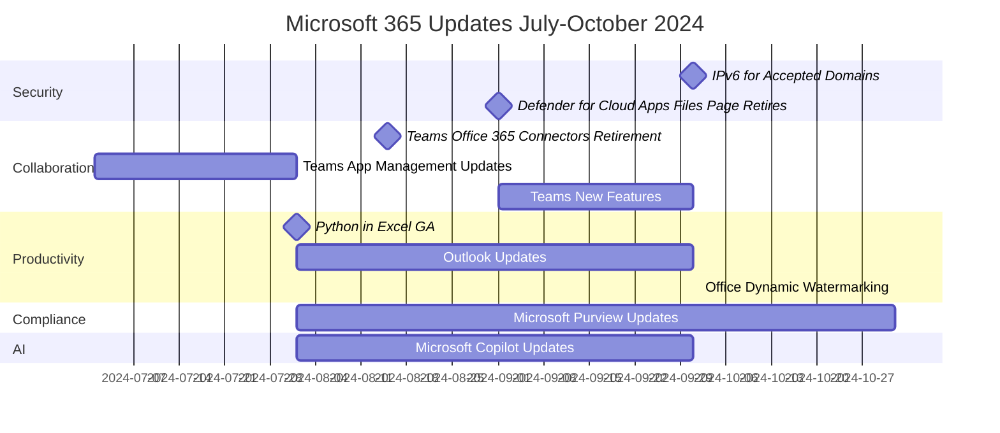

Here's the Message Center Update article based on the given transcript:

### Timeline

### Security and Compliance:

#### IPv6 Enablement for Accepted Domains - October 1, 2024
1. IPv6 support for Accepted Domains in Exchange Online
2. Organizations should update network allow-lists
3. Opt-out details to be provided in September

#### Microsoft Defender for Cloud Apps Update - September 1, 2024
1. Files page in Microsoft Defender for Cloud Apps will be retired
2. Users should use the Policy Management page for Information Protection policies and malware files

#### Microsoft Purview Updates - August to October 2024
1. New tenant-wide Hold report in eDiscovery (Premium)
2. Enhanced global Search feature in Purview portal
3. Data Lifecycle Management integration with Adaptive protection
4. New cmdlet for managing compliance boundary properties

### Collaboration and Communication:

#### Microsoft Teams Updates - July to October 2024
1. Office 365 Connectors feature retirement begins August 15, 2024
2. New app-centric management for app installation
3. Approvals Graph APIs public preview
4. Option to disable attendee emails for town halls and webinars
5. New skin tone settings and reactions
6. Improved meeting experiences for web users on Safari and Firefox

#### Microsoft Viva Updates - July to October 2024
1. Viva Insights home and navigation refresh
2. Viva Amplify updated authoring options and distribution channels
3. Viva Connections Resources section update on mobile

### Productivity and AI:

#### Python in Excel General Availability - August 2024
1. Python formulas available in Excel for Windows
2. Standard compute and self-purchase option for premium compute

#### Microsoft Office Updates - July to November 2024
1. Dynamic watermarking feature for Word, Excel, and PowerPoint
2. Improved resharing experience in Microsoft 365 apps

#### Outlook Updates - August to October 2024
1. Contact deduplication feature
2. Intelligent recap integration from Microsoft Teams
3. New in-app Contact editor for Outlook Mobile
4. Split view in Month view for multiple calendars
5. Offline support for mail actions and compose in new Outlook for Windows
6. New Search filters in Outlook

#### Microsoft Copilot Updates - August to October 2024
1. Chat with Copilot in Outlook mobile
2. New Scheduled prompts feature (requires Copilot and Power Automate licenses)
3. Copilot chat active users in Teams counted as Teams Copilot active users
4. 'Apply All' button for Coaching by Copilot in Outlook

### Admin and Management:

#### Microsoft 365 Admin Center Update - August 30, 2024
1. Retirement of 'Send password in email' feature
2. Admins should use 'Print' option for secure user account detail sharing

#### OneDrive Storage Policy Update - January to March 2025
1. Changes for business and enterprise unlicensed accounts
2. Accounts over 90 days to be archived and inaccessible to users

### Power Platform:

#### Power Automate Updates - August to September 2024
1. Undo and redo feature while building cloud flows (August 25, 2024)
2. Select instead of type email addresses in Outlook and Teams actions (August 5, 2024)
3. View two action properties panes simultaneously (September 1, 2024)
4. New Excel actions in Power Automate for desktop (July 23, 2024)