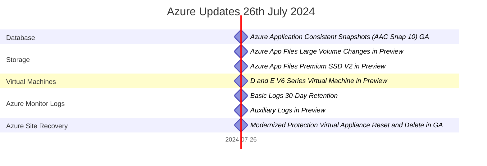

# Summary of Azure Update - 26th July 2024

Video by John Savill's Technical Training

<iframe width="100%" height="415" src="https://www.youtube.com/embed/BYWhi_FNTHY" frameborder="0" allowfullscreen></iframe>

[Watch on YouTube](https://www.youtube.com/watch?v=BYWhi_FNTHY)

### Timeline

### App Service Environments
1. App Service Environments V1 and V2 Retirement - 2024-08-31
   - Move to App Service Environments V3 for better pricing and integration with virtual networks
   - Optimize data plane and control plane improvements

### Virtual Machines
1. D and E V6 Series Virtual Machine in Preview - 2024-07-26
   - Based on Intel Emerald Rapids processor
   - 27% higher virtual CPU performance compared to V5
   - Three times the L3 cache
   - Azure Boost for massive storage and network throughput

### Storage
1. Azure App Files Large Volume Changes in Preview - 2024-07-26
   - Large volumes can now go up to 1 PYTE of storage
   - New large volume type with 122 GB/s performance per TTE
   - Improved throughput performance with more storage allocated
2. Azure App Files Premium SSD V2 in Preview - 2024-07-26
   - Can separately pick IOPS and throughput values
   - Dynamically change IOPS and throughput values
   - Very low latency

### Azure Monitor Logs
1. Basic Logs 30-Day Retention - 2024-07-26
   - Stores logs for 30 days
   - Can run full set of KQL on single table
   - Can do lookup against tables in analytical logs
2. Auxiliary Logs in Preview - 2024-07-26
   - Geared towards verbose logs
   - Much cheaper ingestion and storage
   - Can't run regular queries against it
   - Goal is to run summary rules and store results in analytical logs

### Azure Site Recovery
1. Modernized Protection Virtual Appliance Reset and Delete in GA - 2024-07-26
   - Can delete and reset virtual appliance
   - Can delete appliance from Azure portal
   - Requires infrastructure cleanup and deletion before successful reset
