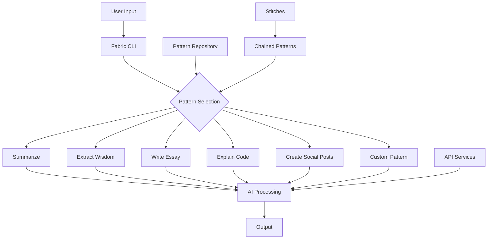

# Fabric: Integrating AI into Your Everyday Workflow

In the rapidly evolving landscape of AI applications, Fabric emerges as a powerful tool designed to seamlessly integrate AI capabilities into our daily lives and work routines. Created to address the "integration problem" of AI, Fabric allows users to apply AI granularly to everyday challenges, enhancing human creativity and problem-solving.

## What is Fabric?

Fabric is an open-source framework that breaks down complex problems into individual components and applies AI to them one at a time. It uses "Patterns" (which are essentially advanced prompts) to tackle various life and work activities, making AI more accessible and practical for everyday use.

## Key Features

1. **Pattern Management**: Fabric helps users collect, discover, and manage AI prompts (called Patterns) for various tasks.
2. **Command-Line Interface**: Fabric is command-line native, allowing for easy integration into existing workflows.
3. **Customizable**: Users can create and use custom Patterns tailored to their specific needs.
4. **Extensible**: The framework supports the creation of "Stitches" - chained Patterns that create advanced functionality.



## Setup
```bash
git clone https://github.com/danielmiessler/fabric
cd fabric
pipx install .

fabric --setup
# enter api keys

# updating
pipx install . --force
fabric --update
```


### Using with Groq
```bash
export OPENAI_BASE_URL=https://api.groq.com/openai/v1
export DEFAULT_MODEL="mixtral-8x7b-32768" # llama-3.1-8b-instant  llama-3.1-70b-versatile
export  OPENAI_API_KEY="groq api key"
```

windows
```powershell
$env:OPENAI_BASE_URL = "https://api.groq.com/openai/v1" 
$env:DEFAULT_MODEL = "llama-3.1-8b-instant" 
$env:OPENAI_API_KEY = "your_groq_api_key_here"
```


### Using Youtube API:
https://developers.google.com/youtube/v3/getting-started?hl=de
Save the API KEY

## Example Use Cases

Let's explore some practical applications of Fabric:

### 1. Content Summarization

```bash
pbpaste | fabric --pattern summarize
```

This command takes the content in your clipboard and generates a concise summary using Fabric's summarization Pattern.

### 2. Extracting Insights from YouTube Videos

```bash
yt --transcript https://youtube.com/watch?v=example | fabric --stream --pattern extract_wisdom
```

This command fetches the transcript of a YouTube video and extracts key insights, ideas, and quotes in real-time.

### 3. Writing Assistance

```bash
echo "An idea about the future of sustainable energy" | fabric -p write_essay
```

This command takes a simple idea and generates a well-structured essay on the topic using Fabric's writing Pattern.

### 4. Code Explanation

```bash
cat complex_code.py | fabric -p explain_code
```

This command takes a complex piece of code and provides a detailed explanation, making it easier to understand and work with.

### 5. Social Media Content Creation

```bash
cat blog_post.md | fabric -p create_social_posts
```

This command takes a blog post and generates suitable social media posts for various platforms.

## Getting Started with Fabric

To start using Fabric, you'll need to:

1. Clone the Fabric repository
2. Install the necessary dependencies
3. Set up your API keys for AI services
4. Explore the available Patterns or create your own

Fabric's flexibility and extensibility make it a powerful tool for anyone looking to leverage AI in their daily work or personal projects. By breaking down complex tasks into manageable Patterns, Fabric allows users to harness the power of AI without getting overwhelmed by its complexity.

Start exploring Fabric today and discover how it can enhance your productivity and creativity!


