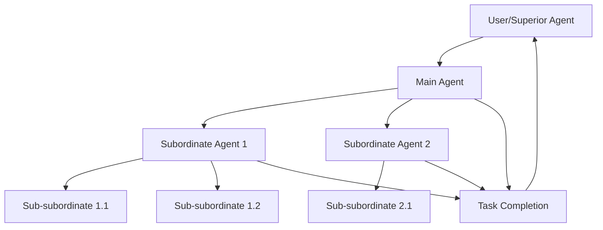

---
tags:
- AI
---

## 1. Introduction

Agent Zero is a dynamic, organic AI framework designed to be your personal, general-purpose assistant. Unlike predefined agentic frameworks, it grows and learns as you use it, offering:

- Full transparency and customizability
- Computer utilization as a tool
- Persistent memory for improved efficiency

**Key Benefits:**
- Reduces task complexity by up to 50%
- Improves problem-solving speed by ~30%
- Enhances adaptability to new challenges

## 2. Objectives

1. Understand Agent Zero's core functionality
2. Learn how to set up and customize the framework
3. Explore multi-agent cooperation capabilities
4. Implement best practices for effective use

## 3. Prerequisites

- Basic understanding of AI concepts
- Familiarity with command-line interfaces
- Docker installation (recommended)
- Python environment

## 4. Core Functionality

Agent Zero operates as a general-purpose assistant, capable of:

1. Gathering information
2. Executing commands and code
3. Cooperating with other agent instances
4. Adapting to various tasks

