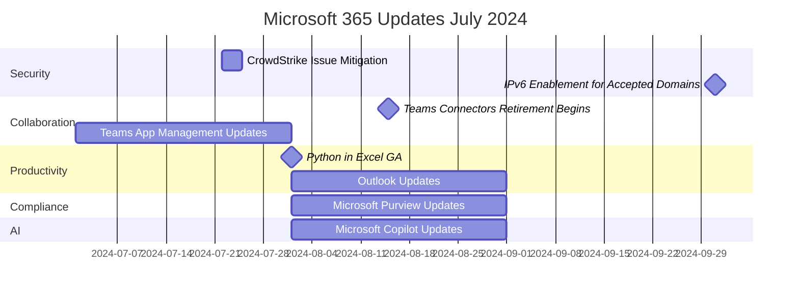

### Timeline

### Security and Compliance:

#### CrowdStrike Issue Mitigation - July 22, 2024
- Third mitigation option released for CrowdStrike Falcon agent issue
- PXE remediation for devices unable to recover with previous options

#### IPv6 Enablement for Accepted Domains - October 1, 2024
- IPv6 support for Accepted Domains in Exchange Online
- Organizations should update network allow-lists
- Opt-out details to be provided in September

#### Microsoft Purview Updates - August 2024
- New tenant-wide Hold report in eDiscovery (Premium)
- Enhanced global Search feature in Purview portal
- Data Lifecycle Management integration with Adaptive protection

### Collaboration and Communication:

#### Microsoft Teams Updates - July-August 2024
- Office 365 Connectors feature retirement begins August 15, 2024
- New app-centric management for app installation
- Users notified when admin unblocks requested app
- Approvals Graph APIs public preview
- Option to disable attendee emails for town halls and webinars

#### Outlook Updates - August-September 2024
- Contact deduplication feature
- Intelligent recap integration from Microsoft Teams
- New in-app Contact editor for Outlook Mobile
- Split view in Month view for multiple calendars

### Productivity and AI:

#### Python in Excel General Availability - August 2024
- Python formulas available in Excel for Windows
- Standard compute and self-purchase option for premium compute

#### Microsoft Copilot Updates - August 2024
- Chat with Copilot in Outlook mobile
- New Scheduled prompts feature (requires Copilot and Power Automate licenses)
- Copilot chat active users in Teams counted as Teams Copilot active users

### Admin and Management:

#### Microsoft 365 Admin Center Update - August 30, 2024
- Retirement of 'Send password in email' feature
- Admins should use 'Print' option for secure user account detail sharing

#### OneDrive Storage Policy Update - January-March 2025
- Changes for business and enterprise unlicensed accounts
- Accounts over 90 days to be archived and inaccessible to users

### Power Platform:

#### Power Automate Updates - August-September 2024
- Undo and redo feature while building cloud flows
- Select instead of type email addresses in Outlook and Teams actions
- View two action properties panes simultaneously
