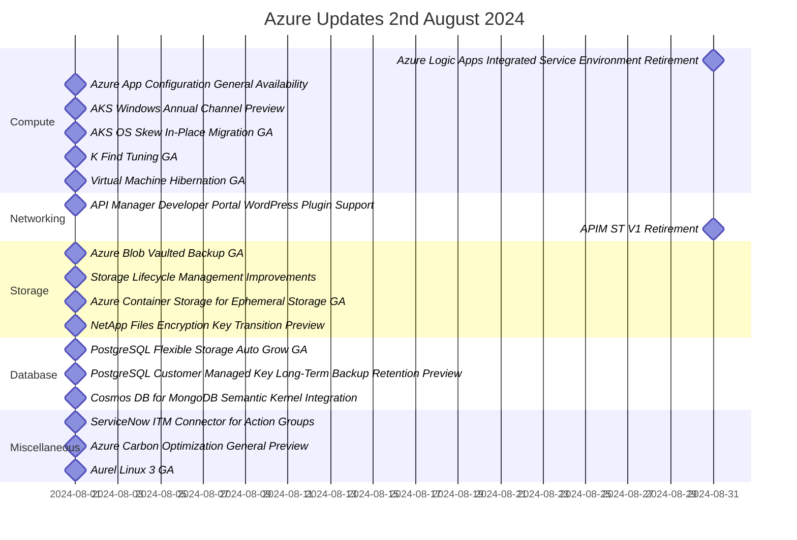

# Summary of Azure Update - 2nd August 2024

Video by John Savill's Technical Training

<iframe width="100%" height="415" src="https://www.youtube.com/embed/wcIn9AzETeI" frameborder="0" allowfullscreen></iframe>

[Watch on YouTube](https://www.youtube.com/watch?v=wcIn9AzETeI)

### Timeline

### Compute:
1. Azure Logic Apps Integrated Service Environment Retirement - August 31, 2024
   - Dependent on the classic cloud service which is being retired.
   - Workflows on ISC will cease to execute.

2. Azure App Configuration General Availability - August 1, 2024
   - Central configuration store for applications.
   - Allows referencing app configuration items without code changes.

3. AKS Windows Annual Channel Preview - August 1, 2024
   - Designed for container nodes with annual updates.
   - Supports portability of container images built on Windows Server.

4. AKS OS Skew In-Place Migration GA - August 1, 2024
   - Enables node image upgrades between Linux skews without creating new nodes.
   - Simplifies the upgrade process.

5. K Find Tuning GA - August 1, 2024
   - Kubernetes AI toolchain operator for deploying and operating AI models.
   - Allows tuning methods for domain-specific language applications.

6. Virtual Machine Hibernation GA - August 1, 2024
   - Saves memory and CPU state to disk to stop compute charges.
   - Useful for virtual desktop scenarios.

### Networking:
1. API Manager Developer Portal WordPress Plugin Support - August 1, 2024
   - Customizes the developer portal using WordPress capabilities.
   - Supports themes and localization.

2. APIM ST V1 Retirement - August 31, 2024
   - Transition to SDV2 for improved resiliency and security options.
   - Migration steps vary based on features used.

### Storage:
1. Azure Blob Vaulted Backup GA - August 1, 2024
   - Backups stored in a separate storage account for enhanced protection.
   - Uses object replication for recovery points.

2. Storage Lifecycle Management Improvements - August 1, 2024
   - Enhanced control over archive tier management.
   - New options for managing rehydration duration.

3. Azure Container Storage for Ephemeral Storage GA - August 1, 2024
   - Built for running container workloads without needing Azure primitives.
   - Supports local NVMe and temp disk storage.

4. NetApp Files Encryption Key Transition Preview - August 1, 2024
   - Transition from platform-managed keys to customer-managed keys.
   - Provides more control over encryption key management.

### Database:
1. PostgreSQL Flexible Storage Auto Grow GA - August 1, 2024
   - Automatically grows storage as data increases.
   - Ensures replicas keep up to avoid integrity issues.

2. PostgreSQL Customer Managed Key Long-Term Backup Retention Preview - August 1, 2024
   - Extends backup retention beyond the default of 35 days.
   - Utilizes PG dump log backup for long-term retention.

3. Cosmos DB for MongoDB Semantic Kernel Integration - August 1, 2024
   - Integrates semantic kernel for large language model orchestration.
   - Supports high-dimensional vector searches for natural language queries.

### Miscellaneous:
1. ServiceNow ITM Connector for Action Groups - August 1, 2024
   - Integrates with ServiceNow to create tickets based on alerts.
   
2. Azure Carbon Optimization General Preview - August 1, 2024
   - Tracks carbon footprint of resources.
   - Helps organizations meet sustainability goals.

3. Aurel Linux 3 GA - August 1, 2024
   - Upgrades kernel and security packages for Microsoft Linux distribution.
   - Available for download on GitHub.
