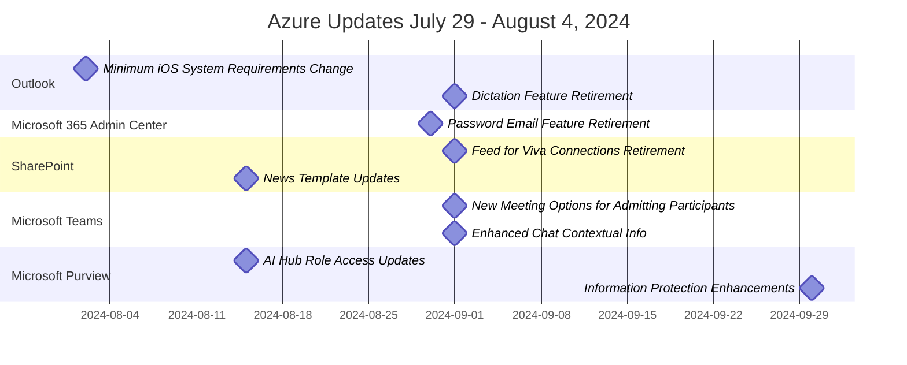

# Summary of MessageCenter Update for August 2024

### Timeline

### Outlook:
1. Minimum iOS System Requirements Change - August 2, 2024
   - Requires iOS 17 as the minimum for Outlook for iOS.
   - Support for iOS 16 will be dropped after iOS 18 release.
   - Users on iOS 16 may lose synchronization capabilities.

2. Dictation Feature Retirement - September 1, 2024
   - The Dictation feature in Outlook for iOS and Android will be retired.
   - Organizations should inform users and update documentation.

### Microsoft 365 Admin Center:
1. Password Email Feature Retirement - August 30, 2024
   - 'Send password in email' feature will be retired.
   - Admins should use the 'Print' option for secure sharing.

### SharePoint:
1. Feed for Viva Connections Retirement - September 1, 2024
   - The Feed for Viva Connections web part and Video news link will be retired.
   - Users are advised to use alternative solutions.

2. News Template Updates - August 15, 2024
   - Updates to News templates for simpler design and email sharing.
   - Rollout starts mid-August for Targeted Release.

### Microsoft Teams:
1. New Meeting Options for Admitting Participants - September 1, 2024
   - Organizers can control who admits participants from the lobby.
   - Two options available: only organizers or including presenters.

2. Enhanced Chat Contextual Info - September 1, 2024
   - Improvements to chat with contextual information and search capabilities.
   - Rollouts begin late July for Targeted Release.

### Microsoft Purview:
1. AI Hub Role Access Updates - August 15, 2024
   - New roles for accessing Microsoft Purview AI Hub will be available.
   - Rollouts begin in August with full availability by late November.

2. Information Protection Enhancements - September 30, 2024
   - Enhancements to default sensitivity labels and policies.
   - Rollout starts late September and completes by late October.
