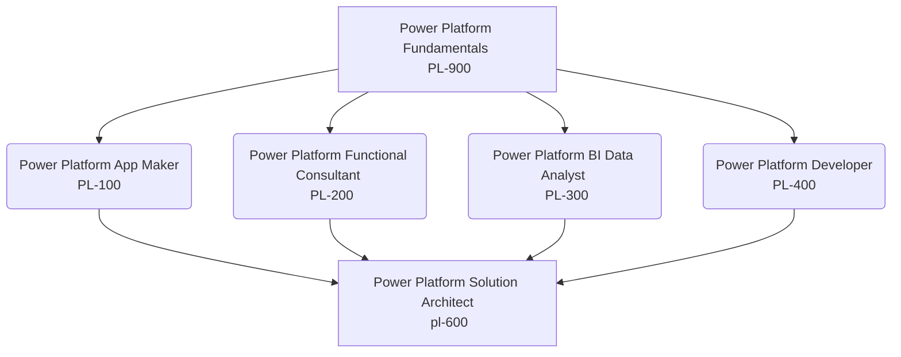

# Power Platform Zertifizierungen übersicht

---


## Power Platform Zertifizierung


example of python code:

```python title="/src/hello-world.py"
print("Hello, World!")
```

 title="/src/components/HelloCodeTitle.js"

### Power Platform Fundamentals
https://learn.microsoft.com/de-de/certifications/power-platform-fundamentals/

### Power Platform Functional Consultant Associate or Power Platform Developer Associate
- https://learn.microsoft.com/de-de/certifications/power-platform-functional-consultant-associate/
- https://learn.microsoft.com/de-de/certifications/power-platform-developer-associate/

### Power Platform Solution Architect Expert
https://learn.microsoft.com/de-de/certifications/power-platform-solution-architect-expert/