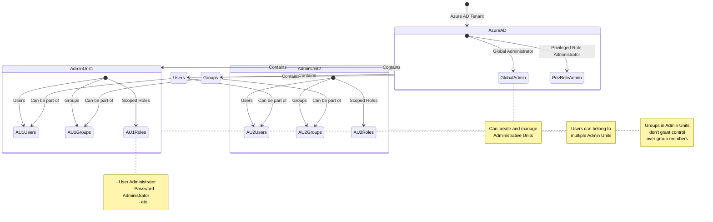

# Azure AD Administrative Units: Overview and Benefits

## Introduction
Azure AD Administrative Units (AUs) provide a way to delegate administrative permissions over subsets of users and groups within an Azure Active Directory instance. This feature allows for more granular control and management of resources in large organizations.

## Core Functionality

### Traditional Azure AD Structure
- Flat structure with no hierarchy
- Users, groups, service principals, and applications in a single tenant
- Roles applied at the tenant level

### Administrative Units
- Create logical groupings of users and groups
- Apply roles at the AU level instead of tenant-wide
- Users can belong to multiple AUs
- Cannot nest AUs

## Implementation Guide

### Prerequisites
- Azure AD instance
- Global Administrator or Privileged Role Administrator role
- Azure AD P1 or higher license for role assignment

### Creation and Management
- Create AUs via Azure Portal, PowerShell, or REST API
- Add users and groups to AUs
- Assign roles scoped to specific AUs

## Key Points
1. AUs allow for delegation of admin tasks to specific subsets of users/groups
2. Adding a group to an AU does not grant control over group members
3. Users with AU-scoped roles cannot manage accounts with global scope permissions
4. AUs are not available in Azure AD B2C

## Best Practices
- Use AUs for departmental or branch office management
- Carefully consider which roles to delegate at the AU level
- Regularly review AU memberships and assigned roles

## Monitoring and Maintenance
- Use My Staff portal (mystaff.microsoft.com) for AU-scoped management tasks
- Monitor role assignments and AU memberships for security

## Additional Resources
- Azure Portal: Azure Active Directory > Administrative Units
- PowerShell and Graph API for bulk operations and automation

