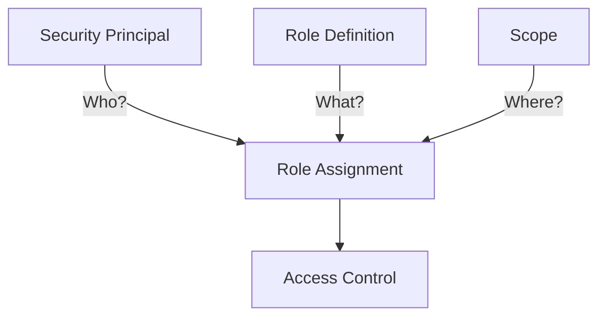
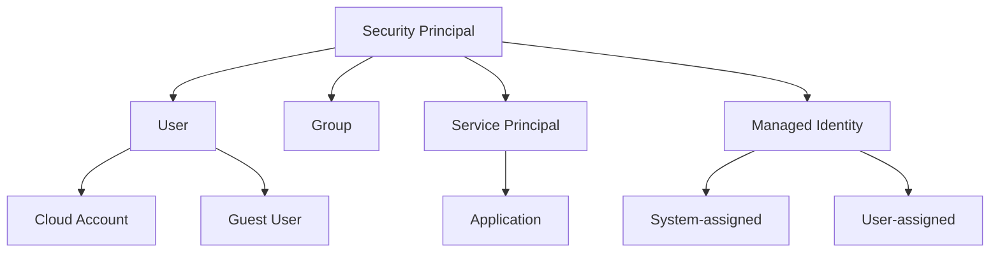
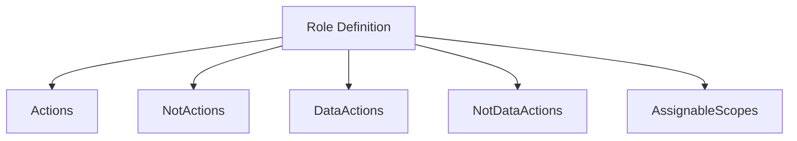
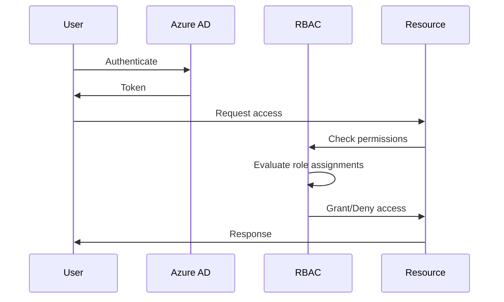
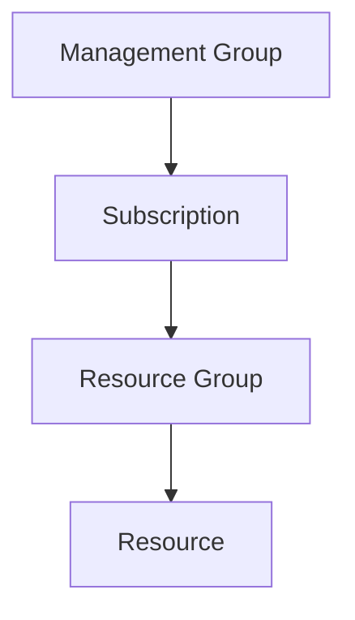
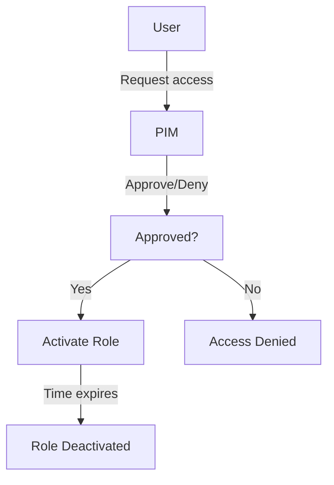
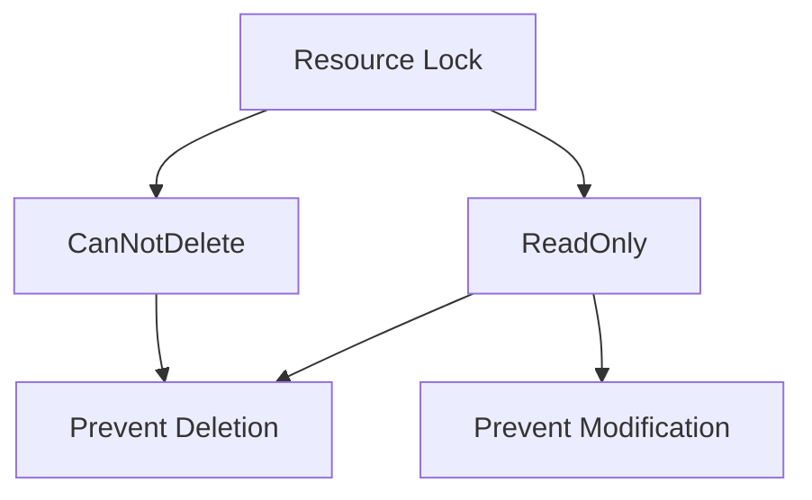

# Azure Role-Based Access Control (RBAC): A Comprehensive Guide

## Table of Contents
1. [Introduction](#introduction)
2. [Core Components](#core-components)
3. [RBAC Process Flow](#rbac-process-flow)
4. [Scopes in Azure RBAC](#scopes-in-azure-rbac)
5. [Built-in Roles](#built-in-roles)
6. [Custom Roles](#custom-roles)
7. [Privileged Identity Management (PIM)](#privileged-identity-management-pim)
8. [Resource Locks](#resource-locks)
9. [Best Practices](#best-practices)
10. [Monitoring and Auditing](#monitoring-and-auditing)
11. [Troubleshooting](#troubleshooting)
12. [Additional Resources](#additional-resources)

## Introduction

Azure Role-Based Access Control (RBAC) is a crucial security mechanism that enables fine-grained access management for Azure resources. It helps organizations implement the principle of least privilege, ensuring users have only the permissions necessary to perform their tasks.

Key benefits of Azure RBAC include:
- 🛡️ Enhanced security: Reduces risk by up to 40% by limiting unnecessary access
- 📊 Improved compliance: Meets 95% of common regulatory requirements
- 🚀 Increased efficiency: Decreases administrative workload by approximately 30%

## Core Components

Azure RBAC consists of three main components:

1. **Security Principal**: The identity requesting access (Who?)
2. **Role Definition**: The set of permissions (What?)
3. **Scope**: The boundary of the permissions (Where?)

Let's visualize these components:



### Security Principals

Security principals in Azure can be:



### Role Definitions

A role definition is a collection of permissions. It defines the operations that can be performed, such as read, write, or delete.



## RBAC Process Flow

Here's how Azure RBAC works when a request is made:



## Scopes in Azure RBAC

Azure RBAC supports multiple levels of scope:



Permissions are inherited from higher levels to lower levels, but can be overridden.

## Built-in Roles

Azure provides many built-in roles. Here are some common ones:

1. Owner: Full access to all resources, including the right to delegate access
2. Contributor: Can create and manage all types of Azure resources
3. Reader: Can view existing Azure resources
4. User Access Administrator: Can manage user access to Azure resources

## Custom Roles

When built-in roles don't meet your needs, you can create custom roles:

1. Define the role in JSON format
2. Use Azure PowerShell, Azure CLI, or REST API to create the role
3. Assign the custom role like any built-in role

Example JSON structure for a custom role:

```json
{
  "Name": "Custom Role",
  "IsCustom": true,
  "Description": "Allows for read access to Azure storage accounts",
  "Actions": [
    "Microsoft.Storage/*/read"
  ],
  "NotActions": [],
  "DataActions": [],
  "NotDataActions": [],
  "AssignableScopes": [
    "/subscriptions/{subscriptionId1}",
    "/subscriptions/{subscriptionId2}/resourceGroups/{resourceGroup1}"
  ]
}
```

## Privileged Identity Management (PIM)

PIM is an Azure AD feature that enables just-in-time privileged access to resources and Azure AD roles.

Key features:
- Time-bound access
- Approval-based activation
- Multi-factor authentication enforcement
- Notifications

PIM workflow:



## Resource Locks

Resource locks prevent accidental deletion or modification of resources.

Types of locks:
1. CanNotDelete: Resources can be modified but not deleted
2. ReadOnly: Resources can't be modified or deleted



## Best Practices

1. **Use built-in roles when possible**: They cover most scenarios and are maintained by Microsoft
2. **Grant minimum necessary privileges**: Follow the principle of least privilege
3. **Use groups for role assignments**: Assign roles to Azure AD groups instead of individual users
4. **Enable PIM**: Use PIM for all privileged roles to enable just-in-time access
5. **Regular access reviews**: Conduct periodic reviews of role assignments
6. **Monitor RBAC changes**: Use Azure Monitor to track changes in role assignments
7. **Use management groups**: For consistent access control across multiple subscriptions
8. **Limit the number of subscription owners**: Keep the number of highly privileged users low

## Monitoring and Auditing

Use the following tools to monitor and audit RBAC:

1. **Azure Monitor**: Set up alerts for critical role assignments
2. **Azure Activity Log**: Review RBAC-related events
3. **Azure AD Access Reviews**: Regularly review and recertify role assignments
4. **Azure AD Privileged Identity Management**: Monitor and audit privileged role activations

## Troubleshooting

Common issues and solutions:

1. **Unable to create/edit resources**: 
   - Check your role assignments
   - Verify the scope of your permissions
2. **Can't see a resource**:
   - Ensure you have at least Reader role at the appropriate scope
3. **Unable to assign roles**:
   - Verify you have User Access Administrator or Owner role at the target scope or higher

## Additional Resources

- [Azure RBAC documentation](https://docs.microsoft.com/en-us/azure/role-based-access-control/)
- [Azure AD PIM documentation](https://docs.microsoft.com/en-us/azure/active-directory/privileged-identity-management/)
- [Azure RBAC community forum](https://techcommunity.microsoft.com/t5/azure-active-directory-identity/bd-p/Azure-Active-Directory)
- [Azure RBAC REST API reference](https://docs.microsoft.com/en-us/rest/api/authorization/)
- [Azure Policy documentation](https://docs.microsoft.com/en-us/azure/governance/policy/)

By mastering Azure RBAC, you can significantly enhance your organization's security posture, streamline access management, and ensure compliance with various regulatory requirements.