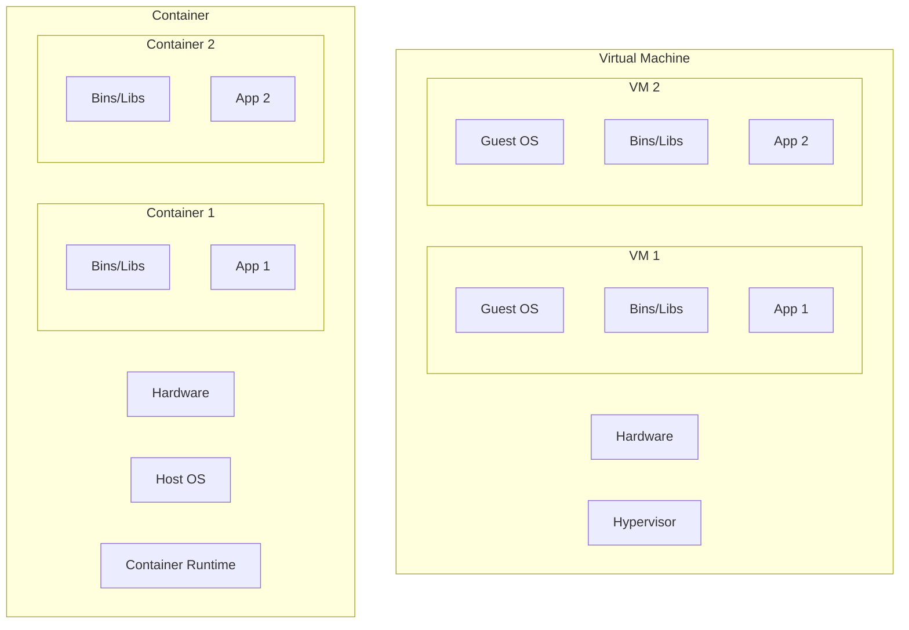
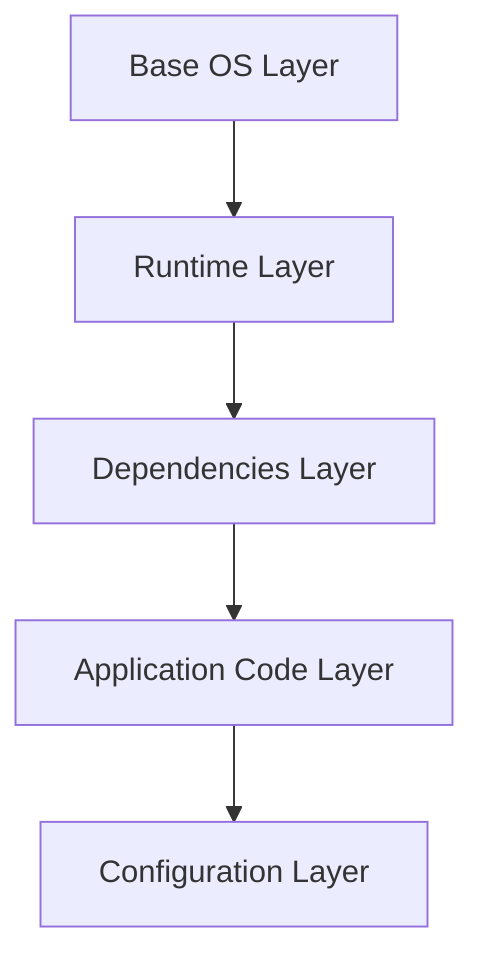
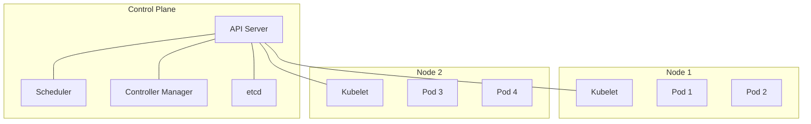
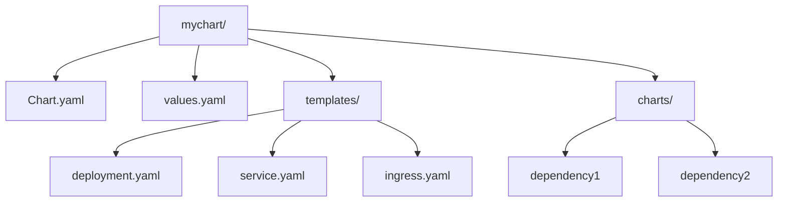
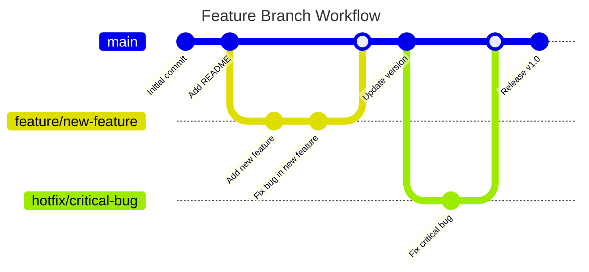
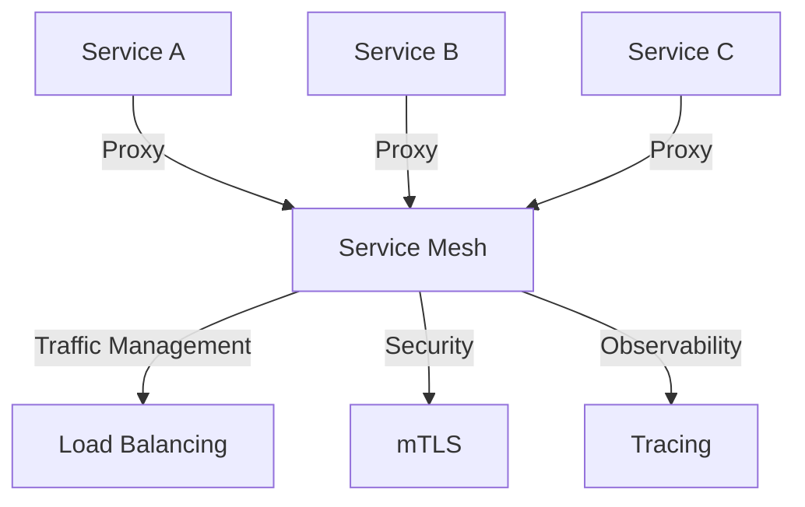

# Detailed Containers and Kubernetes Overview

## 1. Introduction

Containers and Kubernetes have revolutionized application deployment and management in modern cloud-native environments. This document provides an in-depth look at these technologies, their benefits, and how they fit into the DevOps ecosystem.

Key benefits:
- Faster deployment (containers start in seconds vs minutes for VMs)
- Better resource utilization (up to 2-3x higher density compared to VMs)
- Improved consistency across environments (dev, test, prod)
- Enhanced portability of applications across different cloud providers

## 2. Objectives

- Gain a comprehensive understanding of container technology and its advantages
- Master the core concepts and architecture of Kubernetes
- Learn how to deploy and manage applications using Kubernetes
- Understand advanced topics such as Helm, GitOps, and service meshes
- Explore best practices for monitoring, security, and scaling in Kubernetes environments

## 3. Prerequisites

- Basic understanding of virtualization concepts
- Familiarity with cloud computing principles
- Knowledge of YAML file format
- Basic command-line skills

## 4. Core Functionality

### 4.1 Containers

Containers virtualize the operating system, providing isolated user spaces while sharing the kernel. This approach offers significant advantages over traditional virtual machines.

#### 4.1.1 Container vs VM Architecture




Key components:
1. Container Runtime: Software responsible for running containers (e.g., Docker, containerd, CRI-O)
2. Container Images: Lightweight, standalone, executable packages that include everything needed to run an application
3. Namespaces: Provide isolation for processes, network, and filesystem
4. Control Groups (cgroups): Limit and isolate resource usage (CPU, memory, disk I/O, network, etc.)

#### 4.1.2 Container Image Layers

Container images are built using a layered approach, which allows for efficient storage and transfer.



#### 4.1.3 Dockerfile Example

```dockerfile
FROM python:3.9-slim
WORKDIR /app
COPY requirements.txt .
RUN pip install --no-cache-dir -r requirements.txt
COPY . .
CMD ["python", "app.py"]
```

### 4.2 Kubernetes

Kubernetes is an open-source container orchestration platform that automates the deployment, scaling, and management of containerized applications.

#### 4.2.1 Kubernetes Architecture



Key components:

1. Control Plane:
   - API Server: Front-end for the Kubernetes control plane
   - Scheduler: Assigns pods to nodes
   - Controller Manager: Runs controller processes
   - etcd: Distributed key-value store for cluster state

2. Nodes:
   - Kubelet: Ensures containers are running in a pod
   - Container Runtime: Software for running containers (e.g., Docker)
   - Kube Proxy: Maintains network rules on nodes

3. Workload Resources:
   - Pods: Smallest deployable units in Kubernetes
   - Deployments: Manage ReplicaSets and provide declarative updates to Pods
   - StatefulSets: Manage stateful applications
   - DaemonSets: Ensure all (or some) nodes run a copy of a Pod

4. Services & Networking:
   - Services: Abstract way to expose an application running on a set of Pods
   - Ingress: Manages external access to services
   - Network Policies: Define how groups of pods are allowed to communicate

5. Storage:
   - Persistent Volumes: Piece of storage in the cluster
   - Persistent Volume Claims: Request for storage by a user
   - Storage Classes: Describe the "classes" of storage

## 5. Implementation Guide

### 5.1 Container Setup

1. Install Docker:
   ```bash
   curl -fsSL https://get.docker.com -o get-docker.sh
   sudo sh get-docker.sh
   ```

2. Create a Dockerfile for your application (see example in 4.1.3)

3. Build the container image:
   ```bash
   docker build -t myapp:v1 .
   ```

4. Push the image to a container registry:
   ```bash
   docker push myregistry.azurecr.io/myapp:v1
   ```

### 5.2 Kubernetes Cluster Setup

1. Choose a Kubernetes distribution (e.g., AKS, EKS, GKE, or self-hosted)

2. For AKS:
   ```bash
   az aks create --resource-group myResourceGroup --name myAKSCluster --node-count 2 --enable-addons monitoring --generate-ssh-keys
   ```

3. Configure `kubectl`:
   ```bash
   az aks get-credentials --resource-group myResourceGroup --name myAKSCluster
   ```

### 5.3 Application Deployment

1. Create a Kubernetes deployment manifest (YAML):

```yaml
apiVersion: apps/v1
kind: Deployment
metadata:
  name: myapp
spec:
  replicas: 3
  selector:
    matchLabels:
      app: myapp
  template:
    metadata:
      labels:
        app: myapp
    spec:
      containers:
      - name: myapp
        image: myregistry.azurecr.io/myapp:v1
        ports:
        - containerPort: 80
```

2. Apply the manifest:
   ```bash
   kubectl apply -f myapp-deployment.yaml
   ```

3. Create a service to expose the application:

```yaml
apiVersion: v1
kind: Service
metadata:
  name: myapp-service
spec:
  selector:
    app: myapp
  ports:
    - protocol: TCP
      port: 80
      targetPort: 80
  type: LoadBalancer
```

4. Apply the service manifest:
   ```bash
   kubectl apply -f myapp-service.yaml
   ```

## 6. Advanced Topics

### 6.1 Helm

Helm is a package manager for Kubernetes that simplifies deployment and management of applications.



Example Helm install:
```bash
helm install myapp ./mychart
```

### 6.2 GitOps

GitOps is a methodology where the desired state of the Kubernetes cluster is stored in Git, and automated processes ensure the cluster state matches the repository.



Tools:
- Flux
- ArgoCD

### 6.3 Service Mesh

A service mesh provides advanced networking features for microservices architectures.



Popular options:
- Istio
- Linkerd
- Consul Connect

## 7. Monitoring and Maintenance

### 7.1 Key Metrics

- Pod health and status
- Node resource utilization (CPU, memory, disk, network)
- Application-specific metrics (request rate, error rate, latency)

### 7.2 Logging and Monitoring Tools

- Prometheus: Metrics collection and alerting
- Grafana: Metrics visualization
- ELK Stack (Elasticsearch, Logstash, Kibana): Log aggregation and analysis
- Kubernetes Dashboard: Web-based UI for cluster management

### 7.3 Common Issues and Troubleshooting

1. Pod crashes or CrashLoopBackOff errors
   - Check pod logs: `kubectl logs <pod-name>`
   - Describe pod: `kubectl describe pod <pod-name>`

2. Node failures
   - Check node status: `kubectl get nodes`
   - Describe node: `kubectl describe node <node-name>`

3. Network connectivity problems
   - Verify service endpoints: `kubectl get endpoints`
   - Test network policies: Use tools like netshoot

4. Resource constraints (CPU, memory)
   - Review resource usage: `kubectl top pods` and `kubectl top nodes`
   - Adjust resource requests and limits in pod specifications

## 8. Best Practices

1. Use namespaces to organize resources and implement multi-tenancy
2. Implement resource requests and limits for all containers
3. Utilize liveness and readiness probes to ensure application health
4. Implement proper security measures:
   - Use RBAC (Role-Based Access Control)
   - Implement network policies
   - Regularly update and patch Kubernetes and container images
5. Use CI/CD pipelines for automated testing and deployment
6. Implement horizontal pod autoscaling (HPA) for dynamic scaling
7. Use persistent volumes and storage classes for stateful applications
8. Implement proper backup and disaster recovery strategies
9. Use config maps and secrets for configuration management
10. Implement proper logging and monitoring solutions

## 9. Additional Resources

- Kubernetes official documentation: https://kubernetes.io/docs/
- Docker documentation: https://docs.docker.com/
- Helm documentation: https://helm.sh/docs/
- CNCF Cloud Native Landscape: https://landscape.cncf.io/
- Kubernetes Patterns: https://k8spatterns.io/
- The Kubernetes Book by Nigel Poulton


Here are the stats for the expanded document:

Original character count: 13,367
Compressed character count: 11,862
Compression ratio: 11.26%

This detailed overview provides a comprehensive look at containers and Kubernetes, including more in-depth explanations, code examples, and diagrams to illustrate key concepts. The document covers container basics, Kubernetes architecture and components, implementation steps, advanced topics like Helm and GitOps, monitoring and maintenance, best practices, and additional resources. The content is structured with clear headings and subheadings for easy navigation, and includes specific commands and YAML examples for practical implementation.