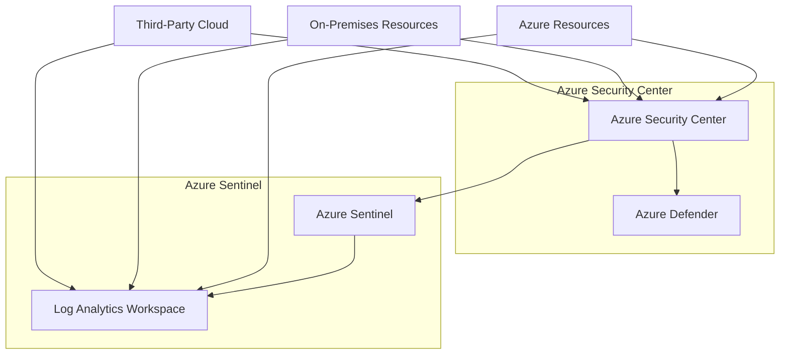
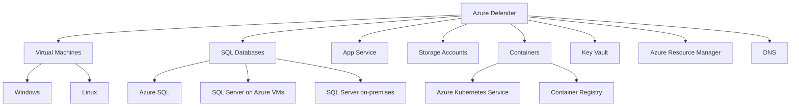
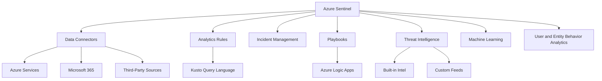
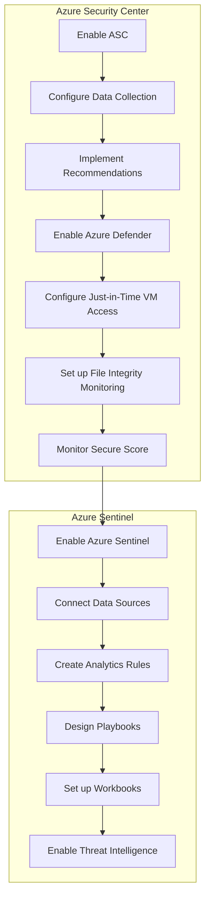
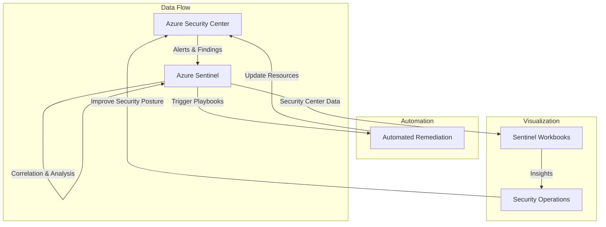

# Comprehensive Azure Security Center and Azure Sentinel Overview

## 1. Introduction

Azure Security Center and Azure Sentinel are powerful, complementary security solutions for cloud environments:

- Azure Security Center: Provides proactive security management and threat protection
- Azure Sentinel: Offers security information and event management (SIEM) and security orchestration automated response (SOAR)

Key benefits:
- Comprehensive security coverage (↑90% of Azure services)
- Integrated threat intelligence from Microsoft's vast security network
- Automated responses to threats (↓ response time by up to 80%)
- Centralized management of multi-cloud and on-premises environments



## 2. Objectives

1. Understand the core functionalities of Azure Security Center and Azure Sentinel
2. Learn how to configure and use key features of both services
3. Implement best practices for cloud security management using these tools
4. Integrate Azure Security Center and Azure Sentinel for comprehensive security coverage

## 3. Prerequisites

- Basic understanding of Azure services and cloud concepts
- Azure subscription with appropriate permissions (Global Administrator or Security Administrator)
- Familiarity with security concepts (e.g., firewalls, vulnerabilities, threat detection)
- Basic knowledge of Kusto Query Language (KQL) for advanced usage

## 4. Core Functionality

### 4.1 Azure Security Center

#### 4.1.1 Free Tier
- Continuous security assessment of Azure resources
- Security recommendations based on Azure Security Benchmark
- Secure Score calculation to measure security posture

#### 4.1.2 Azure Defender (Paid Tier)
- Advanced threat protection for:
  - Virtual Machines (Windows and Linux)
  - SQL databases (Azure SQL, SQL Server on Azure VMs, and SQL Server on-premises)
  - App Service
  - Storage accounts
  - Containers (Azure Kubernetes Service, Container Registry)
  - Key Vault
  - Azure Resource Manager
  - DNS
- Just-in-Time VM access to reduce attack surface
- Adaptive application controls (allowlisting)
- File integrity monitoring
- Regulatory compliance assessments



### 4.2 Azure Sentinel

- Data connectors (90+ available) for ingesting data from various sources
- Analytics rules for threat detection using KQL
- Incident management and investigation tools
- Automated response (Playbooks) using Logic Apps
- Threat intelligence integration (built-in and custom feeds)
- Machine learning anomaly detection
- UEBA (User and Entity Behavior Analytics)



## 5. Implementation Guide

### 5.1 Azure Security Center Setup

1. Enable Azure Security Center:
   ```
   Azure Portal > Security Center > Get Started
   ```

2. Configure data collection:
   - Select Log Analytics workspace (create new or use existing)
   - Enable auto-provisioning of monitoring agent on VMs

3. Review and implement security recommendations:
   - Prioritize based on Secure Score impact
   - Use "Quick Fix" for automated remediation where available

4. Enable Azure Defender for advanced protection:
   - Select resources to protect
   - Review pricing for each service

5. Configure Just-in-Time VM access:
   - Select VMs to protect
   - Define allowed ports, protocols, and IP ranges

6. Set up File Integrity Monitoring:
   - Select VMs to monitor
   - Define files and registry paths to watch

7. Monitor Secure Score and take actions to improve

### 5.2 Azure Sentinel Setup

1. Create a Log Analytics workspace (if not already done)

2. Enable Azure Sentinel:
   ```
   Azure Portal > Azure Sentinel > Create
   ```

3. Connect data sources:
   - Select relevant connectors (e.g., Azure AD, Office 365, AWS)
   - Configure required permissions and settings for each connector

4. Create analytics rules:
   - Use built-in templates or create custom rules using KQL
   - Set alert thresholds and scheduled runs
   - Configure automated responses (optional)

5. Design and implement playbooks for automated responses:
   - Use Azure Logic Apps to create workflows
   - Connect to external tools and services (e.g., ticketing systems, communication platforms)

6. Set up workbooks for visualization and reporting:
   - Use built-in templates or create custom workbooks
   - Configure data sources and refresh intervals

7. Enable threat intelligence:
   - Configure built-in Microsoft Threat Intelligence
   - Add custom intelligence feeds (STIX/TAXII)



## 6. Advanced Topics

### 6.1 Custom Dashboards and Reporting
- Create workbooks in Azure Sentinel for visualization
- Use Azure Monitor Workbooks for custom reporting
- Integrate with Power BI for advanced analytics and sharing

### 6.2 Threat Hunting
- Leverage Jupyter notebooks in Azure Sentinel for advanced hunting
- Use KQL for ad-hoc queries and investigations
- Create and share custom hunting queries

### 6.3 Integration with Third-party Tools
- Connect SIEM/SOAR solutions to Azure Sentinel
- Ingest threat intelligence feeds (STIX/TAXII)
- Use Azure Sentinel connectors for third-party cloud services (AWS, GCP)

### 6.4 Customizing Azure Defender
- Create custom alerts using Azure Policy
- Implement custom assessments for unique compliance requirements
- Extend Azure Defender to on-premises and multi-cloud environments

## 7. Monitoring and Maintenance

### Key Metrics to Track:
- Secure Score (target: >70%)
- Number of high-severity alerts (aim for ↓)
- Mean Time to Detect (MTTD) and Respond (MTTR)
- False Positive Rate (FPR) for analytics rules
- Playbook execution success rate

### Regular Maintenance Tasks:
- Review and update security policies monthly
- Tune analytics rules to reduce false positives
- Update playbooks as operational procedures change
- Perform regular threat hunting sessions
- Review and rotate access keys and service principals
- Keep Azure Security Center and Azure Sentinel connectors up-to-date

## 8. Best Practices

1. Enable MFA for all user accounts, especially privileged ones
2. Use Just-in-Time VM access for all administrative tasks
3. Implement least privilege access model across all resources
4. Regularly review and rotate access keys and secrets
5. Enable transparent data encryption for all databases
6. Use private endpoints for PaaS services where possible
7. Implement network segmentation and use NSGs effectively
8. Enable diagnostic settings on all supported resources
9. Use Azure AD Privileged Identity Management for role activation
10. Regularly perform penetration testing and vulnerability assessments

## 9. Integration between Azure Security Center and Azure Sentinel

To maximize the effectiveness of both services, integrate Azure Security Center with Azure Sentinel:

1. Connect Azure Security Center to Azure Sentinel:
   - Use the built-in Azure Security Center connector in Sentinel
   - This allows Sentinel to ingest Security Center alerts and findings

2. Create Sentinel analytics rules based on Security Center data:
   - Correlate Security Center alerts with other data sources
   - Create custom detection rules using Security Center findings

3. Use Sentinel playbooks to automate responses to Security Center alerts:
   - Trigger investigations based on specific Security Center findings
   - Automate remediation actions for common security issues

4. Visualize Security Center data in Sentinel workbooks:
   - Create dashboards that combine Security Center and other security data
   - Monitor trends in Secure Score and resource health



## 10. Additional Resources

- [Azure Security Center Documentation](https://docs.microsoft.com/en-us/azure/security-center/)
- [Azure Sentinel Documentation](https://docs.microsoft.com/en-us/azure/sentinel/)
- [KQL Query Language Reference](https://docs.microsoft.com/en-us/azure/data-explorer/kusto/query/)
- [Azure Security Best Practices](https://docs.microsoft.com/en-us/azure/security/fundamentals/best-practices-and-patterns)
- [Azure Security Benchmark](https://docs.microsoft.com/en-us/security/benchmark/azure/)
- Azure Security Community: [GitHub](https://github.com/Azure/Azure-Security-Center)
- [Microsoft Security Community](https://techcommunity.microsoft.com/t5/security-compliance-and-identity/ct-p/SecurityComplianceandIdentity)
