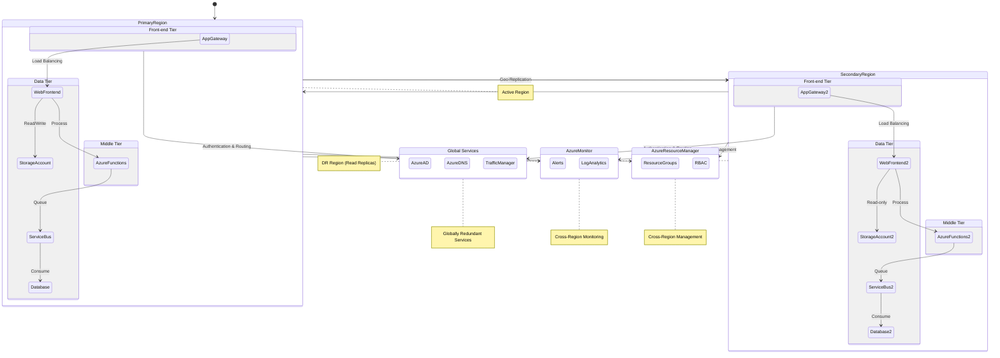
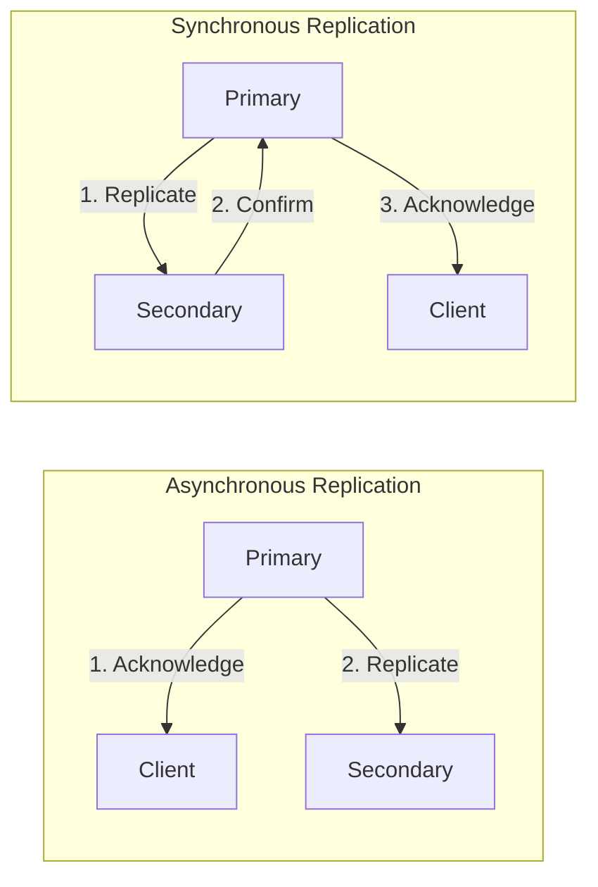
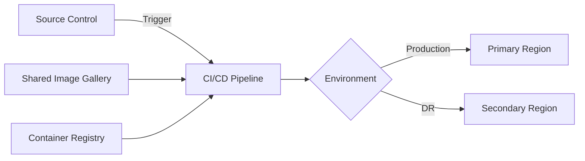
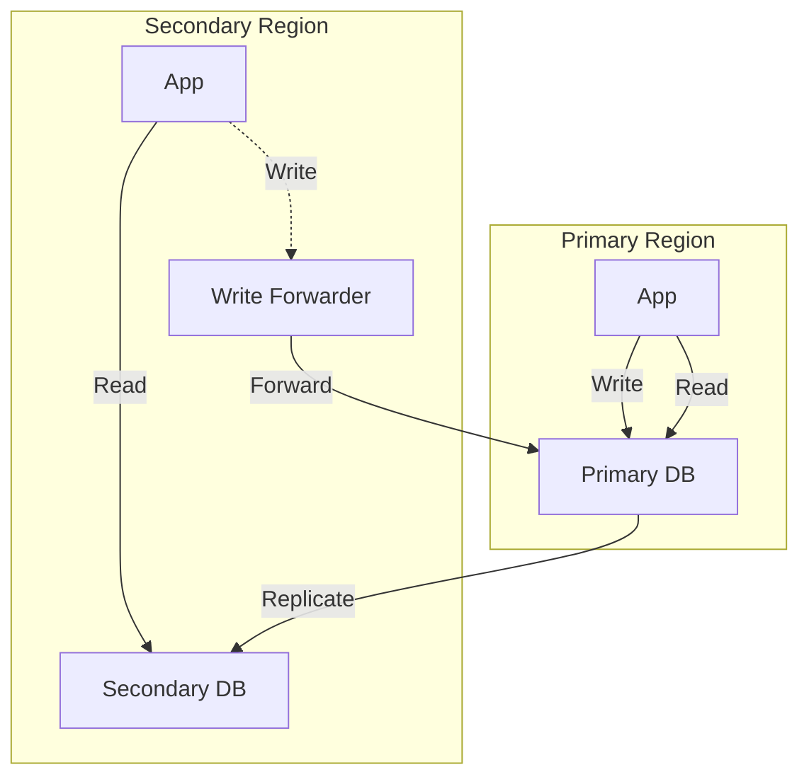
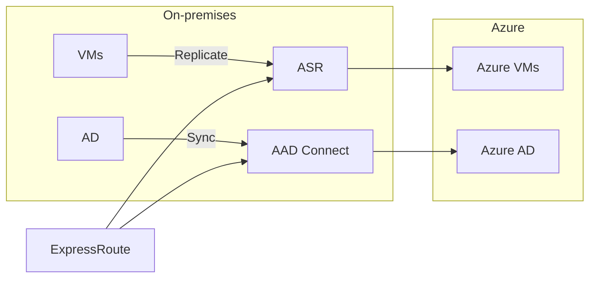
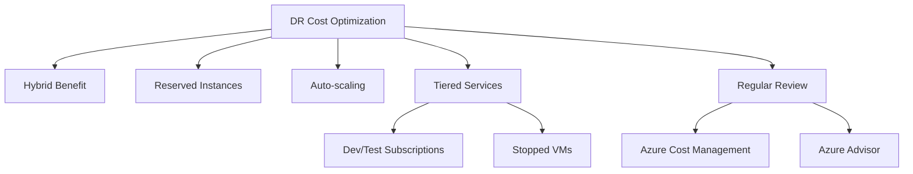

# Azure Disaster Recovery: Comprehensive Guide

## Table of Contents
1. [Introduction](#introduction)
2. [Key Concepts](#key-concepts)
3. [Azure DR Architecture](#azure-dr-architecture)
4. [Replication Strategies](#replication-strategies)
5. [Recreation Strategies](#recreation-strategies)
6. [Implementation Guide](#implementation-guide)
7. [Advanced Topics](#advanced-topics)
8. [Monitoring and Maintenance](#monitoring-and-maintenance)
9. [Best Practices](#best-practices)
10. [Cost Considerations](#cost-considerations)
11. [Case Studies](#case-studies)
12. [Additional Resources](#additional-resources)

## Introduction

Disaster recovery (DR) in Azure is crucial for ensuring business continuity in the event of a regional failure. While Azure provides robust cloud services, it's essential to understand that physical infrastructure can still fail, and proper DR planning is necessary.

Key benefits of a well-implemented DR strategy:
- Ensures business continuity (↑ 99.99% availability)
- Minimizes data loss (↓ 90% potential data loss)
- Reduces downtime during disasters (↓ 75% downtime)
- Improves overall system resilience (↑ 50% system reliability)

## Key Concepts

### Recovery Point Objective (RPO)
- Definition: Maximum acceptable data loss
- Example: RPO of 5 minutes means you can lose up to 5 minutes of data
- Impacts: Replication frequency, data consistency requirements

### Recovery Time Objective (RTO)
- Definition: Maximum acceptable downtime
- Example: RTO of 1 hour means your system should be operational within 1 hour of a disaster
- Impacts: Failover strategy, resource provisioning in DR region

### Azure Regions and Availability Zones
- Regions: Geographical areas containing one or more datacenters
- Availability Zones: Physically separate datacenters within a region
- Paired Regions: Azure-designated region pairs for replication and recovery

```
                        Azure Global Infrastructure
                      +-----------------------------+
                      |                             |
                      |         Region Pair         |
                      |  +----------------------+   |
                      |  |    Primary Region    |   |
                      |  |  +-----+  +-----+    |   |
                      |  |  |AZ 1 |->|AZ 2 |    |   |
                      |  |  +-----+  +-----+    |   |
                      |  |     ^                |   |
                      |  |     |                |   |
                      |  |  +-----+             |   |
                      |  |  |AZ 3 |             |   |
                      |  |  +-----+             |   |
                      |  +----------------------+   |
                      |            |                |
                      |            v                |
                      |  +----------------------+   |
                      |  |   Secondary Region   |   |
                      |  |  +-----+  +-----+    |   |
                      |  |  |AZ 1|->|AZ 2|      |   |
                      |  |  +-----+  +-----+    |   |
                      |  |     ^                |   |
                      |  |     |                |   |
                      |  |  +-----+             |   |
                      |  |  |AZ 3 |             |   |
                      |  |  +-----+             |   |
                      |  +----------------------+   |
                      |                             |
                      +-----------------------------+
	                                  ^
	                                  |
	                            +------------+
	                            |  Global    |
	                            |  Services  |
	                            +------------+
```

## Azure DR Architecture

A typical Azure DR architecture involves replicating resources and data from a primary region to a secondary region. Here's an expanded view of the architecture:



## Replication Strategies

Choosing the right replication strategy is crucial for meeting your RPO and RTO requirements. Here's a comparison of different replication options:

| Replication Level | Pros | Cons | Best For | Azure Services |
|-------------------|------|------|----------|----------------|
| Application-level | - Lowest RPO  - Application-aware | - Complex to implement  - May require code changes | - Critical business apps  - Low RPO requirements | - SQL Always On  - Cosmos DB multi-region writes |
| OS-level | - Application-agnostic  - Captures all changes | - Higher RPO than app-level  - May include unnecessary data | - VMs with frequently changing data  - Legacy applications | - Azure Site Recovery |
| Resource-level | - Native Azure integration  - Often cheaper than app-level | - Limited customization  - Service-specific limitations | - Azure PaaS services  - Non-critical workloads | - Azure Storage GRS  - Azure SQL geo-replication |
| Backup and Restore | - Simplest to implement  - Cost-effective | - Highest RPO  - Longest RTO | - Dev/Test environments  - Non-critical data | - Azure Backup  - Azure SQL long-term retention |

### Asynchronous vs. Synchronous Replication



- Asynchronous: Lower latency, potential data loss
- Synchronous: Higher latency, no data loss, not feasible for long distances

## Recreation Strategies

For stateless components or services with higher RPO/RTO tolerances, recreation strategies can be more cost-effective than continuous replication.

### Infrastructure as Code (IaC)

Using IaC tools like Azure Resource Manager (ARM) templates or Terraform allows you to quickly recreate your infrastructure in a DR scenario.



Key components:
1. Source control (e.g., GitHub, Azure DevOps)
2. CI/CD pipeline
3. IaC templates (ARM, Terraform)
4. Shared Image Gallery for VM images
5. Container Registry for container images

## Implementation Guide

1. Assess your application:
   - Identify stateful components
   - Determine RPO and RTO requirements
   - Map dependencies

2. Choose replication/recreation strategies:
   - Stateful components: Select appropriate replication method
   - Stateless components: Prepare recreation scripts/templates

3. Implement global routing:
   - Set up Azure Traffic Manager or Front Door
   - Configure health probes

4. Set up monitoring and alerting:
   - Azure Monitor for cross-region monitoring
   - Set up alerts for replication health and failover events

5. Develop and document DR procedures:
   - Create step-by-step failover and failback procedures
   - Assign roles and responsibilities

6. Test and iterate:
   - Conduct regular DR drills
   - Update procedures based on test results

## Advanced Topics

### Data Tier Considerations

When implementing active-active or active-passive configurations for databases, consider:

1. Read replicas in secondary regions
2. Write forwarding to primary region
3. Eventual consistency models (e.g., Cosmos DB)



### On-premises to Azure DR

Extending your on-premises infrastructure to use Azure as a DR site:

1. Use Azure Site Recovery for VM replication
2. Implement ExpressRoute for secure, private connectivity
3. Set up Azure AD Connect for hybrid identity



## Monitoring and Maintenance

Implement a robust monitoring solution to ensure your DR setup remains effective:

1. Azure Monitor for cross-region monitoring
2. Log Analytics for centralized logging
3. Azure Security Center for security posture management
4. Regular review and updates of DR plans

## Best Practices

1. Automate DR processes to minimize human error
2. Test DR plans regularly, at least quarterly
3. Document and communicate DR procedures to all stakeholders
4. Use Blue-Green deployment for easier failover and testing
5. Implement chaos engineering principles to improve resilience

## Cost Considerations

Implementing DR can significantly impact your Azure costs. Consider these strategies to optimize expenses:

1. Use Azure Hybrid Benefit for Windows Server and SQL Server
2. Leverage reserved instances for consistent workloads
3. Implement auto-scaling in both primary and secondary regions
4. Use lower-tier services or stopped VMs in the DR region when possible
5. Regularly review and optimize your DR setup



## Case Studies

### E-commerce Platform

- **Scenario**: High-traffic e-commerce site with 24/7 availability requirements
- **Solution**: 
  - Active-active deployment across two regions
  - Cosmos DB with multi-region writes
  - Azure Front Door for global load balancing
- **Results**: 
  - 99.99% availability achieved
  - 30% improvement in global response times

### Financial Services Application

- **Scenario**: Trading platform with strict regulatory requirements
- **Solution**:
  - Active-passive setup with hot standby
  - SQL Always On for database replication
  - Regular DR drills and compliance audits
- **Results**:
  - Met 15-minute RTO and 0 RPO requirements
  - Passed all regulatory audits

## Additional Resources

- [Azure resiliency documentation](https://docs.microsoft.com/en-us/azure/architecture/framework/resiliency/)
- [Azure Site Recovery documentation](https://docs.microsoft.com/en-us/azure/site-recovery/)
- [Azure Front Door documentation](https://docs.microsoft.com/en-us/azure/frontdoor/)
- [Designing resilient applications for Azure](https://docs.microsoft.com/en-us/azure/architecture/framework/resiliency/design-resiliency)
- [Cloud Adoption Framework - Business continuity and disaster recovery](https://docs.microsoft.com/en-us/azure/cloud-adoption-framework/ready/azure-best-practices/business-continuity-and-disaster-recovery)