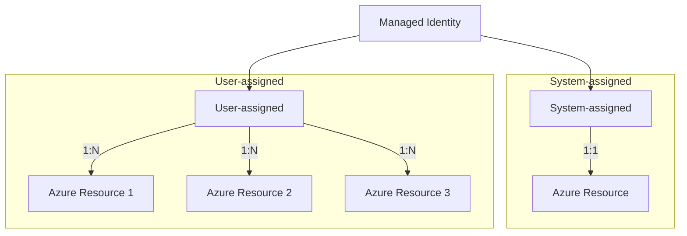
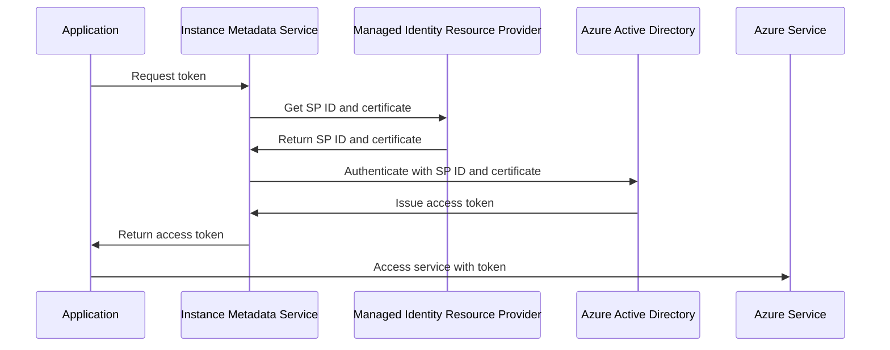

# Comprehensive Azure Managed Identity Guide

## Table of Contents
1. [Introduction](#introduction)
2. [Types of Managed Identities](#types-of-managed-identities)
3. [How Managed Identities Work](#how-managed-identities-work)
4. [Benefits of Managed Identities](#benefits-of-managed-identities)
5. [Supported Azure Services](#supported-azure-services)
6. [Implementation Examples](#implementation-examples)
7. [Token Handling and Resiliency](#token-handling-and-resiliency)
8. [Best Practices](#best-practices)
9. [Azure Arc Support](#azure-arc-support)
10. [Conclusion](#conclusion)

## Introduction

Managed identities provide a secure way for Azure resources to authenticate to other Azure services without storing credentials in code. They solve the critical problem of securely managing secrets or certificates for service-to-service authentication.

## Types of Managed Identities

There are two types of managed identities:

1. **System-assigned Managed Identity**
   - Tied to a single Azure resource
   - Shares lifecycle with the resource
   - Automatically deleted when the resource is deleted

2. **User-assigned Managed Identity**
   - Created as a standalone Azure resource
   - Can be assigned to multiple resources
   - Has its own lifecycle independent of the resources it's assigned to



## How Managed Identities Work

Managed identities are handled by the Managed Identity Resource Provider. The process differs slightly depending on the type of Azure resource:

1. For Virtual Machines:
   - Uses the Instance Metadata Service (IMDS) to obtain tokens
   - IMDS communicates with the Managed Identity Resource Provider
   - The Resource Provider issues and manages certificates for authentication

2. For other Azure services (e.g., Functions, Web Apps):
   - They have their own methods to request tokens
   - Usually involves a REST API call to a specific endpoint



## Benefits of Managed Identities

1. **Enhanced Security**: 
   - No need to store secrets or certificates in code
   - Reduces risk of credential exposure

2. **Simplified Management**: 
   - Azure automatically manages the identity lifecycle
   - No need for manual secret rotation

3. **Improved Resiliency**: 
   - Uses regional Secure Token Service (STS)
   - Long-lived tokens with proactive refresh

4. **Cost-Effective**: 
   - No additional cost for managed identities
   - Reduces operational overhead

## Supported Azure Services

Managed identities are supported by a wide range of Azure services, including but not limited to:

- Virtual Machines
- Azure Functions
- Azure App Service
- Azure Kubernetes Service (AKS)
- Azure Logic Apps
- Azure API Management
- Azure Data Factory
- Azure Event Hubs

## Implementation Examples

### 1. Accessing Blob Storage

```powershell
# Connect using the managed identity
Connect-AzAccount -Identity

# Create a context for the storage account
$context = New-AzStorageContext -StorageAccountName "yourstorageaccount" -UseConnectedAccount

# Copy a blob
Get-AzStorageBlobContent -Container "images" -Blob "sample.jpg" -Destination "C:\temp\" -Context $context
```

### 2. Reading Secrets from Azure Key Vault

```powershell
# Connect using the managed identity
Connect-AzAccount -Identity

# Get a secret from Key Vault
$secret = Get-AzKeyVaultSecret -VaultName "YourKeyVaultName" -Name "SecretName"

# Use the secret
$secretValueText = $secret.SecretValueText
```

## Token Handling and Resiliency

Managed identities use an app-only token flow with several resilience features:

- Tokens are long-lived (24 hours by default)
- Proactive token refresh (typically at 12 hours)
- Uses regional Secure Token Service (STS) for improved availability

```mermaid
gantt
    title Managed Identity Token Lifecycle
    dateFormat HH:mm
    axisFormat %H:%M

    section Token 1
    Active              :active, 00:00, 24h
    Refresh Window      :crit, 12:00, 12h

    section Token 2
    New Token Active    :active, 12:00, 24h
    Refresh Window      :crit, 24:00, 12h
```

## Best Practices

1. Use system-assigned managed identities for:
   - Single resources needing unique permissions
   - Simpler management of identity lifecycle

2. Use user-assigned managed identities for:
   - Multiple resources needing the same permissions
   - Scenarios requiring pre-creation of identities

3. Leverage Azure Key Vault for:
   - Storing secrets for non-Azure AD authenticated services
   - Managing certificates and keys

4. Implement least-privilege access:
   - Grant only the necessary permissions to the managed identity
   - Regularly review and audit assigned permissions

5. Monitor and audit:
   - Enable diagnostic logs for managed identities
   - Regularly review activity logs

## Azure Arc Support

- Supports system-assigned managed identities for on-premises resources
- Enables consistent identity management across hybrid environments
- Uses a hybrid Instance Metadata Service for on-premises machines

## Conclusion

Managed identities provide a secure, easy-to-use, and resilient solution for service-to-service authentication in Azure. By eliminating the need for credential management in application code, they significantly enhance security and simplify operations. As Azure continues to evolve, managed identities are becoming an increasingly critical component of robust and secure cloud architectures.