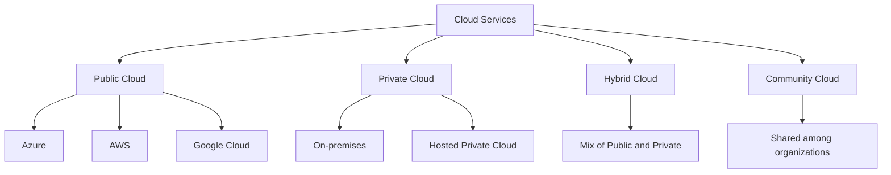
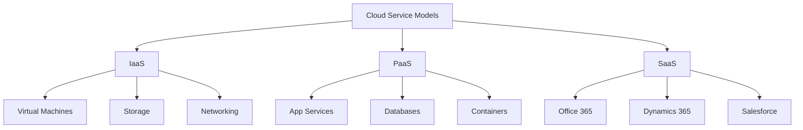
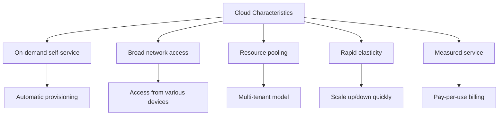
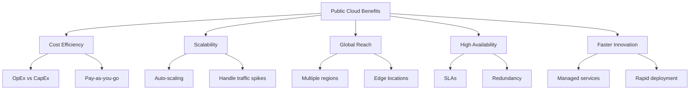
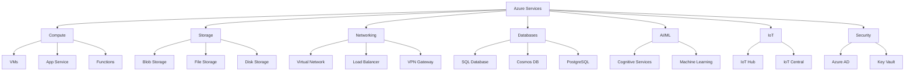
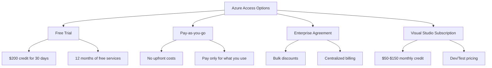
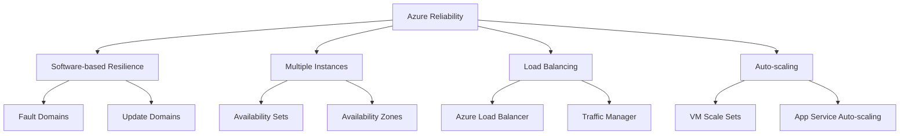
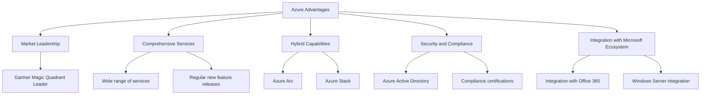

# Azure and Cloud Computing Fundamentals

## Types of Cloud Services

- Public Cloud: Accessible over the internet, shared resources (e.g., Azure, AWS, Google Cloud)
- Private Cloud: Dedicated to a single organization, can be on-premises or hosted
- Hybrid Cloud: Combination of public and private clouds
- Community Cloud: Shared by several organizations with common concerns

## Cloud Service Models

- IaaS (Infrastructure as a Service): Provides virtualized computing resources
- PaaS (Platform as a Service): Offers development and deployment environments
- SaaS (Software as a Service): Delivers software applications over the internet

## Core Characteristics of Cloud Computing

1. On-demand self-service: Users can provision resources without human interaction
2. Broad network access: Services are available over the network and accessed through standard mechanisms
3. Resource pooling: Provider's resources are pooled to serve multiple consumers
4. Rapid elasticity: Capabilities can be elastically provisioned and released to scale with demand
5. Measured service: Resource usage is monitored, controlled, and reported

## Benefits of Public Cloud

- Cost Efficiency: Pay for what you use, reduce capital expenses
- Scalability: Easily scale resources up or down based on demand
- Global Reach: Deploy applications closer to users worldwide
- High Availability: Built-in redundancy and fault tolerance
- Faster Innovation: Access to latest technologies and managed services

## Microsoft Azure Services

Azure offers a comprehensive set of services across various categories, including compute, storage, networking, databases, AI/ML, IoT, and security.

## Getting Started with Azure

- Free Trial: Offers $200 credit for 30 days and 12 months of free services
- Pay-as-you-go: No upfront costs, pay only for what you use
- Enterprise Agreement: For large organizations, offers bulk discounts and centralized management
- Visual Studio Subscription: Includes monthly Azure credit for development and testing

## Azure Reliability and Resiliency

- Software-based Resilience: Focus on distributing workloads across multiple instances
- Multiple Instances: Use of availability sets and zones for redundancy
- Load Balancing: Distribute traffic across multiple instances
- Auto-scaling: Automatically adjust resources based on demand

## Why Choose Azure

- Market Leadership: Consistently ranked as a leader in Gartner Magic Quadrant
- Comprehensive Services: Wide range of services covering various IT needs
- Hybrid Capabilities: Strong support for hybrid cloud scenarios
- Security and Compliance: Advanced security features and compliance certifications
- Integration with Microsoft Ecosystem: Seamless integration with other Microsoft products and services