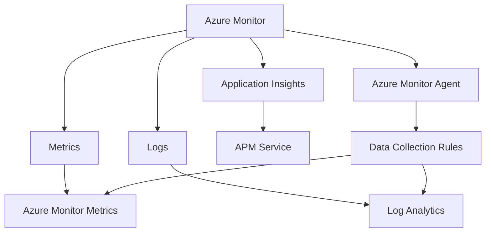
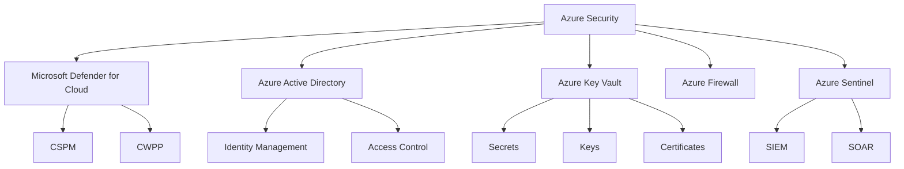
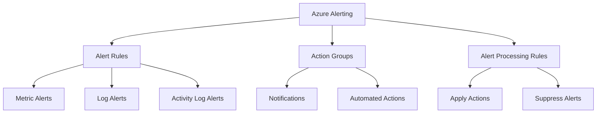
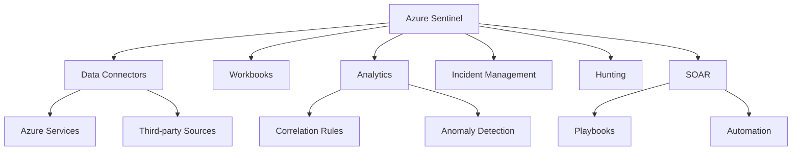

Module 10 - Monitoring & Security

## Azure Monitoring

### Introduction
Azure Monitoring is a comprehensive solution for collecting, analyzing, and acting on telemetry from Azure and on-premises environments. It helps ensure high availability and performance of applications and services.

### Key Components

1. **Azure Monitor**: The core platform for all monitoring data
2. **Log Analytics**: A tool for querying and analyzing log data
3. **Application Insights**: Application Performance Management (APM) service
4. **Metrics**: Time-series database for storing numerical data
5. **Diagnostic Settings**: Configuration for routing platform logs and metrics

### Technical Details

- **Data Sources**:
  - Activity Log: Subscription-level events
  - Resource Logs: Resource-level diagnostic information
  - Guest OS: Data from within VMs or other compute resources
  - Application: Custom application telemetry

- **Data Types**:
  - Metrics: Numerical values stored in a time-series database
  - Logs: Text-based data stored in Log Analytics

- **Azure Monitor Agent (AMA)**: Latest agent for collecting monitoring data, replacing older agents like Log Analytics agent and Telegraf

- **Data Collection Rules (DCRs)**: Define what data to collect and where to send it

### Best Practices

- Implement a comprehensive monitoring strategy across all resources
- Use Azure Policy to enforce consistent monitoring configuration
- Leverage Auto-scaling based on monitoring data
- Implement proper retention policies to manage costs

## Azure Security

### Introduction
Azure Security is a multi-layered approach to protect cloud resources, data, and applications. It encompasses various services and best practices to ensure a secure cloud environment.

### Key Components

1. **Microsoft Defender for Cloud**: Cloud Security Posture Management (CSPM) and Cloud Workload Protection Platform (CWPP)
2. **Azure Active Directory (AD)**: Identity and access management service
3. **Azure Key Vault**: Secure storage for secrets, keys, and certificates
4. **Azure Firewall**: Cloud-native firewall as a service
5. **Azure Sentinel**: Cloud-native SIEM and SOAR solution

### Technical Details

- **Zero Trust Model**: 
  - Verify explicitly
  - Use least privilege access
  - Assume breach

- **Microsoft Defender for Cloud**:
  - Free tier: Basic CSPM features
  - Paid tier: Advanced threat protection for various Azure services

- **Managed Identities**:
  - System-assigned: Tied to a specific Azure resource
  - User-assigned: Can be shared across multiple resources

- **Azure Key Vault**:
  - Supports secrets, keys, and certificates
  - Integrates with Azure AD for access control
  - Offers automated rotation for keys and secrets

### Best Practices

- Implement the principle of least privilege
- Use Multi-Factor Authentication (MFA) for all accounts
- Encrypt data at rest and in transit
- Regularly review and update security policies
- Implement Just-In-Time (JIT) VM access

## Azure Alerting and Action Groups

### Introduction
Azure Alerting helps proactively notify administrators about important events or conditions in the Azure environment. Action Groups define a set of actions to take when an alert is triggered.

### Key Components

1. **Alert Rules**: Define conditions that trigger alerts
2. **Action Groups**: Specify actions to take when alerts fire
3. **Alert Processing Rules**: Control how alerts are handled

### Technical Details

- **Alert Types**:
  - Metric Alerts: Based on resource performance metrics
  - Log Alerts: Based on Log Analytics queries
  - Activity Log Alerts: Based on Azure subscription events

- **Action Types**:
  - Email, SMS, Push notifications
  - Azure Functions
  - Logic Apps
  - Webhook
  - ITSM connection

- **Alert Processing Rules**:
  - Apply actions to multiple alerts
  - Suppress alerts during maintenance windows

### Best Practices

- Use dynamic thresholds for metric alerts where possible
- Implement proper alert severity levels
- Use Action Groups for consistent alert handling
- Regularly review and optimize alert configurations

## Azure Sentinel

### Introduction
Azure Sentinel is a cloud-native Security Information and Event Management (SIEM) and Security Orchestration Automated Response (SOAR) solution. It provides intelligent security analytics across the enterprise.

### Key Components

1. **Data Connectors**: Ingest data from various sources
2. **Workbooks**: Interactive reports and dashboards
3. **Analytics**: Correlation rules and anomaly detection
4. **Incident Management**: Investigate and respond to security incidents
5. **Hunting**: Proactively search for threats
6. **SOAR**: Automate response to threats

### Technical Details

- Built on top of Log Analytics workspace
- Uses Kusto Query Language (KQL) for data analysis
- Supports integration with Microsoft 365 Defender
- Offers Machine Learning models for anomaly detection

### Best Practices

- Implement a comprehensive data ingestion strategy
- Regularly update and tune analytics rules
- Use automation playbooks for common response scenarios
- Conduct regular threat hunting exercises
- Integrate with existing security tools and processes

These sections provide a comprehensive overview of Azure's monitoring and security capabilities, highlighting the key components, technical details, and best practices for each area. The mermaid diagrams visually represent the relationships between different components within each section, making it easier to understand the overall structure of these Azure services.