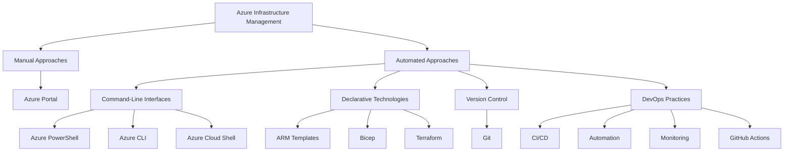

## Azure Infrastructure Management and DevOps

This section covers various methods for managing Azure infrastructure, from manual approaches to automated, code-based solutions, as well as an introduction to DevOps practices in Azure.

### Portal Interactions

The Azure portal provides a graphical interface for managing Azure resources.

- Intuitive and user-friendly for beginners
- Great for exploring available options and monitoring resources
- Lacks scalability and consistency for large-scale deployments
- Not suitable for automation or repetitive tasks

### Command-Line Interfaces

Azure provides powerful command-line tools for management and automation.

#### Azure PowerShell

- Cross-platform PowerShell modules for Azure management
- Imperative approach to resource management
- Ideal for automation and scripting tasks
- Requires installation of Az module

#### Azure CLI

- Cross-platform command-line interface for Azure
- Also uses an imperative approach
- Suitable for automation and scripting
- Can be installed on various operating systems

#### Azure Cloud Shell

- Browser-based shell environment
- Provides both PowerShell and Bash options
- Pre-authenticated with Azure credentials
- Includes common Azure tools and utilities

### Declarative Technologies

Declarative approaches focus on describing the desired end-state rather than specifying step-by-step instructions.

#### ARM Templates

- JSON-based templates for defining Azure resources
- Declarative approach to infrastructure deployment
- Supports parameters for reusability across environments
- Can be complex and verbose for large deployments

#### Bicep

- Domain-specific language for Azure resource definition
- Compiles to ARM JSON templates
- More concise and readable than ARM JSON
- Supports modules for better organization and reusability

#### Terraform

- Open-source, multi-cloud infrastructure as code tool
- Supports Azure and other cloud providers
- Uses its own domain-specific language (HCL)
- Provides a consistent workflow across different environments

### Version Control with Git

Git is essential for managing infrastructure as code and application source code.

- Distributed version control system
- Tracks changes and enables collaboration
- Supports branching for parallel development
- Integrates with various hosting platforms (e.g., GitHub, Azure DevOps)

### DevOps Practices

DevOps combines development and operations to improve software delivery and infrastructure management.

- Focuses on continuous integration and delivery (CI/CD)
- Emphasizes automation and collaboration
- Utilizes pipelines for consistent deployments
- Incorporates monitoring and feedback for continuous improvement

### GitHub Actions

GitHub Actions provides automation capabilities for GitHub repositories.

- Supports CI/CD workflows
- Can be triggered by various GitHub events
- Offers Azure-specific actions for easy integration
- Supports OpenID Connect for secure Azure authentication

This comprehensive approach to Azure infrastructure management highlights the evolution from manual, portal-based management to automated, code-driven solutions. By leveraging declarative technologies, version control, and DevOps practices, organizations can achieve more consistent, scalable, and efficient management of their Azure resources. The integration of tools like GitHub Actions further enhances the ability to automate deployments and maintain infrastructure as code, aligning with modern cloud computing best practices.