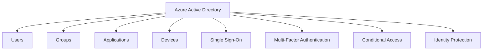
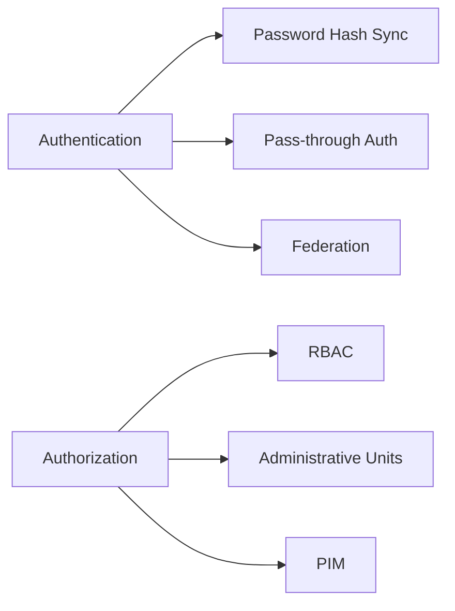
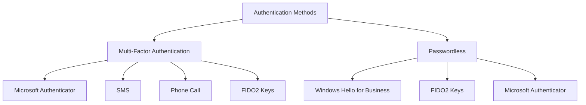
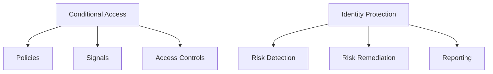
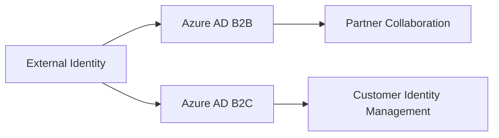
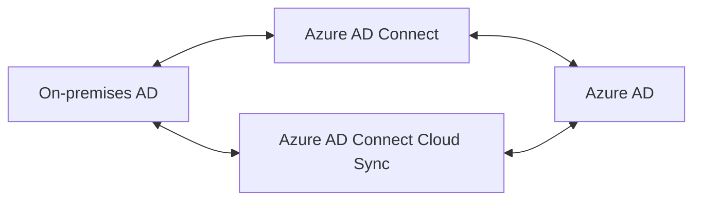

# Introduction to Azure Identity and Access Management

This summary provides a comprehensive overview of Azure's identity and access management solutions, focusing on Azure Active Directory (Azure AD) and related services. It covers key concepts, features, and best practices for implementing secure and efficient identity management in Azure cloud environments.

## Azure Active Directory (Azure AD)

### Overview
Azure AD is Microsoft's cloud-based identity and access management service, serving as the foundation for securing access to Azure resources, Microsoft 365, and third-party applications.

### Key Components
- **Users**: Represent individuals within the organization
- **Groups**: Collections of users for easier management
- **Applications**: Registered apps that integrate with Azure AD
- **Devices**: Endpoints that can be registered or joined to Azure AD

### Features
- **Single Sign-On (SSO)**: Enables users to access multiple applications with a single set of credentials
- **Multi-Factor Authentication (MFA)**: Adds an extra layer of security by requiring additional verification
- **Conditional Access**: Allows granular control over access to resources based on various factors
- **Identity Protection**: Uses machine learning to detect and prevent identity-based risks

### Azure AD Editions
- **Free**: Basic directory services and user management
- **Office 365 Apps**: Tailored for Office 365 users
- **Premium P1**: Advanced identity and access management features
- **Premium P2**: Adds advanced security and governance capabilities

## Authentication and Authorization

### Authentication Methods
- **Password Hash Synchronization**: Syncs password hashes from on-premises AD to Azure AD
- **Pass-through Authentication**: Validates passwords against on-premises AD
- **Federation**: Delegates authentication to a separate identity provider (e.g., ADFS)

### Authorization
- **Role-Based Access Control (RBAC)**: Assigns permissions to users, groups, or applications
- **Administrative Units**: Allows delegation of administrative tasks for specific groups of users or resources

### Best Practices
- Implement **least privilege** access principles
- Use **Privileged Identity Management (PIM)** for just-in-time access to elevated roles
- Regularly perform **access reviews** to ensure appropriate permissions

## Multi-Factor Authentication and Passwordless

### MFA Options
- **Microsoft Authenticator app**: Push notifications or one-time passcodes
- **SMS**: Text messages with verification codes
- **Phone call**: Automated voice calls for verification
- **FIDO2 security keys**: Physical keys for passwordless authentication

### Passwordless Authentication
- **Windows Hello for Business**: Biometric and PIN-based authentication for Windows devices
- **FIDO2 security keys**: Standards-based passwordless authentication
- **Microsoft Authenticator app**: Passwordless sign-in using the mobile app

### Best Practices
- Enable MFA for all users, especially administrators
- Implement **number matching** for enhanced security in MFA prompts
- Gradually transition to passwordless authentication methods

## Conditional Access and Identity Protection

### Conditional Access
- **Policies**: Define rules for allowing or blocking access based on various signals
- **Signals**: User, device, location, application, and real-time risk detection
- **Access Controls**: Require MFA, compliant devices, or specific locations for access

### Identity Protection
- **Risk Detection**: Uses machine learning to identify potentially compromised identities
- **Risk Remediation**: Automated actions to mitigate detected risks
- **Reporting**: Provides detailed reports on risky users and sign-ins

### Best Practices
- Implement a **Zero Trust** security model using Conditional Access
- Use **risk-based Conditional Access** policies to adapt security requirements dynamically
- Regularly review and update policies based on changing security needs

## Azure AD B2B and B2C

### Azure AD B2B (Business-to-Business)
- Enables collaboration with external partners using their own identities
- Supports various identity providers (Azure AD, Microsoft Account, Google, etc.)
- Allows fine-grained control over external user access

### Azure AD B2C (Business-to-Consumer)
- Customer identity and access management solution
- Supports social identity providers and local accounts
- Customizable user experiences for sign-up, sign-in, and profile management

### Best Practices
- Use **cross-tenant access settings** to control inbound and outbound access for B2B collaboration
- Implement **custom policies** in B2C for complex identity scenarios
- Regularly review external user access and implement **lifecycle management**

## Hybrid Identity and Azure AD Connect

### Azure AD Connect
- Synchronizes on-premises AD with Azure AD
- Supports **password hash synchronization**, **pass-through authentication**, and **federation**
- Enables hybrid identity scenarios for seamless access to cloud and on-premises resources

### Azure AD Connect Cloud Sync
- Lightweight alternative to full Azure AD Connect
- Supports multi-forest scenarios and partial attribute synchronization
- Managed service with reduced on-premises footprint

### Best Practices
- Implement **staged rollout** for synchronization
- Use **filtering** to control which objects are synchronized
- Regularly monitor synchronization health and errors

By implementing these Azure identity and access management solutions, organizations can secure their cloud resources, enable seamless access for users, and maintain compliance with security best practices. Regular review and optimization of identity policies and configurations are essential to adapt to evolving security threats and organizational needs.