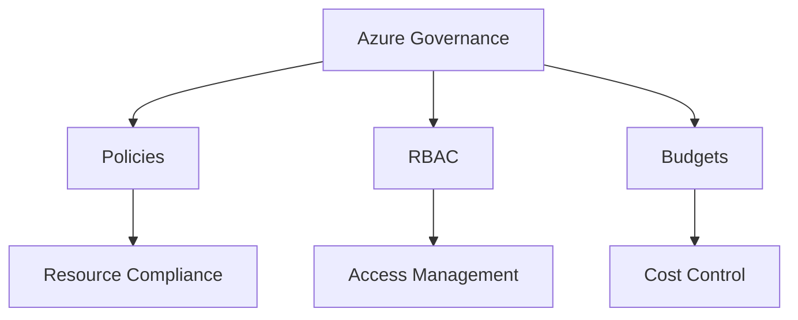
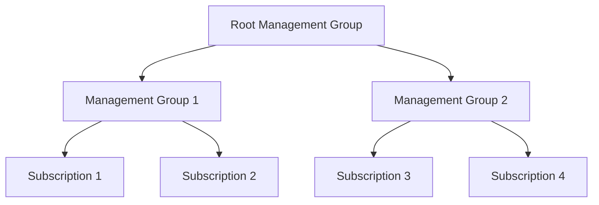
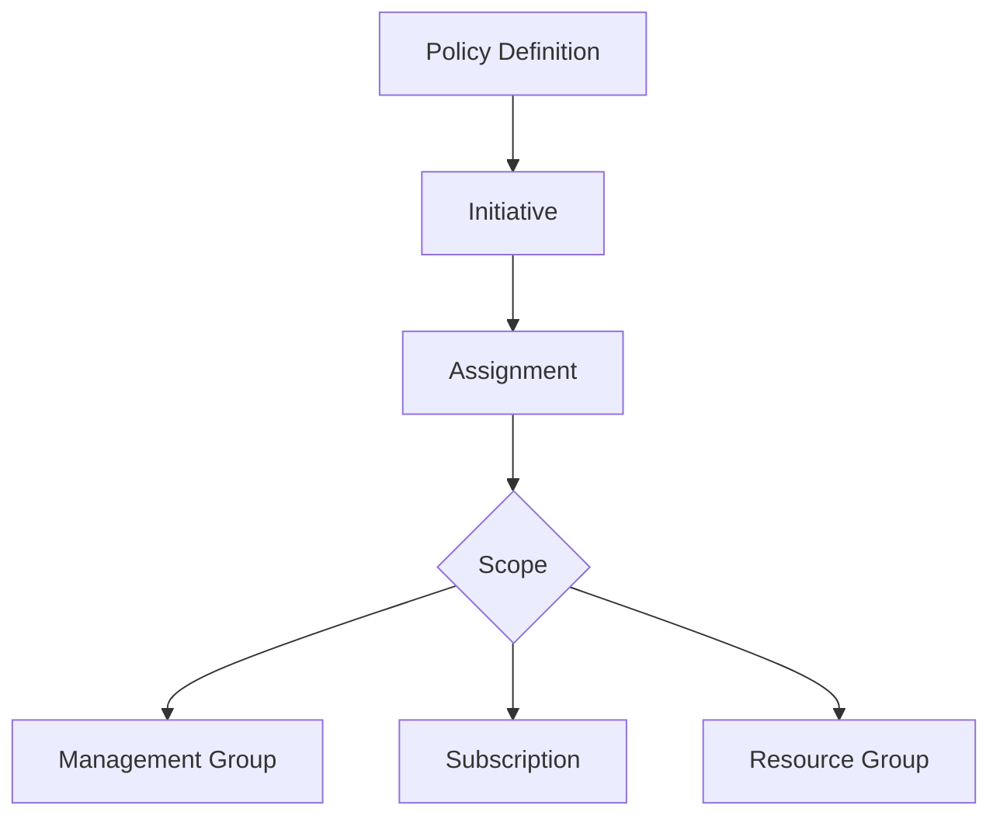
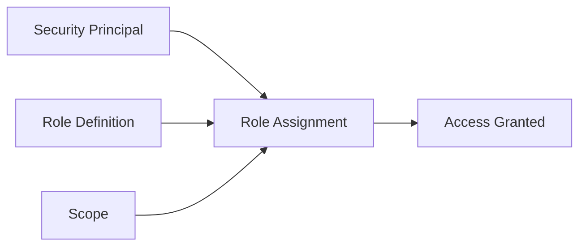
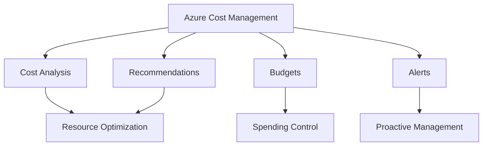
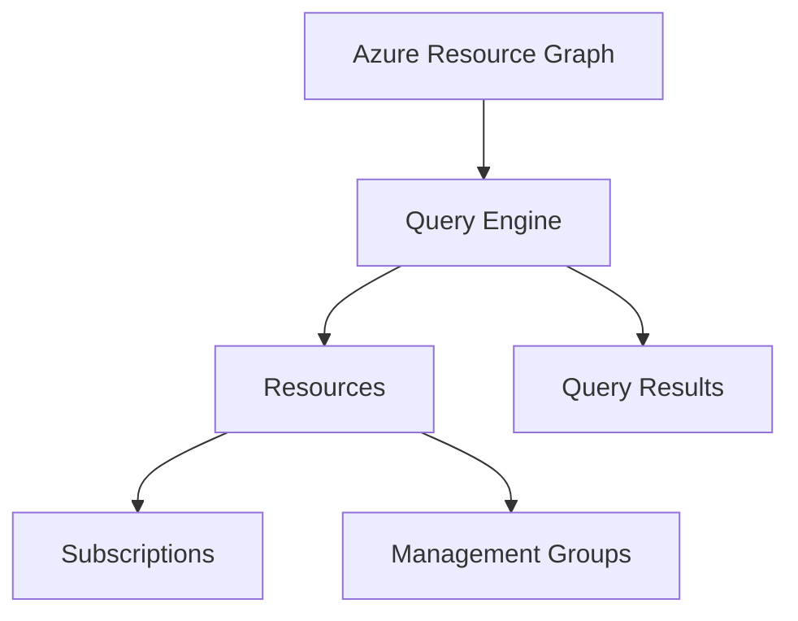
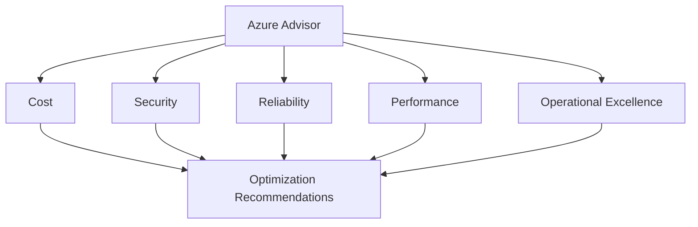

# Azure Governance and Management

This summary provides a comprehensive overview of Azure governance and management concepts, focusing on key components, best practices, and tools for effectively controlling and optimizing Azure environments.

## Introduction to Governance in Azure

Governance in Azure is critical due to the shift from traditional on-premises IT operations to cloud-based self-service models. It ensures that organizational policies, compliance requirements, and best practices are enforced across cloud resources.

### Key Components:
- **Policies**: Define what can be done
- **Role-Based Access Control (RBAC)**: Define who can do it
- **Budgets**: Define how much can be spent

### Importance:
- Enforces company rules and regulatory requirements
- Prevents misconfigurations and security risks
- Enables cost control and optimization

## Management Groups and Subscriptions

Management groups and subscriptions provide a hierarchical structure for organizing and managing Azure resources.

### Management Groups
- Root-level container for organizing subscriptions
- Can have up to 6 levels of hierarchy
- Enables inheritance of policies and access controls

### Subscriptions
- Billing and access control boundary
- Trust a specific Azure AD tenant
- Container for resource groups and resources

### Best Practices:
- Use management groups for consistent policy application across multiple subscriptions
- Create subscriptions based on business needs, environments, or departments
- Consider quota limits when designing subscription structure

## Azure Policy

Azure Policy is a service for creating, assigning, and managing policies to enforce rules and effects across Azure resources.

### Key Features:
- **Policy Definitions**: JSON files that describe policy rules
- **Initiatives**: Groups of related policies
- **Assignments**: Application of policies to specific scopes

### Policy Effects:
- Audit: Check compliance without enforcing
- Deny: Prevent non-compliant resources from being created
- Deploy: Automatically create or modify resources
- Modify: Add, update, or remove resource properties

### Best Practices:
- Start with audit policies before enforcing deny
- Use initiatives for comprehensive compliance management
- Regularly review and update policies

## Role-Based Access Control (RBAC)

RBAC in Azure provides fine-grained access management for Azure resources.

### Components:
- **Security Principal**: User, group, or service principal
- **Role Definition**: Set of permissions
- **Scope**: Boundary for the role assignment
- **Assignment**: Linking of role to principal at a scope

### Best Practices:
- Follow the principle of least privilege
- Use built-in roles when possible
- Assign roles to groups instead of individual users
- Regularly review and audit role assignments

## Azure Cost Management and Billing

Azure Cost Management provides tools for monitoring, allocating, and optimizing cloud spending.

### Key Features:
- **Cost Analysis**: Detailed breakdown of resource costs
- **Budgets**: Set spending limits and alerts
- **Alerts**: Notifications for cost anomalies
- **Recommendations**: Cost optimization suggestions

### Best Practices:
- Set up budgets and alerts for proactive cost management
- Use tags for cost allocation and chargeback
- Leverage Azure Advisor for cost optimization recommendations
- Regularly review and optimize resource usage

## Azure Resource Graph

Azure Resource Graph provides fast and efficient querying capabilities for Azure resources across subscriptions.

### Key Features:
- Uses Kusto Query Language (KQL)
- Supports complex queries across multiple subscriptions
- Provides near real-time results

### Use Cases:
- Resource inventory and compliance checking
- Security and operational investigations
- Cost optimization queries

## Azure Advisor

Azure Advisor is a personalized cloud consultant that provides recommendations to optimize Azure deployments.

### Recommendation Categories:
- Cost
- Security
- Reliability
- Performance
- Operational Excellence

### Best Practices:
- Regularly review Advisor recommendations
- Prioritize high-impact suggestions
- Integrate Advisor with other Azure services for automated improvements

## Conclusion

Effective governance and management are crucial for successful Azure deployments. By leveraging management groups, subscriptions, Azure Policy, RBAC, and cost management tools, organizations can ensure compliance, security, and cost optimization across their Azure environments. Regular use of Azure Advisor and Resource Graph can provide valuable insights and opportunities for improvement.

Azure's governance tools offer a comprehensive approach to managing cloud resources, which is essential in today's complex and rapidly evolving cloud landscapes. Compared to other cloud providers, Azure's integrated governance features provide a robust framework for organizations to maintain control and visibility over their cloud operations.

