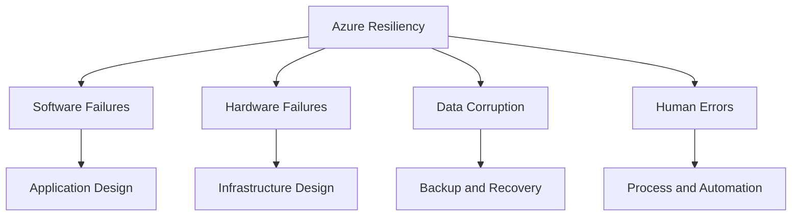
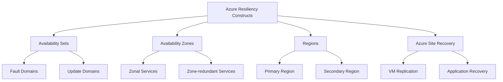
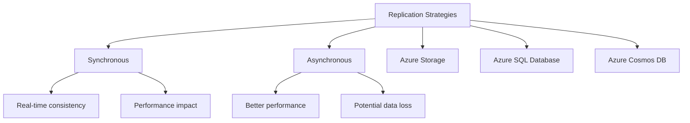
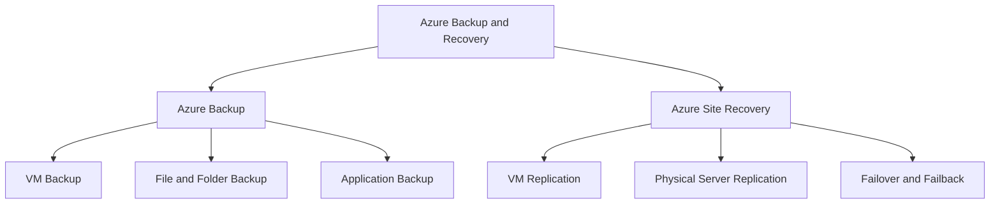
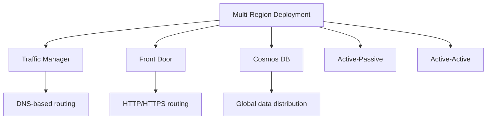
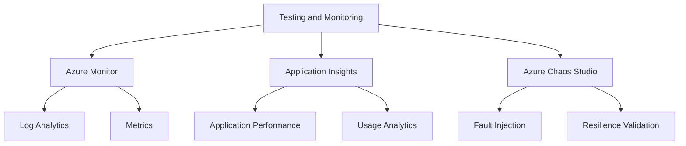

## Azure Resiliency and Disaster Recovery

This summary provides a comprehensive overview of resiliency and disaster recovery concepts in Azure, focusing on key components, best practices, and tools for ensuring high availability and business continuity.

## Introduction to Azure Resiliency

Resiliency in Azure is critical for ensuring applications and services remain available and can recover quickly from failures. It involves designing systems that can withstand various types of failures and recover gracefully.

### Key Components:
- **Software failures**: Bugs, crashes, memory leaks
- **Hardware failures**: Disk, server, network, power
- **Data corruption**: Accidental or malicious
- **Human errors**: Misconfiguration, insufficient testing

### Importance:
- Ensures business continuity
- Maintains customer trust
- Meets regulatory requirements
- Minimizes financial impact of outages

## Azure Resiliency Constructs

Azure provides various constructs to help build resilient applications and infrastructure.

### Key Components:
- **Availability Sets**: Logical grouping of VMs for resiliency against rack-level failures
- **Availability Zones**: Physically separate datacenters within an Azure region
- **Regions**: Geographical areas containing one or more datacenters
- **Azure Site Recovery**: Disaster recovery service for VMs and applications

### Best Practices:
- Use Availability Sets for VMs that perform the same function
- Distribute critical workloads across Availability Zones
- Implement multi-region deployments for critical applications
- Regularly test disaster recovery scenarios

## Replication Strategies

Replication is a key component of resiliency, ensuring data and services are available in multiple locations.

### Types of Replication:
- **Synchronous**: Real-time replication with potential performance impact
- **Asynchronous**: Delayed replication with better performance but potential data loss

### Azure Services for Replication:
- **Azure Storage**: Geo-redundant storage (GRS) and read-access geo-redundant storage (RA-GRS)
- **Azure SQL Database**: Active geo-replication and auto-failover groups
- **Azure Cosmos DB**: Multi-region writes

### Considerations:
- Recovery Point Objective (RPO): Acceptable data loss
- Recovery Time Objective (RTO): Acceptable downtime
- Performance impact of replication
- Cost of maintaining replicated resources

## Backup and Recovery

Backup is essential for protecting against data loss and ensuring business continuity.

### Azure Backup Services:
- **Azure Backup**: Backup service for Azure VMs, on-premises servers, and more
- **Azure Site Recovery**: Disaster recovery service for Azure VMs and on-premises workloads

### Key Features:
- Application-consistent backups
- Long-term retention
- Geo-redundant storage for backups
- Backup for hybrid environments

### Best Practices:
- Regularly test backup restoration
- Implement backup encryption
- Use immutable storage for backups to protect against ransomware
- Implement role-based access control (RBAC) for backup management

## Multi-Region Deployments

Multi-region deployments are crucial for ensuring high availability and disaster recovery for critical applications.

### Key Components:
- **Traffic Manager**: DNS-based traffic routing for global load balancing
- **Front Door**: Application delivery network for global HTTP/HTTPS routing
- **Cosmos DB**: Global distribution for low-latency data access

### Deployment Patterns:
- Active-Passive: Primary region handles all traffic, secondary region on standby
- Active-Active: Both regions handle traffic simultaneously

### Considerations:
- Data synchronization between regions
- Latency and performance impact
- Cost of maintaining multiple deployments
- Complexity of managing multi-region applications

## Testing and Monitoring

Regular testing and monitoring are essential for ensuring the effectiveness of resiliency measures.

### Key Components:
- **Azure Monitor**: Platform for collecting and analyzing telemetry data
- **Application Insights**: Application performance management service
- **Azure Chaos Studio**: Service for running controlled experiments on Azure workloads

### Best Practices:
- Implement comprehensive monitoring for all critical components
- Regularly conduct disaster recovery drills
- Use chaos engineering to identify weaknesses in the system
- Continuously review and update resiliency strategies based on test results

Azure's resiliency features provide a robust framework for building highly available and disaster-resistant applications. By leveraging these tools and following best practices, organizations can ensure their services remain available and recoverable in the face of various failures and disasters. Compared to on-premises solutions, Azure offers more flexibility and cost-effective options for implementing resiliency across multiple geographical locations.