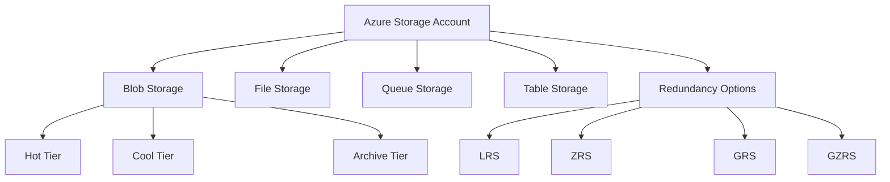
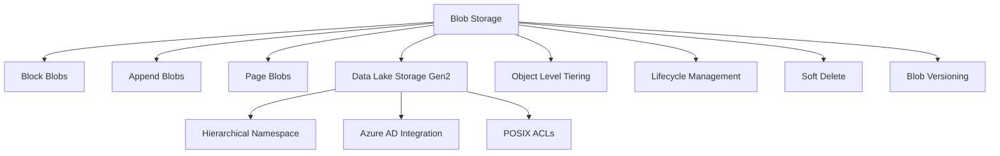
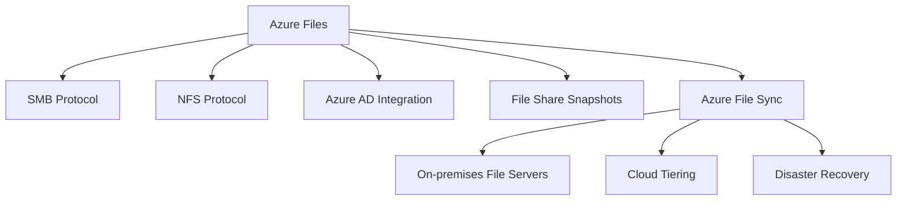
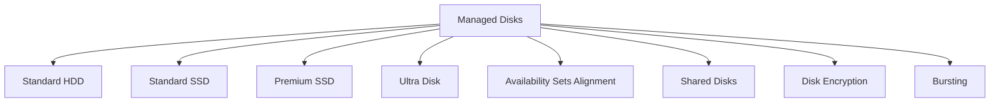
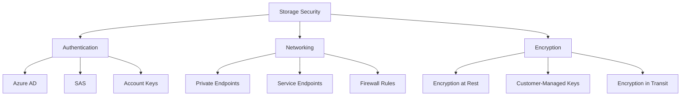

## Azure Storage Overview

Azure Storage provides a suite of cloud storage solutions designed to meet various data storage and access requirements. This section covers the fundamental concepts and services within Azure Storage.

### Key Components

- **Storage Accounts**: The top-level namespace for storage services in Azure
- **Blob Storage**: For unstructured data like files, images, and videos
- **File Storage**: Managed file shares accessible via SMB and NFS protocols
- **Queue Storage**: For message-based communication between application components
- **Table Storage**: NoSQL data store for semi-structured data

### Storage Account Types

- **General Purpose v2 (GPv2)**: Standard multi-service storage account
- **Premium Storage**: High-performance SSD-based storage for specific workloads

### Data Redundancy Options

- **Locally Redundant Storage (LRS)**: Three copies within a single datacenter
- **Zone Redundant Storage (ZRS)**: Three copies across availability zones
- **Geo-Redundant Storage (GRS)**: Six copies across paired regions
- **Geo-Zone Redundant Storage (GZRS)**: Combines ZRS in primary region with GRS

### Access Tiers

- **Hot**: Frequent access, higher storage cost, lower access cost
- **Cool**: Infrequent access, lower storage cost, higher access cost
- **Archive**: Rarely accessed data, lowest storage cost, highest retrieval cost

## Blob Storage and Data Lake Storage

Blob Storage is designed for storing large amounts of unstructured data, while Data Lake Storage Gen2 builds on Blob Storage to provide a hierarchical namespace and enhanced analytics capabilities.

### Blob Storage Features

- **Block Blobs**: For storing large objects, ideal for streaming and storing documents
- **Append Blobs**: Optimized for append operations, useful for logging scenarios
- **Page Blobs**: For frequent random read/write operations, used for VM disks

### Data Lake Storage Gen2

- Built on top of Blob Storage
- Provides a true hierarchical file system
- Supports Azure AD-based access control and POSIX permissions
- Optimized for big data analytics workloads

### Key Capabilities

- **Object Level Tiering**: Move individual blobs between access tiers
- **Lifecycle Management**: Automatically move or delete data based on age or access patterns
- **Soft Delete**: Protects against accidental deletion or overwrite
- **Blob Versioning**: Automatically maintain previous versions of blobs

## Azure Files and File Sync

Azure Files provides fully managed file shares in the cloud, while Azure File Sync enables hybrid scenarios by synchronizing on-premises file servers with Azure Files.

### Azure Files Features

- Supports SMB and NFS protocols
- Integrates with Azure AD Domain Services for identity-based access control
- Offers snapshot capabilities for point-in-time recovery

### Azure File Sync Capabilities

- Synchronizes multiple on-premises file servers with Azure Files
- Provides cloud tiering to optimize on-premises storage usage
- Enables fast disaster recovery for file servers

### Use Cases

- **Lift and Shift**: Easily migrate on-premises file shares to the cloud
- **Hybrid Storage**: Maintain local access while leveraging cloud storage
- **Backup and Disaster Recovery**: Use Azure Files as a backup target or for quick recovery

## Managed Disks

Managed Disks provide scalable and highly available block storage for Azure VMs, abstracting the complexities of storage account management.

### Managed Disk Types

- **Standard HDD**: Cost-effective storage for dev/test workloads
- **Standard SSD**: General-purpose SSD storage
- **Premium SSD**: High-performance storage for production workloads
- **Ultra Disk**: Highest performance for data-intensive workloads

### Key Features

- **Availability Sets Alignment**: Ensures disks are placed on separate storage clusters
- **Shared Disks**: Allows multiple VMs to attach to the same managed disk
- **Disk Encryption**: Supports encryption at rest using platform-managed or customer-managed keys
- **Bursting**: Provides temporary performance boost for supported disk types

### Performance Considerations

- IOPS and throughput limits vary based on disk size and type
- Premium SSD v2 and Ultra Disks allow independent scaling of IOPS and throughput

## Storage Security and Networking

Azure Storage provides various security and networking features to protect data and control access to storage resources.

### Authentication and Authorization

- **Azure AD Integration**: Supports Azure AD-based access control for fine-grained permissions
- **Shared Access Signatures (SAS)**: Provides time-limited, scoped access to storage resources
- **Storage Account Keys**: Offers full access to storage accounts (use with caution)

### Networking Features

- **Private Endpoints**: Enables access to storage accounts over a private IP address within a VNet
- **Service Endpoints**: Provides optimized routing from VNet subnets to storage services
- **Firewall Rules**: Allows IP-based access restrictions for storage accounts

### Encryption

- **Encryption at Rest**: All data is automatically encrypted using Microsoft-managed keys
- **Customer-Managed Keys**: Allows use of customer-controlled keys for encryption
- **Encryption in Transit**: Enforces secure transfer using HTTPS

These sections provide a comprehensive overview of Azure Storage services, their key features, and important considerations for implementation and management. The mermaid diagrams visually represent the relationships between different components and features within each main section.

