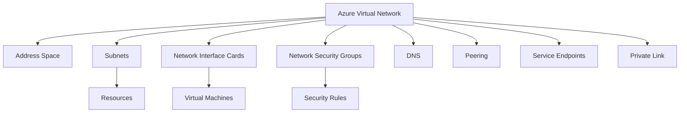
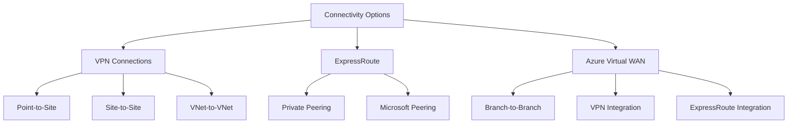
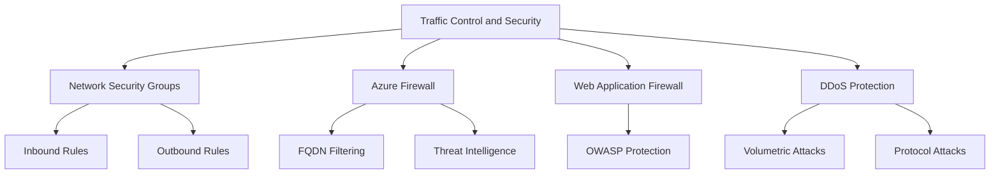
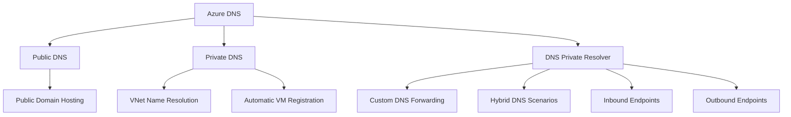

## Azure Virtual Networks

Azure Virtual Networks (VNets) provide the fundamental networking infrastructure for Azure resources, enabling secure communication and isolation.

### Key Components

- **Address Space**: Defined using CIDR notation (e.g., 10.0.0.0/16)
- **Subnets**: Subdivisions of the VNet address space
- **Network Interface Cards (NICs)**: Connect VMs to subnets
- **Network Security Groups (NSGs)**: Act as a built-in firewall for subnets and NICs

### Features and Capabilities

- **IP Addressing**: Supports both IPv4 and IPv6
- **DNS**: Built-in DNS or custom DNS servers
- **Peering**: Connect VNets within or across regions
- **Service Endpoints**: Secure and direct connectivity to Azure services
- **Private Link**: Private connectivity to Azure PaaS services

### Best Practices

- Plan address spaces carefully to avoid overlaps
- Use NSGs to control traffic flow
- Implement least privilege access
- Utilize service endpoints and private link for enhanced security

## Connectivity Options

Azure offers various connectivity options to connect on-premises networks, other cloud providers, and the internet to Azure resources.

### VPN Connections

- **Point-to-Site (P2S)**: Individual device to Azure VNet
- **Site-to-Site (S2S)**: On-premises network to Azure VNet
- **VNet-to-VNet**: Connect Azure VNets in different regions

### ExpressRoute

- Dedicated private connection to Azure
- Higher bandwidth and lower latency than VPN
- Supports private peering and Microsoft peering

### Azure Virtual WAN

- Managed networking service for branch-to-branch connectivity
- Integrates VPN, ExpressRoute, and SD-WAN

### Considerations

- Choose based on bandwidth requirements, security needs, and budget
- Consider using a combination of options for redundancy
- Implement proper routing and firewalls for security

## Traffic Control and Security

Azure provides multiple layers of traffic control and security to protect your network resources.

### Network Security Groups (NSGs)

- Stateful firewall for VNets
- Control inbound and outbound traffic
- Apply to subnets or individual NICs

### Azure Firewall

- Managed, cloud-based network security service
- Provides inbound and outbound traffic filtering
- Supports FQDN filtering, network and application rules

### Web Application Firewall (WAF)

- Protects web applications from common exploits
- Can be deployed with Azure Application Gateway or Azure Front Door

### DDoS Protection

- Defends against Distributed Denial of Service attacks
- Available in Basic (free) and Standard tiers

### Best Practices

- Implement defense in depth with multiple security layers
- Use NSGs as a first line of defense
- Utilize Azure Firewall for advanced filtering and logging
- Enable DDoS Protection Standard for critical workloads

## Azure DNS and Name Resolution

Azure provides both public and private DNS services to manage domain names for Azure resources and external domains.

### Azure Public DNS

- Hosts your public domain names
- Supports A, AAAA, CNAME, MX, NS, SOA, SRV, and TXT records
- High availability and global distribution

### Azure Private DNS

- Name resolution for VNets
- Automatic registration of VMs
- Split-horizon DNS support

### Azure DNS Private Resolver

- Custom DNS forwarding
- Enables hybrid DNS scenarios
- Supports inbound and outbound endpoints

### Best Practices

- Use Azure Private DNS for internal name resolution
- Implement DNS Private Resolver for hybrid scenarios
- Secure DNS zones with Azure RBAC
- Regularly audit and monitor DNS records

This summary provides an overview of key Azure networking concepts, including Virtual Networks, connectivity options, traffic control and security, and DNS services. Each section includes important features, best practices, and a mermaid diagram to visualize the relationships between components. The information is structured to give Azure Solutions Architects a comprehensive understanding of networking capabilities in Azure, enabling them to design and implement secure and efficient network architectures.