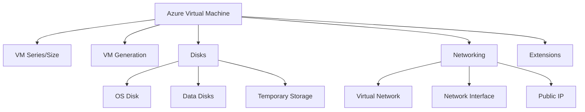
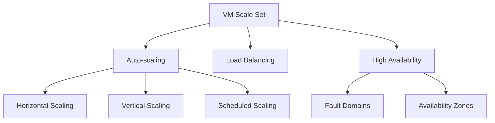
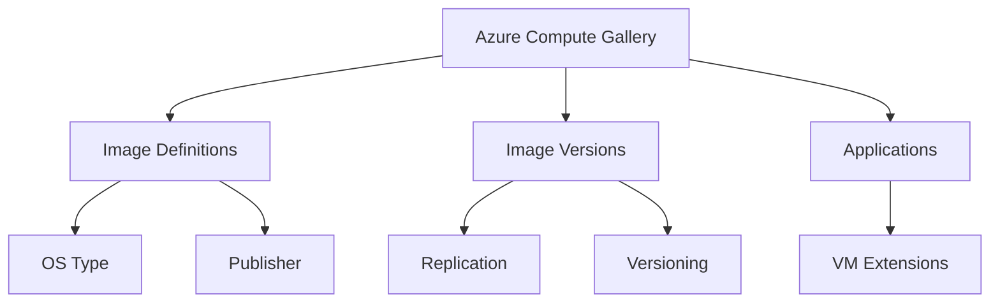
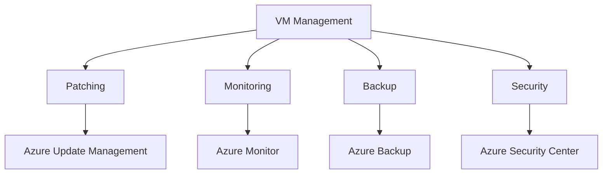

## Azure Virtual Machines

Azure Virtual Machines (VMs) are a fundamental Infrastructure-as-a-Service (IaaS) offering in Azure, providing scalable computing resources on-demand.

### Key Components and Concepts

- **VM Series and Sizes**: Different VM types optimized for various workloads (e.g., general purpose, compute-optimized, memory-optimized)
- **VM Generations**: Gen1 (BIOS-based) and Gen2 (UEFI-based) VMs
- **Disks**: OS disks, data disks, and temporary storage
- **Networking**: Virtual network integration, network interfaces, and public IPs
- **Extensions**: Additional capabilities and configurations for VMs

### Features and Capabilities

- **Availability options**: Availability Sets and Availability Zones for high availability
- **Scaling**: Manual scaling or auto-scaling with VM Scale Sets
- **Security**: Network Security Groups, Azure Security Center integration
- **Monitoring**: Azure Monitor integration for performance tracking and diagnostics

### Best Practices

- Choose the appropriate VM size based on workload requirements
- Use Managed Disks for simplified storage management
- Implement proper backup and disaster recovery strategies
- Utilize Azure Hybrid Benefit for cost savings on Windows Server VMs

## VM Scale Sets

VM Scale Sets enable you to manage and scale multiple identical VMs as a single resource.

### Key Features

- **Auto-scaling**: Automatically adjust the number of VM instances based on demand
- **Load balancing**: Built-in load balancing for distributed applications
- **High availability**: Spread VMs across fault domains and availability zones
- **Large-scale applications**: Support for up to 1,000 VM instances per scale set

### Scaling Options

- **Horizontal scaling**: Add or remove VM instances
- **Vertical scaling**: Increase or decrease VM size
- **Scheduled scaling**: Set up scaling rules based on time of day or week

### Best Practices

- Use application health probes for accurate scaling decisions
- Implement proper monitoring and alerting for scale events
- Consider using multiple scale sets for different application tiers

## Azure Compute Gallery

Azure Compute Gallery (formerly Shared Image Gallery) is a service for storing and managing VM images and applications.

### Key Components

- **Image definitions**: Metadata about the image, including OS type, publisher, and version
- **Image versions**: Specific builds of an image
- **Applications**: VM applications that can be deployed alongside VMs

### Features and Capabilities

- **Replication**: Replicate images across regions for faster deployment
- **Versioning**: Manage multiple versions of images
- **Sharing**: Share images across subscriptions and Azure AD tenants

### Best Practices

- Use image definitions to organize and categorize images
- Implement proper versioning strategy for image updates
- Leverage replication for improved deployment performance in multi-region scenarios

## VM Management and Maintenance

Proper management and maintenance of VMs are crucial for ensuring optimal performance, security, and cost-efficiency.

### Key Management Tasks

- **Patching**: Regular OS and application updates
- **Monitoring**: Performance tracking and diagnostics
- **Backup**: Regular backups of VM data and configurations
- **Security**: Implementing security measures and best practices

### Azure Automation Options

- **Azure Automation**: Automate common management tasks
- **Azure Update Management**: Centralized update management for VMs
- **Azure Monitor**: Comprehensive monitoring and alerting solution

### Best Practices

- Implement a robust patching strategy
- Use Azure Backup for regular VM backups
- Leverage Azure Security Center for security recommendations and compliance

This summary provides an overview of key concepts related to Azure Virtual Machines, VM Scale Sets, Azure Compute Gallery, and VM management best practices. These components form the foundation of many Azure services and are crucial for building scalable and resilient cloud applications. Understanding these concepts is essential for Azure Solutions Architects to design effective and efficient cloud infrastructures.
