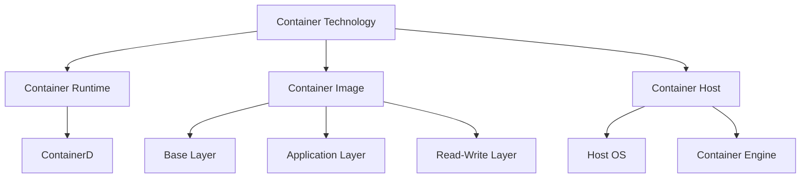
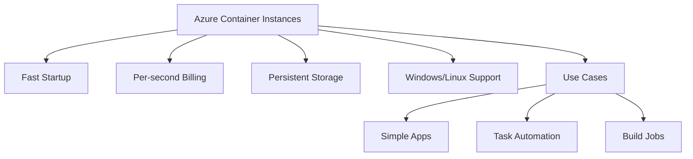
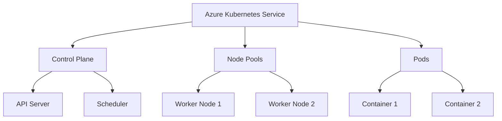
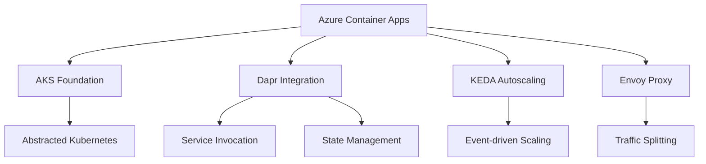
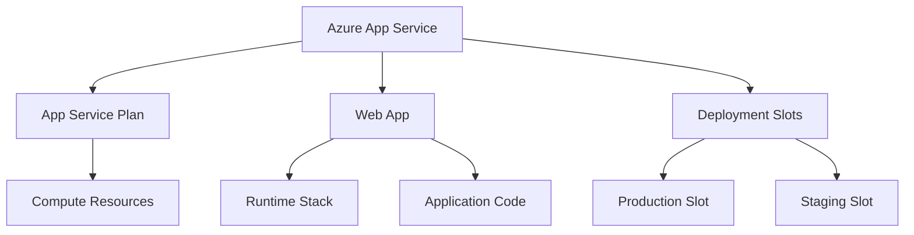
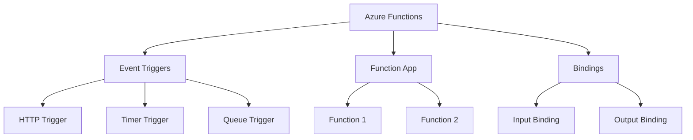
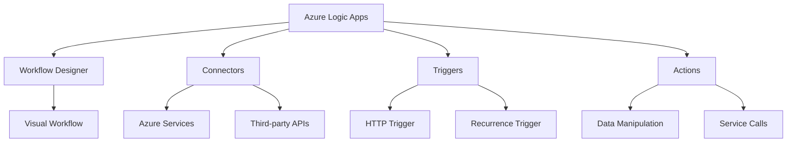
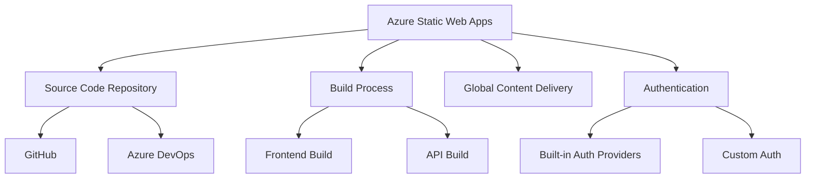

## Container Technology

### Introduction
Containers are the next stage in virtualization, allowing multiple isolated applications to run on the same OS instance.

### Key Components
- **Container Runtime**: Manages container lifecycle (e.g., ContainerD)
- **Container Image**: Layered file system for application and dependencies
- **Container Host**: The underlying OS running the container runtime

### Comparison: Containers vs. Virtual Machines
- Containers virtualize the OS, while VMs virtualize hardware
- Containers share the host OS kernel, resulting in lighter resource usage
- Containers offer faster startup times and higher density

### Best Practices
- Use containers for stateless applications
- Implement proper isolation and security measures
- Leverage container orchestration for production workloads

## Azure Container Instances (ACI)

### Introduction
Azure Container Instances is the fastest and simplest way to run containers in Azure without managing servers.

### Key Features
- Fast startup times
- Per-second billing
- Persistent storage options
- Support for both Windows and Linux containers

### Use Cases
- Simple applications
- Task automation
- Build jobs

### Considerations
- Limited orchestration capabilities
- Not suitable for complex multi-container applications

## Azure Kubernetes Service (AKS)

### Introduction
Azure Kubernetes Service is a managed Kubernetes offering that simplifies container orchestration and management.

### Key Components
- **Control Plane**: Managed by Azure (API server, scheduler, etc.)
- **Node Pools**: Worker nodes running containerized applications
- **Pods**: Smallest deployable units in Kubernetes

### Features
- Automated upgrades and scaling
- Integration with Azure AD for authentication
- Advanced networking options (e.g., CNI, kubenet)

### Best Practices
- Implement proper resource requests and limits
- Use namespaces for logical separation of resources
- Leverage Helm charts for application deployment

## Azure Container Apps

### Introduction
Azure Container Apps is a fully managed environment for running microservices and containerized applications.

### Key Features
- Built on top of AKS, but abstracts Kubernetes complexity
- Integrated with Dapr (Distributed Application Runtime)
- KEDA-powered autoscaling
- Envoy proxy for advanced networking features

### Use Cases
- Microservices architectures
- Event-driven applications
- API backends

### Considerations
- Less control over underlying infrastructure compared to AKS
- May have limitations for highly customized Kubernetes workloads

## Azure App Service

### Introduction
Azure App Service is a fully managed platform for building, deploying, and scaling web apps.

### Key Components
- **App Service Plan**: Defines the compute resources for your apps
- **Web App**: The actual application running on App Service
- **Deployment Slots**: Facilitates staging and testing of new versions

### Features
- Support for multiple languages and frameworks
- Built-in CI/CD integration
- Custom domain and SSL support
- Automatic scaling options

### Best Practices
- Use deployment slots for zero-downtime updates
- Implement App Service Environment for network isolation
- Leverage App Service Diagnostics for troubleshooting

## Azure Functions

### Introduction
Azure Functions is a serverless compute service that enables running event-driven code without managing infrastructure.

### Key Features
- Support for multiple programming languages
- Flexible scaling options (Consumption and Premium plans)
- Extensive binding system for easy integration with other services
- Durable Functions for long-running workflows

### Use Cases
- Real-time data processing
- IoT data handling
- Microservices implementation
- Scheduled tasks

### Best Practices
- Keep functions focused and small
- Use dependency injection for better testability
- Implement proper error handling and logging

## Azure Logic Apps

### Introduction
Azure Logic Apps is a cloud service that helps you automate workflows and processes across applications and services.

### Key Components
- **Workflow Designer**: Visual tool for creating logic apps
- **Connectors**: Pre-built components for integrating with various services
- **Triggers**: Events that start a workflow
- **Actions**: Tasks performed within a workflow

### Features
- No-code/low-code development
- Built-in error handling and retry logic
- Integration with Azure services and external APIs
- Support for long-running workflows

### Use Cases
- Business process automation
- System integration
- Data orchestration

## Azure Static Web Apps

### Introduction
Azure Static Web Apps is a service that automatically builds and deploys full stack web apps to Azure from a code repository.

### Key Features
- Integrated CI/CD with GitHub or Azure DevOps
- Built-in authentication providers
- Globally distributed content for fast delivery
- Optional integration with Azure Functions for API support

### Use Cases
- Single Page Applications (SPAs)
- Static content websites
- Progressive Web Apps (PWAs)

### Best Practices
- Implement proper caching strategies
- Use custom domains and free SSL certificates
- Leverage staging environments for testing

This summary provides an overview of the key Azure services related to containerization, serverless computing, and web application hosting. Each section highlights the main components, features, and best practices associated with the respective service, along with mermaid diagrams to visualize the relationships between different elements.