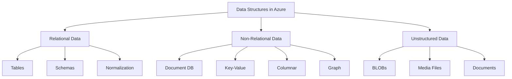
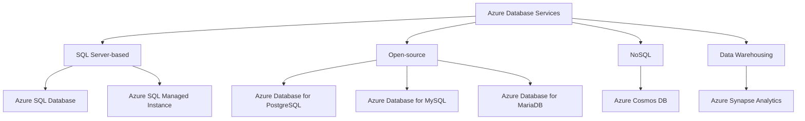
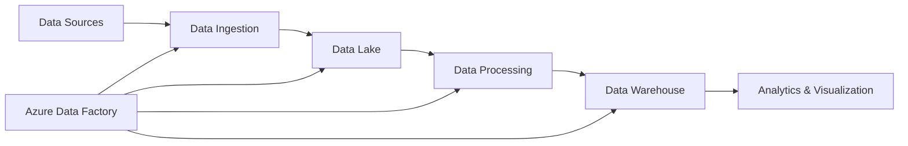
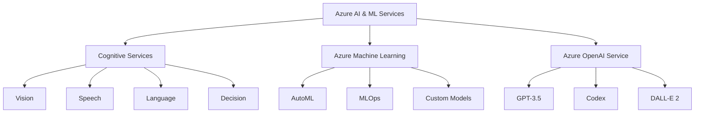

## Types of Data Structures

### Introduction
This section covers the various data structures used in Azure databases, including relational and non-relational models.

### Key Points
- **Relational Data**: Structured data following a schema, typically used for OLTP (Online Transaction Processing)
- **Non-Relational Data**: Flexible data structures, often referred to as NoSQL databases
- **Unstructured Data**: Raw data without a predefined schema, such as media files or documents

### Technical Details
1. Relational Data:
   - Uses tables with defined schemas
   - Normalizes data to reduce redundancy
   - Supports ACID transactions
   - Examples: SQL Server, PostgreSQL, MySQL

2. Non-Relational Data:
   - Document databases (e.g., JSON, XML)
   - Key-value stores
   - Columnar databases
   - Graph databases

3. Unstructured Data:
   - Binary Large Objects (BLOBs)
   - Media files (JPEG, MP4, etc.)
   - Text documents (PDF, DOCX, etc.)

### Best Practices
- Choose the appropriate data structure based on the application's requirements
- Consider scalability and performance needs when selecting a data model
- Use relational databases for complex transactions and data integrity
- Leverage non-relational databases for flexibility and scalability in big data scenarios

## Azure Database Services

### Introduction
Azure offers a wide range of database services to cater to various data storage and processing needs.

### Key Points
- **SQL Server-based**: Azure SQL Database, Azure SQL Managed Instance
- **Open-source**: Azure Database for PostgreSQL, MySQL, and MariaDB
- **NoSQL**: Azure Cosmos DB
- **Data Warehousing**: Azure Synapse Analytics

### Technical Details
1. Azure SQL Database:
   - Fully managed PaaS offering
   - High compatibility with SQL Server
   - Supports single databases, elastic pools, and hyperscale

2. Azure SQL Managed Instance:
   - Near 100% compatibility with on-premises SQL Server
   - VNET integration for enhanced security
   - Supports SQL Agent, CLR, and other advanced features

3. Azure Database for PostgreSQL/MySQL:
   - Flexible server option for more control
   - Supports high availability and read replicas
   - Built-in security features and encryption

4. Azure Cosmos DB:
   - Multi-model database (document, key-value, graph, column-family)
   - Global distribution with multi-region writes
   - Configurable consistency levels

5. Azure Synapse Analytics:
   - Integrated analytics platform
   - Combines data warehousing, big data analytics, and data integration

### Best Practices
- Use managed services to reduce operational overhead
- Implement proper security measures, including encryption and network isolation
- Leverage built-in high availability and disaster recovery features
- Choose the appropriate service tier based on performance and scalability requirements

## Data Flow and Analytics

### Introduction
This section covers the process of data flow, from ingestion to analysis, in Azure.

### Key Points
- **ETL/ELT**: Extract, Transform, Load / Extract, Load, Transform processes
- **Data Lake**: Azure Data Lake Storage Gen2 for raw data storage
- **Data Factory**: Orchestration and data movement service
- **Synapse Analytics**: Integrated analytics service
- **Power BI**: Business intelligence and data visualization tool

### Technical Details
1. Data Ingestion:
   - Batch processing for large volumes of data
   - Stream processing for real-time data using Azure Event Hubs or IoT Hub

2. Data Storage:
   - Azure Data Lake Storage Gen2 for raw data
   - Azure Blob Storage for unstructured data
   - Azure SQL Database or Cosmos DB for structured/semi-structured data

3. Data Processing:
   - Azure Databricks for big data processing and machine learning
   - Azure HDInsight for Hadoop-based analytics
   - Azure Stream Analytics for real-time data processing

4. Data Warehousing:
   - Azure Synapse Analytics for large-scale data warehousing
   - Supports both serverless and dedicated SQL pools

5. Data Visualization:
   - Power BI for creating interactive dashboards and reports
   - Integration with Azure Synapse Analytics for seamless data exploration

### Best Practices
- Implement a data governance strategy to ensure data quality and compliance
- Use Azure Data Factory for orchestrating complex data workflows
- Leverage Azure Synapse Analytics for unified data warehousing and big data analytics
- Implement proper security measures throughout the data pipeline
- Optimize data storage and processing for cost-effectiveness

## Artificial Intelligence and Machine Learning

### Introduction
Azure provides a comprehensive suite of AI and ML services for building intelligent applications.

### Key Points
- **Azure Cognitive Services**: Pre-built AI models for vision, speech, language, and decision-making
- **Azure Machine Learning**: End-to-end ML platform for building, training, and deploying models
- **Azure OpenAI Service**: Integration of OpenAI's powerful language models

### Technical Details
1. Azure Cognitive Services:
   - Computer Vision: Image analysis, object detection, OCR
   - Speech Services: Speech-to-text, text-to-speech, translation
   - Language Understanding: Natural language processing, sentiment analysis
   - Decision: Anomaly detection, content moderation

2. Azure Machine Learning:
   - Automated ML for model selection and hyperparameter tuning
   - MLOps capabilities for CI/CD of ML models
   - Integration with popular ML frameworks (TensorFlow, PyTorch, etc.)

3. Azure OpenAI Service:
   - GPT-3.5 for natural language generation
   - Codex for code generation and completion
   - DALL-E 2 for image generation from text descriptions

### Best Practices
- Start with pre-built Cognitive Services for quick implementation of AI capabilities
- Use Azure Machine Learning for custom model development and deployment
- Implement responsible AI practices, including fairness, transparency, and privacy
- Leverage Azure OpenAI Service for advanced language models while adhering to usage guidelines
- Monitor and optimize AI/ML models for performance and cost-effectiveness

This summary provides an overview of the key concepts discussed in the transcript, focusing on Azure's database services, data structures, data flow and analytics, and AI/ML capabilities. The information is structured to highlight the main components, technical details, and best practices for each topic, along with mermaid diagrams to visualize the relationships between different elements.

