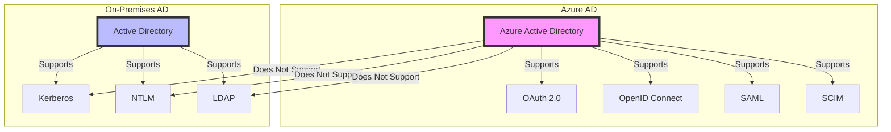
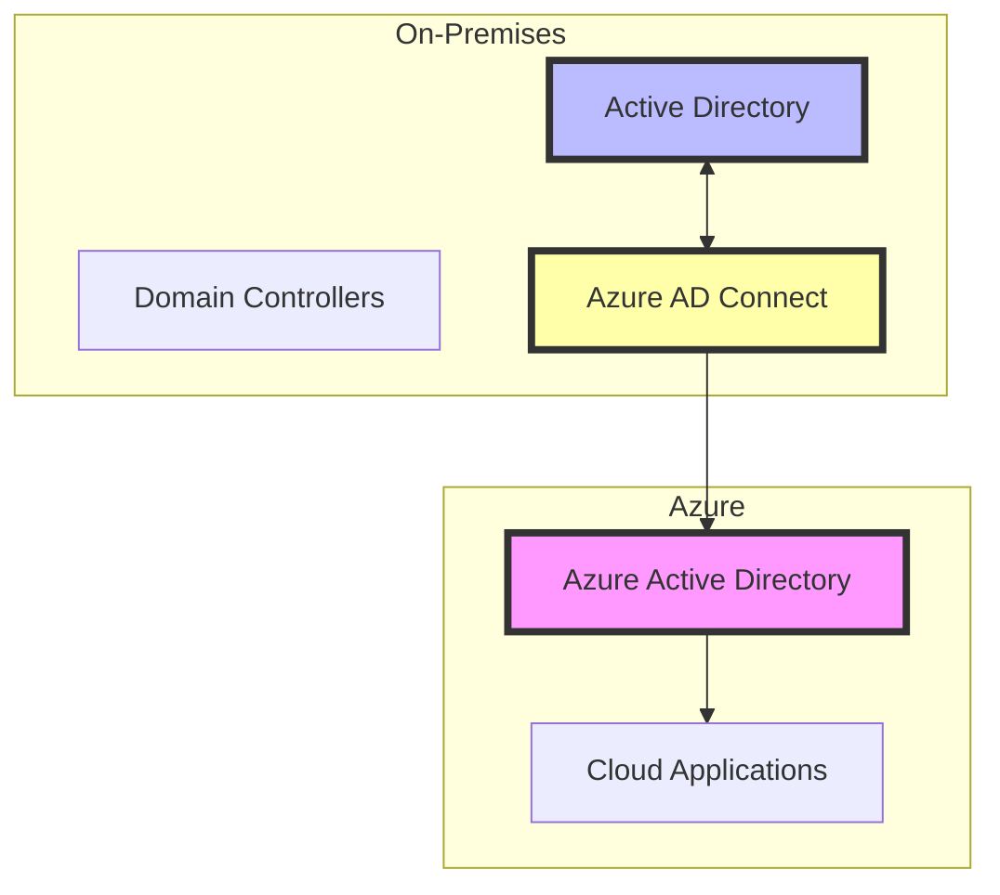

# Azure AD and On-Premises AD: A Comprehensive Overview

## 1. Introduction

Azure Active Directory (Azure AD) is a cloud-based identity and access management service that is fundamentally different from on-premises Active Directory (AD). This document provides a comprehensive overview of Azure AD, its relationship with on-premises AD, and how they work together in modern enterprise environments.

Key benefits of Azure AD:
- Cloud-native identity provider
- Seamless integration with cloud services
- Enhanced security features
- Support for modern authentication protocols
- Simplified federation with thousands of pre-configured apps

## 2. Objectives

1. Understand the fundamental differences between Azure AD and on-premises AD
2. Learn how Azure AD integrates with cloud services and on-premises infrastructure
3. Explore the key features and capabilities of Azure AD
4. Understand the hybrid identity model and migration strategies
5. Identify scenarios where on-premises AD is still necessary in Azure environments

## 3. Prerequisites

- Basic understanding of identity and access management concepts
- Familiarity with on-premises Active Directory
- Knowledge of cloud computing fundamentals
- Azure subscription for hands-on experience (optional)

## 4. Core Functionality

### 4.1 Azure AD vs. On-Premises AD

Key differences:
- Azure AD is a cloud-based identity provider, while on-premises AD is designed for local network environments
- Azure AD supports modern authentication protocols (OAuth 2.0, OpenID Connect), while on-premises AD uses traditional protocols (Kerberos, NTLM, LDAP)
- Azure AD has a flat structure, whereas on-premises AD uses a hierarchical structure with domains and forests

### 4.2 Azure AD Integration with Cloud Services

Azure AD serves as a central identity provider for various cloud services:

1. Microsoft 365 applications
2. Azure resources and services
3. Third-party SaaS applications
4. Custom developed applications

Integration is achieved through:
- Built-in federation support for thousands of applications
- Support for industry-standard protocols (SAML, OAuth 2.0, OpenID Connect)
- Azure AD Application Proxy for publishing on-premises web applications

### 4.3 Key Features of Azure AD

1. Conditional Access
   - Granular access control based on user, device, location, and risk factors
   - Integration with Azure AD MFA for step-up authentication

2. Identity Protection
   - Risk-based policies and machine learning to detect anomalies
   - Automatic remediation actions for suspicious activities

3. Privileged Identity Management (PIM)
   - Just-in-time privileged access to Azure and Azure AD resources
   - Time-bound role activations with approval workflows

4. External Identities
   - B2B collaboration for partners and vendors
   - B2C for customer-facing applications with support for social identities

5. Cloud-based authentication
   - Password Hash Synchronization
   - Pass-through Authentication
   - Seamless Single Sign-On (SSO)

## 5. Implementation Guide

### 5.1 Hybrid Identity Model

Steps for implementing a hybrid identity model:

1. Install and configure Azure AD Connect
2. Choose the appropriate authentication method:
   - Password Hash Synchronization (recommended)
   - Pass-through Authentication
   - Federation (ADFS)
3. Enable Seamless Single Sign-On
4. Configure sync filtering and attribute mapping
5. Set up Azure AD Connect Health for monitoring

### 5.2 Migrating Applications to Azure AD

1. Inventory existing applications and their authentication methods
2. Identify applications that can be migrated to Azure AD
3. Use Azure AD Application Proxy for on-premises web applications
4. Implement modern authentication for Office 365 and other cloud services
5. Update client applications to use MSAL (Microsoft Authentication Library)

## 6. Advanced Topics

### 6.1 Azure AD Domain Services

For scenarios requiring Kerberos, NTLM, or LDAP support in Azure:

1. Enable Azure AD Domain Services in your Azure AD tenant
2. Configure virtual network settings
3. Update DNS settings for the virtual network
4. Enable password hash synchronization to Azure AD DS
5. Join virtual machines to the managed domain

### 6.2 Passwordless Authentication

Implement passwordless options:
- Windows Hello for Business
- FIDO2 security keys
- Microsoft Authenticator app

### 6.3 Zero Trust Security Model

Leverage Azure AD capabilities for implementing Zero Trust:
- Conditional Access policies
- Device management with Microsoft Intune
- Azure AD Identity Protection
- Azure AD Privileged Identity Management

## 7. Monitoring and Maintenance

1. Use Azure AD Connect Health for sync monitoring
2. Implement Azure Monitor and Log Analytics for Azure AD logs
3. Regularly review Azure AD Identity Protection reports
4. Perform periodic access reviews using Azure AD Access Reviews
5. Monitor and optimize license usage

## 8. Best Practices

1. Implement Multi-Factor Authentication (MFA) for all users
2. Use Conditional Access policies to enforce adaptive authentication
3. Regularly review and update access permissions
4. Implement least privilege access model using PIM
5. Enable self-service password reset to reduce helpdesk load
6. Use Azure AD B2B for external user collaboration
7. Implement Azure AD Password Protection for on-premises AD
8. Regularly update Azure AD Connect and review sync settings

## 9. Additional Resources

- [Azure Active Directory Documentation](https://docs.microsoft.com/en-us/azure/active-directory/)
- [Microsoft Identity Platform](https://docs.microsoft.com/en-us/azure/active-directory/develop/)
- [Azure AD for Developers](https://docs.microsoft.com/en-us/azure/active-directory/develop/v2-overview)
- [Azure AD Identity Protection](https://docs.microsoft.com/en-us/azure/active-directory/identity-protection/)
- [Azure AD Conditional Access](https://docs.microsoft.com/en-us/azure/active-directory/conditional-access/)