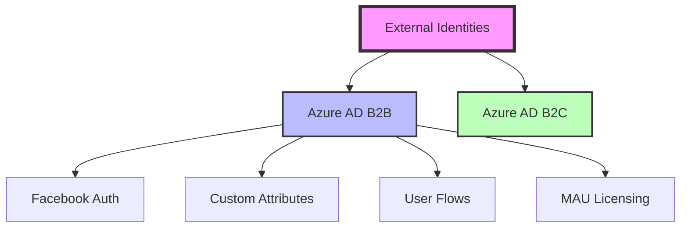
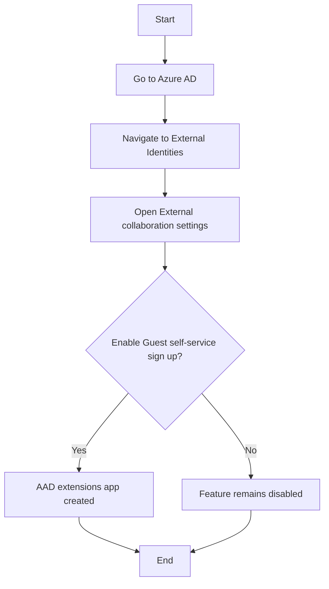
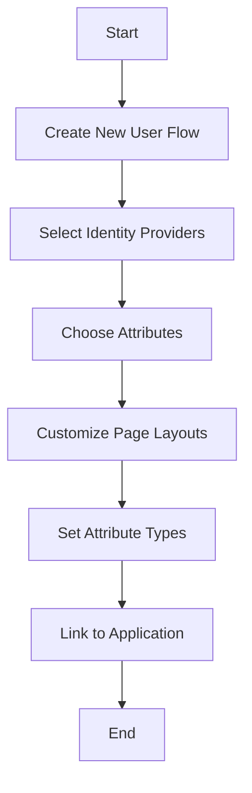
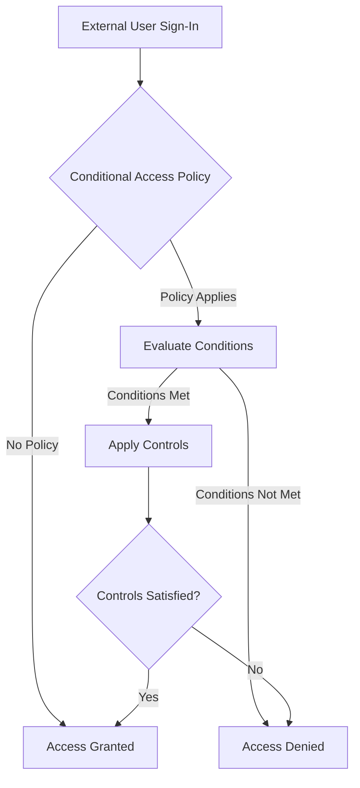

# Detailed Azure AD External Identities Technical Documentation

## 1. Introduction

Azure AD External Identities is a comprehensive solution that unifies and enhances Azure AD B2B and B2C capabilities. It addresses collaboration challenges with external users and provides improved customization options.

Key benefits:
- Unified approach to external identity management
- Increased flexibility in authentication methods
- Reduced administrative overhead by up to 30%
- Improved user experience for external collaborators



## 2. Objectives

1. Understand the External Identities concept and its relationship to B2B and B2C
2. Learn to configure and use new features (Facebook authentication, custom attributes, user flows)
3. Implement self-service sign-up for external users
4. Optimize the licensing model for external identities
5. Integrate External Identities with custom applications

## 3. Prerequisites

- Azure AD tenant (P1 or P2 license recommended for advanced features)
- Global Administrator or Identity Experience Framework Developer role
- Basic understanding of Azure AD B2B and B2C concepts
- Application development knowledge (for custom integrations)
- Facebook Developer account (for Facebook authentication)

## 4. Core Functionality

External Identities serves as an umbrella for B2B and B2C, adding several new features:

### 4.1 B2B Enhancements

1. Facebook as an identity provider
   - Allows partners to authenticate using their Facebook accounts
   - Seamless integration with existing B2B collaboration workflows

2. Custom user attributes
   - Define additional attributes to collect during sign-up
   - Store and retrieve custom data for external users

3. Self-service sign-up via user flows
   - Create customized onboarding experiences
   - Collect necessary information during sign-up process

4. Monthly Active User (MAU) based licensing option
   - More flexible pricing model for organizations with varying external user counts

### 4.2 B2C

- Remains unchanged, ideal for customer-facing applications
- Supports a wide range of social identity providers and local accounts

## 5. Implementation Guide

### 5.1 Enable Self-Service Sign-Up

1. Navigate to Azure AD > External Identities
2. Under "External collaboration settings", enable "Guest self-service sign up via user flows"
3. This action creates an "AAD extensions app" (do not modify this app)



### 5.2 Add Facebook as Identity Provider

1. Go to Azure AD > External Identities > Identity providers
2. Click "Add Facebook"
3. Enter your Facebook app ID and secret
4. Configure the redirect URI in your Facebook app settings

Detailed steps for Facebook app creation:
a. Go to developers.facebook.com and create a new app
b. Set up Facebook Login product
c. Configure Valid OAuth Redirect URIs (format: https://login.microsoftonline.com/te/tenant-id/oauth2/authresp)
d. Copy the App ID and App Secret to use in Azure AD configuration

### 5.3 Create Custom User Attributes

1. Navigate to Azure AD > External Identities > Custom user attributes
2. Click "Add attribute"
3. Provide a name, display name, and data type
4. (Optional) Set a default value

Example custom attributes:
- Name: shirtSize, Type: String
- Name: preferredLanguage, Type: String
- Name: yearsOfExperience, Type: Integer

### 5.4 Configure User Flows

1. Go to Azure AD > External Identities > User flows
2. Click "New user flow"
3. Select identity providers (e.g., Facebook, Email)
4. Choose attributes to collect (including custom attributes)
5. Customize page layouts and attribute types



### 5.5 Link User Flow to App

1. In the user flow settings, click "Add application"
2. Select the target application from the list
3. Save the changes

### 5.6 App Configuration (Sample)

1. Register a new application in Azure AD
   a. Set platform as Single-page application
   b. Configure redirect URI (e.g., http://localhost:3000)
2. Use Azure AD QuickStart to configure the app
   a. Select Single-page application (JavaScript)
   b. Follow the guided setup
3. Download the sample code and run locally
   a. Update config with your app's client ID
   b. Install dependencies (npm install)
   c. Run the app (npm start)

## 6. Advanced Topics

### 6.1 Custom Attribute Storage and Retrieval

Custom attributes are stored as extension attributes in the format:
`extension_<app_id>_<attribute_name>`

To access these attributes via Microsoft Graph API:

```graphql
GET /users?$filter=userType eq 'Guest' and mail eq 'user@example.com'
&$select=userPrincipalName,mail,extension_<app_id>_shirtSize
```

Replace `<app_id>` with your AAD extensions app ID (without dashes).

### 6.2 MAU Licensing Configuration

1. Go to Azure AD > External Identities > Linked subscriptions
2. Click "Link subscription"
3. Select the Azure subscription for billing
4. Choose a resource group
5. Apply the changes

Pricing model:
- First 50,000 MAU: Free
- Additional users: Tiered pricing
- MFA authentications: Charged separately

### 6.3 Conditional Access for External Users

1. Create a new Conditional Access policy
2. Set user condition to include guest users
3. Configure appropriate controls (e.g., require MFA)
4. Test the policy thoroughly before enforcing



## 7. Monitoring & Maintenance

- Track Monthly Active User (MAU) count for licensing purposes
- Monitor user flow completions and conversion rates
- Regularly review and update custom attributes
- Analyze sign-in logs for external users
- Set up alerts for suspicious activities from external accounts

### 7.1 Azure Monitor Integration

1. Configure diagnostic settings for Azure AD
2. Send logs to Log Analytics workspace
3. Create custom queries to track external user activities

Example query to monitor external user sign-ins:

```kusto
SigninLogs
| where UserType == "Guest"
| summarize count() by bin(TimeGenerated, 1d), AppDisplayName
| render timechart
```

## 8. Best Practices

1. Use descriptive names for custom attributes to ensure clarity
2. Limit the number of required fields in user flows to improve completion rates
3. Implement progressive profiling to collect additional information over time
4. Test user flows thoroughly in a staging environment before production deployment
5. Implement appropriate Conditional Access policies for external users
6. Regularly review and clean up unused external accounts
7. Use Azure AD Privileged Identity Management for just-in-time access to sensitive resources
8. Educate internal users on best practices for inviting and collaborating with external users

## 9. Additional Resources

- [Azure AD External Identities documentation](https://docs.microsoft.com/en-us/azure/active-directory/external-identities/)
- [B2B and B2C feature comparison](https://docs.microsoft.com/en-us/azure/active-directory/external-identities/compare-with-b2c)
- [External Identities pricing details](https://azure.microsoft.com/en-us/pricing/details/active-directory/external-identities/)
- [Microsoft Graph API documentation](https://docs.microsoft.com/en-us/graph/api/overview?view=graph-rest-1.0)
- [Conditional Access for B2B users](https://docs.microsoft.com/en-us/azure/active-directory/conditional-access/concept-conditional-access-cloud-apps)


This expanded document provides more details on Azure AD External Identities, including additional implementation steps, advanced topics, and best practices. I've also included several Mermaid diagrams to visualize key concepts and flows.
