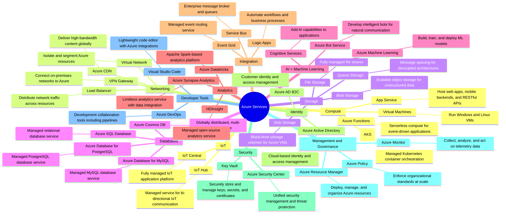
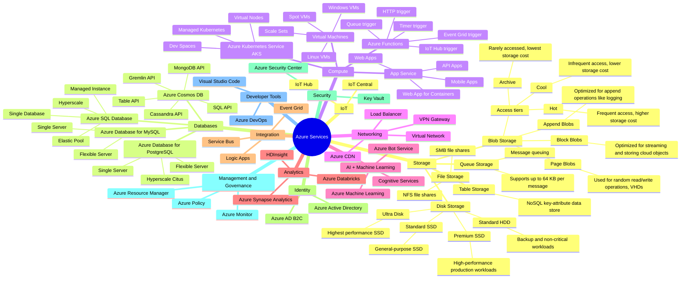

Here is an overview of some of the most important Azure services:

• **Storage**: 
  - Azure Blob Storage - Object storage for unstructured data
  - Azure Files - Managed file shares for cloud or on-premises deployment
  - Azure Disk Storage - Block-level storage volumes for Azure VMs

• **Databases**:
  - Azure SQL Database - Managed relational database service
  - Azure Cosmos DB - Globally distributed, multi-model database
  - Azure Database for MySQL/PostgreSQL - Managed open-source databases

• **Networking**:
  - Azure Virtual Network - Isolate and segment Azure resources
  - Azure Load Balancer - Distribute network traffic across resources
  - Azure VPN Gateway - Connect on-premises networks to Azure

• **Security**:
  - Azure Active Directory - Cloud-based identity and access management
  - Azure Key Vault - Securely store and manage keys, secrets, and certificates
  - Azure Security Center - Unified security management and threat protection

• **Monitoring & Management**:
  - Azure Monitor - Collect, analyze, and act on telemetry data
  - Azure Resource Manager - Deploy, manage, and organize Azure resources

• **AI & Machine Learning**:
  - Azure Machine Learning - Build, train, and deploy ML models
  - Azure Cognitive Services - Add AI capabilities to applications

• **DevOps & Integration**:
  - Azure DevOps - Development collaboration tools including pipelines
  - Azure Logic Apps - Automate workflows and business processes

This overview covers some of the core Azure services across various categories. Each service is designed to address specific cloud computing needs and can be combined to create comprehensive solutions.

### Übersicht mit allen Optionen der Services
