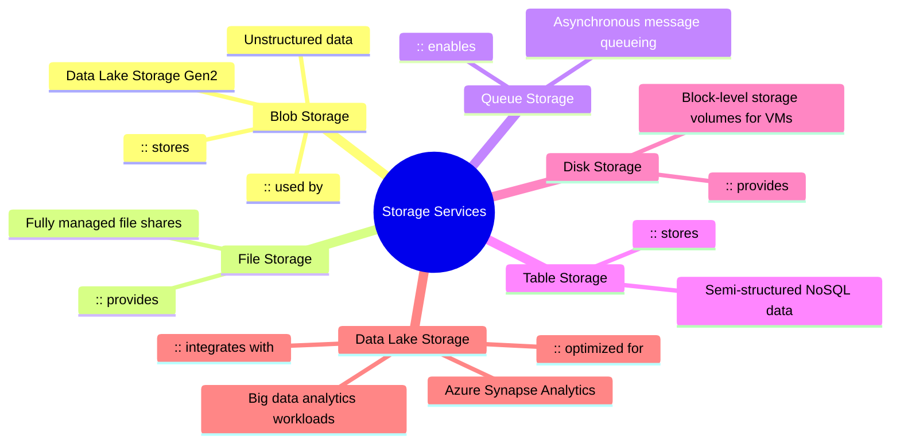
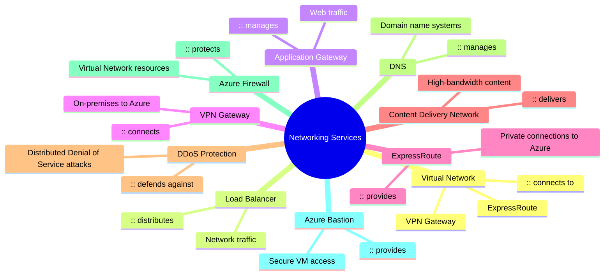
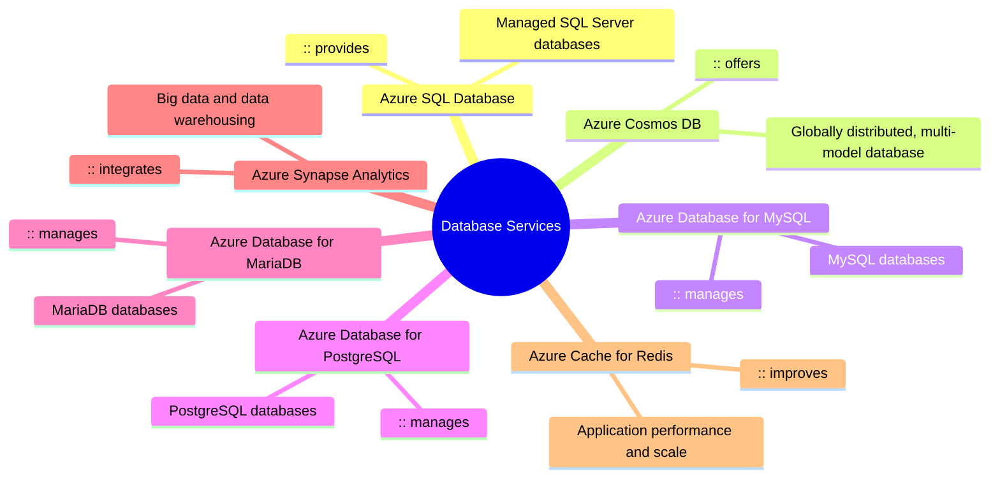
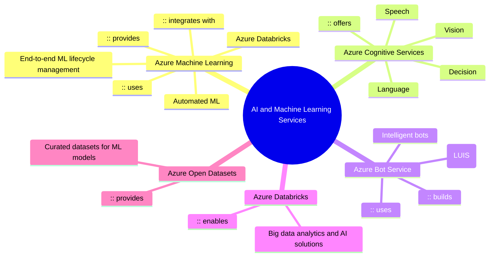

### Compute Services
```mermaid
mindmap
  root((Compute Services))
    Virtual Machines
      :: scales with
      Virtual Machine Scale Sets
      :: uses
      Azure Dedicated Host
    Azure Kubernetes Service
      :: orchestrates
      Container Instances
      :: uses
      Virtual Machines
    Azure Functions
      :: part of
      Serverless Compute
      :: integrates with
      App Service
    App Service
      :: hosts
      Web Apps
      API Apps
      Mobile Apps
    Azure Batch
      :: manages
      Large-scale parallel and HPC applications
    Azure Service Fabric
      :: builds and operates
      Microservices and containerized applications
    Azure CycleCloud
      :: orchestrates
      High-Performance Computing (HPC) clusters
```


### Storage Services


### Network Services


### Compute Services


### Azure AI and Machine Learing Services


### Compute Services
```mermaid

```