## Azure Storage and Related Services

Description: This diagram illustrates the Azure Storage service and its connected components, including main features, dependencies, and important notes.

```mermaid
stateDiagram-v2
    [*] --> AzureStorage

    state AzureStorage {
        [*] --> BlobStorage
        [*] --> FileStorage
        [*] --> QueueStorage
        [*] --> TableStorage
        
        state "BlobStorage\nUnstructured data storage" as BlobStorage {
            BlockBlobs
            AppendBlobs
            PageBlobs
        }
        
        state "FileStorage\nFully managed file shares" as FileStorage {
            SMBProtocol
            NFSProtocol
        }
        
        state "QueueStorage\nMessage queuing for workflows" as QueueStorage
        state "TableStorage\nNoSQL key-value store" as TableStorage
    }

    state "Related Services" as RelatedServices {
        state "DataLakeStorageGen2\nBig data analytics storage" as DataLakeStorageGen2
        state "AzureBackup\nBackup and recovery" as AzureBackup
        state "AzureCDN\nContent delivery" as AzureCDN
        state "AzureDataFactory\nData integration" as AzureDataFactory
    }

    AzureStorage --> RelatedServices : Integrates with

    state "Management & Security" as ManagementSecurity {
        state "AzureKeyVault\nSecure key management" as AzureKeyVault
        state "AzureAD\nIdentity and access control" as AzureAD
        state "StorageExplorer\nGUI tool for storage management" as StorageExplorer
    }

    AzureStorage --> ManagementSecurity : Secured and managed by

    state "Data Transfer" as DataTransfer {
        state "AzureDataBox\nOffline data transfer" as AzureDataBox
        state "AzureMigration\nCloud migration service" as AzureMigration
    }

    AzureStorage --> DataTransfer : Data movement

    %% Connections
    BlobStorage --> DataLakeStorageGen2 : Hierarchical namespace
    AzureStorage --> AzureBackup
    BlobStorage --> AzureCDN
    AzureStorage --> AzureDataFactory
```

Metadata:
- Version: Azure Storage 2023
- Last Updated: July 2023
- Responsible Team: Azure Storage Team

Key Features:
- **Blob Storage**: Scalable object storage for unstructured data
- **File Storage**: Fully managed file shares accessible via SMB and NFS protocols
- **Queue Storage**: Messaging store for reliable messaging between application components
- **Table Storage**: NoSQL datastore for semi-structured data

Warnings:
- Not all features are available in all Azure regions
- Some advanced features may require higher-tier storage accounts
- Cross-region replication may have data residency implications

This diagram provides an overview of Azure Storage and its related services. It shows the main components of Azure Storage (Blob, File, Queue, and Table) and how they connect to other Azure services for enhanced functionality, security, and data management.