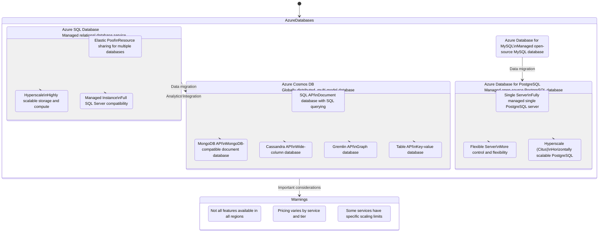

## Azure Database Services Overview

Description: This diagram illustrates the main Azure database services, their key features, and relationships.

Metadata:
- Version: Azure Database Services 2023
- Last Updated: July 2023
- Responsible Team: Azure Data Team

Key Features:
1. Azure SQL Database:
   - Fully managed SQL Server database engine
   - Built-in intelligence and security
   - High availability and disaster recovery options

2. Azure Cosmos DB:
   - Multi-model database with global distribution
   - Guaranteed single-digit millisecond response times
   - Automatic and instant scalability

3. Azure Database for MySQL:
   - Fully managed and scalable MySQL database
   - Built-in high availability
   - Automated backups and point-in-time restore

4. Azure Database for PostgreSQL:
   - Fully managed and scalable PostgreSQL database
   - Built-in intelligence and security
   - Multiple deployment options for various workloads

Warnings:
- Not all features are available in all Azure regions
- Pricing can vary significantly between services and tiers
- Some services have specific scaling limits that may affect large-scale deployments

This diagram provides an overview of Azure's main database services, their key components, and relationships. It highlights the versatility of Azure's database offerings, from relational to NoSQL and open-source options, each with its own set of features and deployment models.
