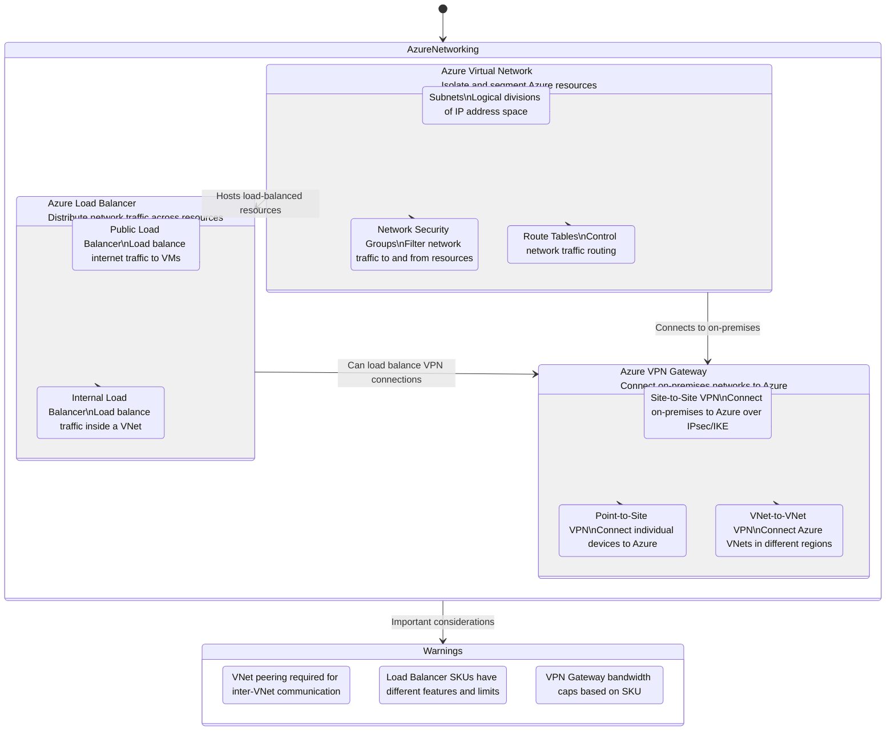

## Azure Networking Services Overview

Description: This diagram illustrates the main Azure networking services, their key features, and relationships.

Metadata:
- Version: Azure Networking Services 2023
- Last Updated: July 2023
- Responsible Team: Azure Networking Team

Key Features:
1. Azure Virtual Network:
   - Provides network isolation and segmentation
   - Enables communication between Azure resources, internet, and on-premises networks
   - Supports network security groups and user-defined routing

2. Azure Load Balancer:
   - Distributes incoming traffic across multiple instances
   - Provides high availability and performance for applications
   - Supports both public (internet-facing) and internal load balancing

3. Azure VPN Gateway:
   - Enables secure connections between Azure and on-premises networks
   - Supports various VPN types: Site-to-Site, Point-to-Site, and VNet-to-VNet
   - Provides encrypted tunnels over the public internet

Warnings:
- VNet peering is required for communication between different virtual networks
- Load Balancer features and limits vary depending on the chosen SKU (Basic vs. Standard)
- VPN Gateway bandwidth is capped based on the selected SKU, affecting connection speeds

This diagram provides an overview of Azure's main networking services, their key components, and relationships. It highlights how these services work together to create secure, scalable, and performant network architectures in Azure.

Key points to note:
- Virtual Networks form the foundation of Azure networking, providing isolation and segmentation.
- Load Balancers can distribute traffic to resources within a VNet or across VNets.
- VPN Gateways enable secure connectivity between Azure and on-premises networks or between Azure VNets in different regions.