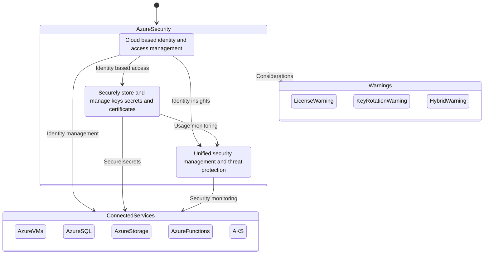

## Azure Security Services Overview

Description: This diagram illustrates the main Azure security services, their key features, connected services, and relationships.

Metadata:
- Version: Azure Security Services 2023
- Last Updated: July 2023
- Responsible Team: Azure Security Team

Key Features:
1. Azure Active Directory (AD):
   - Centralized identity and access management
   - Single Sign-On for cloud and on-premises applications
   - Multi-Factor Authentication for enhanced security
   - Conditional Access for context-based access control

2. Azure Key Vault:
   - Centralized secret management
   - Key management for encryption
   - Certificate management for SSL/TLS
   - Hardware Security Module (HSM) backing

3. Azure Security Center:
   - Unified view of security across Azure resources
   - Continuous security assessment and recommendations
   - Advanced threat detection and protection
   - Regulatory compliance monitoring and reporting

Connected Azure Services:
- Azure VMs: Secure access and management
- Azure SQL: Database access control and data protection
- Azure Storage: Secure data storage and access management
- Azure Functions: Secure serverless computing
- Azure Kubernetes Service (AKS): Secure container orchestration

Warnings:
- Some advanced features in Azure AD and Security Center may require premium licenses
- Regular key rotation is recommended for Azure Key Vault to maintain security
- Azure Security Center may have limited visibility in hybrid or multi-cloud environments

This diagram provides an overview of Azure's main security services, their key components, relationships, and connections to other Azure services. It highlights how these services work together to create a comprehensive security ecosystem in Azure.

Key points to note:
- Azure AD forms the foundation of identity and access management across Azure services.
- Key Vault provides centralized management of secrets, keys, and certificates used by other Azure services.
- Security Center offers a unified view of security posture across Azure resources and provides actionable recommendations.

