## Azure Monitoring & Management Services Overview

Description: This diagram illustrates the main Azure monitoring and management services, their key features, connected services, and relationships.

```mermaid
stateDiagram-v2
    [*] --> AzureMonitoringManagement

    state AzureMonitoringManagement {
        AzureMonitor
        AzureResourceManager
    }

    AzureMonitor --> Metrics
    AzureMonitor --> Logs
    AzureMonitor --> Alerts
    AzureMonitor --> ApplicationInsights
    AzureMonitor --> ActionGroups

    Metrics : Numerical time series data
    Logs : Text based event data
    Alerts : Proactive notifications
    ApplicationInsights : Application performance monitoring
    ActionGroups : Define notification recipients

    AzureResourceManager --> Templates
    AzureResourceManager --> RoleBasedAccessControl
    AzureResourceManager --> ResourceGroups
    AzureResourceManager --> Tags
    AzureResourceManager --> Locks

    Templates : JSON based resource definitions
    RoleBasedAccessControl : Granular access management
    ResourceGroups : Logical containers for resources
    Tags : Metadata for organization and billing
    Locks : Prevent accidental changes or deletion

    state ConnectedServices {
        AzureVMs
        AzureStorage
        AzureSQL
        AzureWebApps
        AzureNetworking
    }

    AzureMonitor --> ConnectedServices : Collects telemetry
    AzureResourceManager --> ConnectedServices : Manages resources

    state Warnings {
        DataRetention
        CostManagement
        ComplexQueries
    }

    AzureMonitoringManagement --> Warnings : Considerations

    DataRetention : Limited data retention periods
    CostManagement : High data volume can increase costs
    ComplexQueries : Log Analytics requires KQL knowledge
```

Metadata:
- Version: Azure Monitoring & Management Services 2023
- Last Updated: July 2023
- Responsible Team: Azure Management & Governance Team

Key Features:
1. Azure Monitor:
   - Metrics: Collect and analyze numerical time-series data
   - Logs: Gather and query text-based event data
   - Alerts: Set up proactive notifications based on specified conditions
   - Application Insights: Deep application performance monitoring and diagnostics
   - Action Groups: Define and manage notification recipients and actions

2. Azure Resource Manager:
   - Templates: Deploy and manage resources using JSON-based definitions
   - Role-Based Access Control (RBAC): Implement granular access management
   - Resource Groups: Organize resources into logical containers
   - Tags: Apply metadata to resources for organization and billing
   - Locks: Prevent accidental modification or deletion of critical resources

Connected Azure Services:
- Azure VMs: Virtual machine performance and health monitoring
- Azure Storage: Storage account metrics and diagnostics
- Azure SQL: Database performance and query insights
- Azure Web Apps: App Service performance and availability monitoring
- Azure Networking: Network resource metrics and diagnostics

Warnings:
- Data Retention: Azure Monitor has limited data retention periods, varying by data type
- Cost Management: High volumes of ingested data can significantly increase monitoring costs
- Complex Queries: Log Analytics requires knowledge of Kusto Query Language (KQL) for advanced querying

This diagram provides an overview of Azure's main monitoring and management services, their key components, relationships, and connections to other Azure services. It highlights how these services work together to provide comprehensive visibility and control over Azure resources.

Key points to note:
- Azure Monitor forms the foundation for collecting and analyzing telemetry data across Azure services.
- Azure Resource Manager provides a unified layer for deploying, organizing, and managing Azure resources.
- These services integrate with various Azure services to provide end-to-end monitoring and management capabilities.
