## Azure AI & Machine Learning Services Overview

Description: This diagram illustrates the main Azure AI and Machine Learning services, their key features, connected services, and relationships.

```mermaid
stateDiagram-v2
    [*] --> AzureAIandML

    state AzureAIandML {
        AzureMachineLearning
        AzureCognitiveServices
    }

    AzureMachineLearning --> MLWorkspace
    AzureMachineLearning --> AutomatedML
    AzureMachineLearning --> MLPipelines
    AzureMachineLearning --> ModelManagement
    AzureMachineLearning --> MLOps

    state MLWorkspace : Centralized place to manage ML lifecycle
    state AutomatedML : Automated feature engineering and model selection
    state MLPipelines : Reusable workflows for training and deployment
    state ModelManagement : Version control and deployment of models
    state MLOps : DevOps practices for ML

    AzureCognitiveServices --> Vision
    AzureCognitiveServices --> Speech
    AzureCognitiveServices --> Language
    AzureCognitiveServices --> Decision
    AzureCognitiveServices --> OpenAI

    state Vision : Image and video analysis
    state Speech : Speech to text and text to speech
    state Language : Natural language processing and understanding
    state Decision : Personalized recommendations and anomaly detection
    state OpenAI : Large language models and generative AI

    state ConnectedServices {
        AzureStorage
        AzureContainerRegistry
        AzureKubernetes
        AzureDataFactory
        PowerBI
    }

    AzureMachineLearning --> ConnectedServices : Integrates with
    AzureCognitiveServices --> ConnectedServices : Utilizes

    state Warnings {
        DataPrivacy
        ModelAccuracy
        ScalabilityChallenges
    }

    state DataPrivacy : Ensure compliance with data protection regulations
    state ModelAccuracy : Regular monitoring and retraining may be necessary
    state ScalabilityChallenges : Large scale deployments may require careful planning

    AzureAIandML --> Warnings : Considerations
```

Metadata:
- Version: Azure AI & Machine Learning Services 2023
- Last Updated: July 2023
- Responsible Team: Azure AI & Machine Learning Team

Key Features:
1. Azure Machine Learning:
   - ML Workspace: Centralized place to manage the entire machine learning lifecycle
   - Automated ML: Automates feature engineering and model selection process
   - ML Pipelines: Create reusable workflows for training, validation, and deployment
   - Model Management: Version control and deployment management for ML models
   - MLOps: Implement DevOps practices for machine learning projects

2. Azure Cognitive Services:
   - Vision: Analyze images and videos, recognize objects, faces, and more
   - Speech: Convert speech to text and text to speech, speaker recognition
   - Language: Natural language processing, translation, and sentiment analysis
   - Decision: Build recommendation systems and detect anomalies
   - OpenAI: Leverage large language models and generative AI capabilities

Connected Azure Services:
- Azure Storage: Store datasets and model artifacts
- Azure Container Registry: Store and manage container images for deployment
- Azure Kubernetes Service: Deploy and scale ML models
- Azure Data Factory: Orchestrate data movement and transformation
- Power BI: Visualize insights from ML models

Warnings:
- Data Privacy: Ensure compliance with data protection regulations when handling sensitive data
- Model Accuracy: Regular monitoring and retraining may be necessary to maintain model performance
- Scalability Challenges: Large-scale deployments may require careful planning and optimization

This diagram provides an overview of Azure's main AI and Machine Learning services, their key components, relationships, and connections to other Azure services. It highlights how these services work together to provide comprehensive AI and ML capabilities.
