## Azure DevOps & Integration Services Overview

Description: This diagram illustrates the main Azure DevOps and Integration services, their key features, connected services, and relationships.

```mermaid
stateDiagram-v2
    [*] --> AzureDevOpsAndIntegration

    state AzureDevOpsAndIntegration {
        AzureDevOps
        AzureLogicApps
    }

    AzureDevOps --> Boards
    AzureDevOps --> Repos
    AzureDevOps --> Pipelines
    AzureDevOps --> TestPlans
    AzureDevOps --> Artifacts

    state Boards : Agile project management tools
    state Repos : Git repositories for version control
    state Pipelines : CI/CD automation
    state TestPlans : Test case management and execution
    state Artifacts : Package management for your applications

    AzureLogicApps --> WorkflowDesigner
    AzureLogicApps --> Connectors
    AzureLogicApps --> EnterpriseIntegration
    AzureLogicApps --> B2BIntegration
    AzureLogicApps --> ServerlessCompute

    state WorkflowDesigner : Visual designer for creating workflows
    state Connectors : Pre-built connectors for various services
    state EnterpriseIntegration : Connect enterprise and cloud-based applications
    state B2BIntegration : Automate B2B processes and workflows
    state ServerlessCompute : Run integration workflows without managing infrastructure

    state ConnectedServices {
        AzureActiveDirectory
        AzureKeyVault
        AzureStorage
        AzureFunctions
        AzureMonitor
    }

    AzureDevOps --> ConnectedServices : Integrates with
    AzureLogicApps --> ConnectedServices : Utilizes

    state Warnings {
        LearningCurve
        CostManagement
        GovernanceComplexity
    }

    state LearningCurve : Initial setup and configuration can be complex
    state CostManagement : Monitor usage to optimize costs, especially for Logic Apps
    state GovernanceComplexity : Implementing proper governance across services can be challenging

    AzureDevOpsAndIntegration --> Warnings : Considerations
```

Metadata:
- Version: Azure DevOps & Integration Services 2023
- Last Updated: July 2023
- Responsible Team: Azure DevOps & Integration Team

Key Features:
1. Azure DevOps:
   - Boards: Agile project management tools for planning and tracking work
   - Repos: Git repositories for version control of your code
   - Pipelines: CI/CD automation for building, testing, and deploying applications
   - Test Plans: Test case management and execution tools
   - Artifacts: Package management for your applications

2. Azure Logic Apps:
   - Workflow Designer: Visual designer for creating and managing workflows
   - Connectors: Pre-built connectors for various services and applications
   - Enterprise Integration: Connect enterprise and cloud-based applications
   - B2B Integration: Automate B2B processes and workflows
   - Serverless Compute: Run integration workflows without managing infrastructure

Connected Azure Services:
- Azure Active Directory: User authentication and access management
- Azure Key Vault: Secure storage of secrets and certificates
- Azure Storage: Store artifacts and workflow data
- Azure Functions: Extend Logic Apps with custom code
- Azure Monitor: Monitor performance and usage of DevOps and Logic Apps

Warnings:
- Learning Curve: Initial setup and configuration of these services can be complex
- Cost Management: Monitor usage to optimize costs, especially for Logic Apps which can incur costs based on executions
- Governance Complexity: Implementing proper governance across services can be challenging, especially in large organizations

This diagram provides an overview of Azure's main DevOps and Integration services, their key components, relationships, and connections to other Azure services. It highlights how these services work together to provide comprehensive development and integration capabilities.