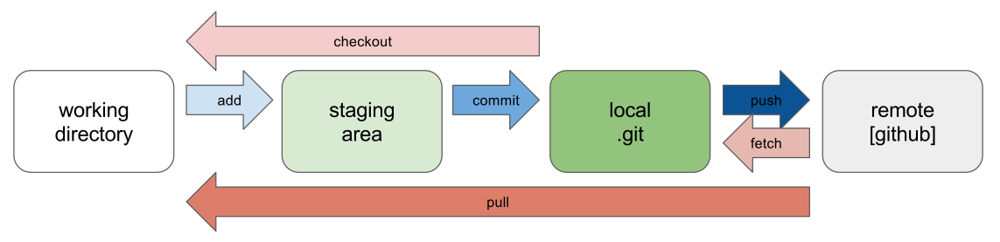

> Platform die auf Markdown basiert und davon eine Statische Website erstellt
> https://www.mkdocs.org/

## Übersicht
### Vorteile:
- basiert auf Markdown Dateien
- Open Source
- python bibliothek
- mehrere Themes 
- Konfiguration mit YAML Datei
- Sehr gute Suche mit auto verfollständigung
### Nachteile:
- keine

## Setup
- python package installieren
- seite mit mkdocs erstellen
- yaml file konfigurieren
- markdown Dateien hinzufügen
- statische Seite generieren
- Statische Seite bereitstellen
  - Docker Compose mit reverse Proxy
- CD einrichten mit Github Actions

## Deployment
- Kann mit Docker Container bereitgestellt werden

### Continuous Delivery
- CD via Github Action
- jenkins
- o.ä.

