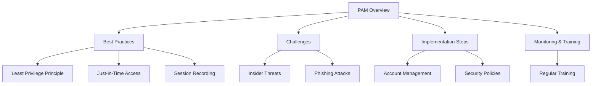
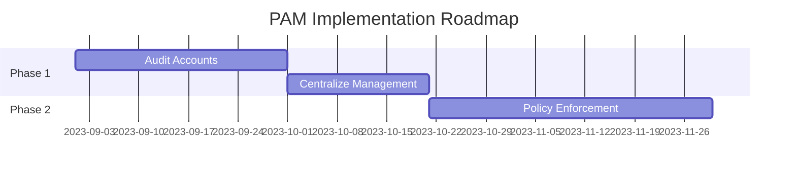

# Executive Summary of Privileged Access Management - IAM Tutorial #11

Video by The Morpheus Tutorials

<iframe width="100%" height="415" src="https://www.youtube.com/embed/6vCalj0us64" frameborder="0" allowfullscreen></iframe>

[Watch on YouTube](https://www.youtube.com/watch?v=6vCalj0us64)

# Technical Document: Privileged Access Management (PAM)

## 1. Executive Summary
- Overview of PAM and its significance in Identity & Access Management (IAM).
- Key recommendations for implementing best practices in PAM.

## 2. Project Visualization

## 3. Introduction
- **Problem Statement**: PAM addresses the risks associated with privileged accounts, which are often targeted by attackers.
- **Objectives**: Enhance security by managing and monitoring privileged access effectively.
- **Key Benefits**: Reduces risk of data breaches, enhances compliance, and improves overall security posture.

## 4. Core Functionality
- **PAM Overview**: PAM controls access to critical systems and data by managing privileged accounts.
- **Key Components**:
  1. **Privileged Accounts**: Accounts with elevated rights beyond standard user access.
  2. **Access Control**: Mechanisms to restrict and monitor access based on roles.
  
- **Step-by-Step Process Breakdown**:
  1. Identify privileged accounts within the organization.
  2. Implement a hierarchical structure for access rights.
  3. Enforce security policies for privileged users.

## 5. Implementation
- **Preparation Steps**:
  1. Conduct an audit of existing privileged accounts.
  2. Establish a centralized dashboard for account management.
  
- **Deployment Best Practices**:
  1. Apply the least privilege principle to limit access rights.
  2. Implement Just-in-Time access for temporary privileges.
  
- **Integration with Other Systems**: Ensure PAM solutions integrate seamlessly with existing IAM frameworks.

## 6. Monitoring and Best Practices
- **Key Metrics to Track**:
  - Number of privileged accounts.
  - Frequency of access rights usage.
  
- **Security Recommendations**:
  1. Enforce two-factor authentication (2FA) for all privileged accounts.
  2. Regularly review and adjust access rights based on usage.

- **Troubleshooting Guide**:

| Issue | Possible Cause | Resolution |
|-------|----------------|------------|
| Unauthorized Access | Misconfigured permissions | Review and adjust access rights |
| Phishing Incident | Lack of user training | Implement regular security training |

## 7. Recommendations and Roadmap
- **Top Recommendations**:
  1. Implement a centralized account management system for visibility.
  2. Enforce strict security policies for privileged accounts.
  3. Conduct regular audits and training for administrators.

- **Implementation Timeline**:

## 8. Additional Resources
- Official documentation: [PAM Best Practices Guide](#)
- Key tutorials and community forums: [IAM Community Forum](#)

---

*Report by: [Your Name] | Date: [Today] | Version: [1.0]*

## Glossary
- **IAM**: Identity & Access Management
- **PAM**: Privileged Access Management
- **2FA**: Two-Factor Authentication

This document provides a structured approach to understanding and implementing PAM within an organization, emphasizing the importance of managing privileged access to mitigate risks effectively.
