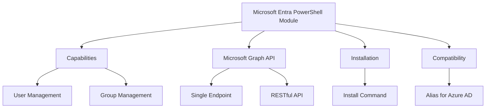
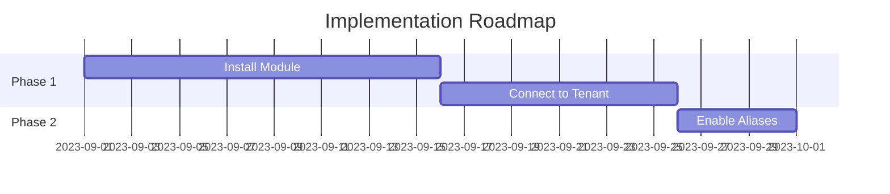

# Executive Summary of Entra PowerShell Module Overview

Video by John Savill's Technical Training

<iframe width="100%" height="415" src="https://www.youtube.com/embed/YOgpAkshmYI" frameborder="0" allowfullscreen></iframe>

[Watch on YouTube](https://www.youtube.com/watch?v=YOgpAkshmYI)

# Technical Overview: Microsoft Entra PowerShell Module

## 1. Executive Summary
- Introduction of Microsoft Entra PowerShell module enhances interaction with Microsoft services.
- Transition from Azure Active Directory (Azure AD) modules to Microsoft Graph API.
- Key benefits include improved usability and scenario-based commands.

## 2. Project Visualization

## 3. Introduction
1. **Problem Statement**: Legacy Azure AD modules are deprecated, requiring a transition to a more modern solution.
2. **Objectives**: Streamline PowerShell commands for user and group management through a unified interface.
3. **Key Benefits**:
   - Enhanced usability with scenario-driven commands.
   - Compatibility with existing Azure AD scripts (98% compatibility).

## 4. Core Functionality
1. **Microsoft Graph Overview**: 
   - A single endpoint for various Microsoft services (e.g., Entra ID, Microsoft 365).
   - Utilizes RESTful API principles, allowing HTTP communication.
   
2. **Key Components**:
   - **PowerShell Module**: Automatically generated using OpenAPI specifications and AutoRest.
   - **Scenario-Based Commands**: Designed for human users rather than developers.

3. **Step-by-Step Process Breakdown**:
   - Install the module using `Install-Module Microsoft.Graph.Entra`.
   - Connect to the tenant using `Connect-MgGraph` or `Connect-Entra`.

## 5. Implementation
1. **Preparation Steps**:
   - Ensure PowerShell is updated to the latest version.
   - Install the Entra module from the PowerShell Gallery.

2. **Deployment Best Practices**:
   - Regularly update the module to access new features.
   - Use `Connect-Entra` for session management.

3. **Integration with Other Systems**:
   - Interoperable with existing Microsoft Graph module.
   - Supports both V1 and beta endpoints for testing new features.

## 6. Monitoring and Best Practices
1. **Key Metrics to Track**:
   - Frequency of API calls and response times.
   - User permissions and consented scopes.

2. **Security Recommendations**:
   - Regularly review and update permissions.
   - Use Multi-Factor Authentication (MFA) for enhanced security.

3. **Troubleshooting Guide**:

| Issue | Possible Cause | Resolution |
|-------|----------------|------------|
| Long command strings | Non-intuitive API design | Use aliases for Azure AD |
| Piping issues | Lack of support in Microsoft Graph | Use Entra module for piping |

## 7. Recommendations and Roadmap
1. **Top Recommendations**:
   - Transition to the Entra module for improved usability.
   - Enable Azure AD aliases for legacy script compatibility.
   - Regularly check for updates to leverage new features.

2. **Implementation Timeline**:

## 8. Additional Resources
- Official documentation: [Microsoft Graph Documentation](https://docs.microsoft.com/en-us/graph/)
- Community forums and tutorials for further learning.

---

*Report by: [Your Name] | Date: [Today] | Version: [1.0]*

## Glossary
- **API**: Application Programming Interface
- **MFA**: Multi-Factor Authentication
- **REST**: Representational State Transfer
- **SDK**: Software Development Kit
- **V1**: Version 1 of the API endpoint
