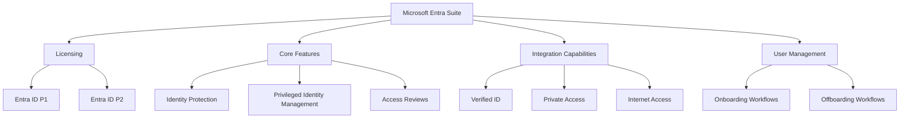
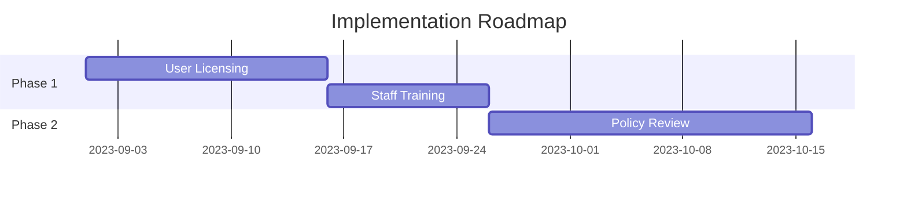

# Executive Summary of Entra Suite Overview

Video by John Savill's Technical Training

<iframe width="100%" height="415" src="https://www.youtube.com/embed/Fu1qyW3kuLo" frameborder="0" allowfullscreen></iframe>

[Watch on YouTube](https://www.youtube.com/watch?v=Fu1qyW3kuLo)

# Technical Overview: Microsoft Entra Suite

## 1. Executive Summary
- **Objective**: Clarify the components and benefits of the Microsoft Entra Suite.
- **Key Outcomes**: Understanding of licensing structure, features, and integration capabilities.
- **Recommendations**: Consider the Entra Suite for comprehensive identity management solutions.

## 2. Project Visualization

## 3. Introduction
- **Problem Statement**: Confusion regarding the features and licensing of the Entra Suite.
- **Objectives**: Provide clarity on the suite's offerings and how they integrate with existing services.
- **Key Benefits**: 
  1. Streamlined identity management processes.
  2. Enhanced security through advanced features.
  3. Cost-effective licensing for organizations needing multiple capabilities.

## 4. Core Functionality
- **Overview**: The Entra Suite consolidates various identity management features into a single offering.
- **Key Components**:
  1. **Identity Protection**: Risk-based conditional access and multi-factor authentication (MFA).
  2. **Privileged Identity Management**: Just-in-time elevation of permissions for Azure resources.
  3. **Access Reviews**: Basic and advanced reviews with machine learning capabilities.

## 5. Implementation
- **Preparation Steps**:
  1. Ensure users are licensed for Entra ID P1.
  2. Assess organizational needs for additional features.
- **Deployment Best Practices**:
  1. Utilize onboarding workflows to streamline user access.
  2. Implement offboarding processes to ensure security post-employment.
- **Integration with Other Systems**:
  - Leverage existing Azure services for enhanced identity management.

## 6. Monitoring and Best Practices
- **Key Metrics to Track**:
  1. User access patterns.
  2. Security incidents related to identity management.
- **Security Recommendations**:
  - Regularly review access permissions and conduct audits.
- **Troubleshooting Guide**:

| Issue | Possible Cause | Resolution |
|-------|----------------|------------|
| Access Denied | Incorrect Permissions | Review user roles |
| MFA Failure | Device Issues | Verify device settings |

## 7. Recommendations and Roadmap
- **Top Recommendations**:
  1. Adopt the Entra Suite for comprehensive identity management.
     - *Rationale*: Integrates multiple features into one solution.
  2. Train staff on new workflows and features.
     - *Rationale*: Ensures effective use of the suite.
  3. Regularly review and update security policies.
     - *Rationale*: Adapts to evolving security threats.

## 8. Additional Resources
- **Official Documentation**: [Microsoft Entra Documentation](https://docs.microsoft.com/en-us/entra)
- **Community Forums**: Engage with other users for tips and best practices.

---

*Report by: [Your Name] | Date: [Today] | Version: [1.0]*

## Glossary
- **MFA**: Multi-Factor Authentication
- **P1/P2**: Entra ID Plan 1/Plan 2
- **TCP/UDP**: Transmission Control Protocol/User Datagram Protocol
